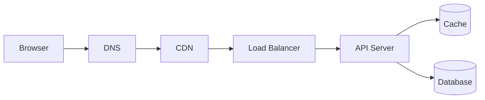

# Week 1 — Request Lifecycle & Web Foundations

## Mission

By the end of this week, you should be able to look at a browser request and explain the major systems it crosses, what each component contributes, and where latency or failure can appear.

This week is deliberately foundational. Later topics—caching, load balancing, queues, replication, observability—make much more sense once this request path is intuitive.

## Week architecture



## Learning outcomes

By Sunday, you should be able to:

- Trace a request from browser to database and back.
- Explain latency vs throughput.
- Explain HTTP request/response structure.
- Explain at a high level what TLS adds to HTTPS.
- Explain what DNS does and why TTL matters.
- Explain what a CDN caches and why edge location matters.
- Compare TCP, UDP, and WebSockets at the level relevant to system design.
- Explain reverse proxy vs load balancer.
- Explain why stateless services scale more easily.
- Design a read-heavy `GET /users/:id` API for large traffic.

## Daily plan

| Day | Topic | Time |
|---|---|---:|
| 1 | Request lifecycle | 45–60 min |
| 2 | HTTP & HTTPS | 45–60 min |
| 3 | DNS & CDN | 45–60 min |
| 4 | TCP, UDP & WebSockets | 45–60 min |
| 5 | Load balancing & statelessness | 45–60 min |
| 6 | Design lab | 90–120 min |
| 7 | Review & quiz | 45–60 min |

## Week rule

For every component, ask four questions:

1. **What problem does it solve?**
2. **Where does it sit in the request path?**
3. **What can fail?**
4. **What tradeoff does it introduce?**

If you can answer those four questions without notes, you understand the component well enough to use it in system design.

---

# How to Study This Week

The first version of this module was intentionally concise. This revision adds a **three-layer reading model** so you can choose depth without losing the daily rhythm.

## Reading levels

### 🥋 Core — required
Read the lesson itself. You should be able to complete the exercises and exit criterion from this material alone.

### 📚 Deep dive — recommended
Spend another 20–40 minutes with one authoritative source. The goal is not to memorize details; it is to see the simplified model connected to the real protocol or production practice.

### 🕳️ Rabbit hole — optional
Use these when a topic is especially interesting or relevant to work. Do **not** let a rabbit hole derail the weekly plan.

## Source hierarchy

Prefer sources in this order:

1. **Standards** — IETF RFCs and protocol specifications.
2. **Maintainer/platform documentation** — MDN, PostgreSQL, NGINX, Cloudflare, AWS, etc.
3. **Production engineering literature** — Google SRE and engineering write-ups.
4. **Books** — durable mental models and deeper explanations.
5. **Interview material** — useful for practice, but never the source of truth.

The point is to learn principles first and product knobs second.

---

# Core Books for the 12-Week Journey

You do **not** need to read all of these cover to cover.

| Book | Why it belongs in the course | When to use it |
|---|---|---|
| **Designing Data-Intensive Applications, 2nd ed. — Martin Kleppmann & Chris Riccomini (2026)** | Tradeoffs, reliability, data systems, distributed systems | Weeks 2, 6, 7, 9, 10 |
| **Computer Networking: A Top-Down Approach, 9th ed. — Kurose & Ross** | Strong web/networking foundations, including modern HTTP/3 and QUIC | Weeks 1 and 4 |
| **Site Reliability Engineering — Google** | Reliability, SLOs, monitoring, load balancing, overload | Weeks 1, 7, 8 |
| **The Site Reliability Workbook — Google** | Practical exercises and production case studies | Weeks 7–8 |
| **System Design Interview, Vol. 1 — Alex Xu** | Guided design exercises and estimation practice | Weeks 3–12 |
| **System Design Interview, Vol. 2 — Alex Xu & Sahn Lam** | More advanced bottleneck/tradeoff exercises | Weeks 6–12 |

## Week 1 book assignment

Do **not** read a whole networking textbook this week.

Suggested:

- **Kurose & Ross**: skim the application-layer sections relevant to HTTP, DNS, CDN, and transport.
- **Google SRE**: read *Monitoring Distributed Systems* after Day 1 or Day 6.
- **DDIA 2e**: optionally skim Chapters 1–2 for the language of tradeoffs and non-functional requirements.

---

# Evidence Notebook

For each day, create a tiny decision log:

```text
Concept:
Problem solved:
What evidence would make me add it?
What failure does it introduce?
What is the simpler alternative?
```

Example:

```text
Concept: Redis cache
Problem solved: repeated expensive profile reads
Evidence: DB read saturation + high request locality
New failure: cache outage / stale data / stampede
Simpler alternative: keep PostgreSQL-only
```

This is the habit that turns system-design knowledge into engineering judgment.
