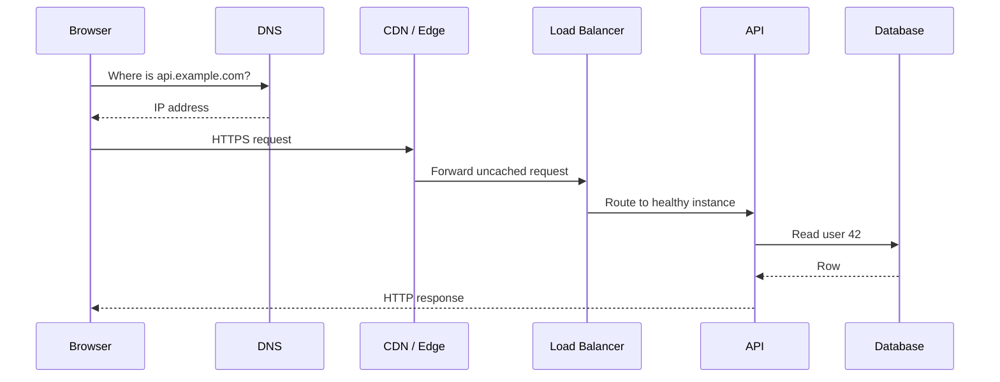
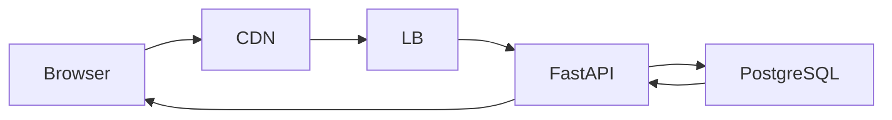

# Day 1 — Follow the Request

## Goal

Build a mental model of what happens between typing a URL and receiving data from an application.

## Timebox

- 10 min — mental model
- 15 min — key concepts
- 15 min — draw the request path
- 10 min — failure exercise
- 5 min — retrieval quiz

---

## 1. The request journey

Suppose the browser calls:

```http
GET https://api.example.com/users/42
```

A simplified path is:



This diagram is intentionally simplified. Real systems may add firewalls, API gateways, service meshes, caches, authentication systems, queues, and more.

The system-design skill is knowing **when those extra components are justified**.

---

## 2. Latency vs throughput

### Latency

How long one operation takes.

Example:

```text
GET /users/42 → 85 ms
```

### Throughput

How much work the system handles during a period.

Example:

```text
8,000 requests/second
```

A system can have:

- low latency + low throughput,
- low latency + high throughput,
- high latency + high throughput,
- or the unfortunate fourth option: slow and overloaded. 😅

### Important

Improving throughput does not automatically improve latency.

Adding workers might process more jobs per minute while each individual job still takes the same amount of time.

---

## 3. Where latency comes from

Think in budgets:

```text
DNS lookup            10 ms
Network/TLS            25 ms
Load balancer           2 ms
API logic               8 ms
Database               30 ms
Serialization           3 ms
Network return          20 ms
----------------------------
Total                  ~98 ms
```

The numbers are illustrative, not universal.

The lesson is that **end-to-end latency is composed of many smaller costs**.

---

## 4. Client/server boundary

A common beginner mistake is to think of “the backend” as one box.

Instead think:

```text
Client
  ↓
Network edge
  ↓
Application layer
  ↓
Data layer
  ↓
Dependencies
```

Every boundary creates possible:

- latency,
- failure,
- retries,
- security requirements,
- observability needs.

---

## 5. Apply it to the transcription platform

Imagine the user opens the jobs page:

```http
GET /jobs/abc123
```

Possible path:



Now ask:

- Do we need the CDN for this dynamic request?
- Could job status be cached?
- What happens if PostgreSQL takes 2 seconds?
- What happens if one FastAPI instance crashes?

Do not solve everything today. Just notice the questions.

---

## 6. The request lifecycle in more detail

The earlier diagram is a useful map. Now add enough detail to reason about real latency and failures.

### Stage A — URL parsing and local state

Before the network is touched, the client may already have useful state:

- browser HTTP cache,
- DNS cache,
- existing TCP/TLS connection,
- service worker,
- HSTS information.

A request that reuses existing state can take a very different path from a cold request.

### Stage B — DNS resolution

The browser or operating system asks a recursive resolver for the destination. The resolver may answer from cache or contact authoritative DNS infrastructure.

This gives us a useful distinction:

```text
cold DNS lookup  !=  cached DNS lookup
```

When measuring user latency, avoid assuming every request pays every setup cost.

### Stage C — transport and security

Depending on protocol/version, the client establishes or reuses a transport connection and a secure session.

At a high level:

```text
name resolution
    ↓
transport connection
    ↓
TLS security context
    ↓
HTTP request
```

The exact handshake differs between HTTP versions and transports. The system-design lesson is simpler: **connection setup has cost, and connection reuse matters**.

### Stage D — edge and routing

A CDN, reverse proxy, gateway, or load balancer may:

- terminate TLS,
- serve a cached response,
- reject a request,
- rate-limit it,
- route it to a backend,
- attach tracing/request metadata.

Do not draw every possible component by default. Add one only when a requirement justifies it.

### Stage E — application work

The API may spend time on:

- authentication/authorization,
- validation,
- business logic,
- serialization,
- calls to other services,
- cache/database access.

The phrase “API latency” can therefore hide several distinct costs.

### Stage F — data access

A database request may involve:

- waiting for a pooled connection,
- parsing/planning,
- index lookup or scan,
- disk/cache access,
- lock waits,
- network round trips,
- result serialization.

A query that takes `30 ms` in isolation may take much longer when the connection pool is exhausted.

---

## 7. Percentiles: averages lie politely

Suppose 99 users receive a response in `50 ms`, but one waits `5 seconds`.

The average can still look healthy while that unlucky user has a terrible experience.

Production systems commonly watch percentiles:

```text
p50 → median experience
p95 → slower 5%
p99 → tail experience
```

System-design intuition:

> As load approaches capacity, **tail latency** often becomes interesting before the average looks catastrophic.

You do not need statistical mastery this week. Just stop treating “average latency” as the whole story.

---

## 8. Throughput, concurrency, and saturation

Three different questions:

- **Latency** — how long does one request take?
- **Throughput** — how many requests can we finish per unit time?
- **Concurrency** — how many operations are in flight at once?

Example:

```text
200 concurrent requests
100 ms average service time
```

That does not automatically tell you the maximum sustainable throughput. Resource limits matter:

- CPU,
- memory,
- connection pools,
- network,
- database capacity,
- downstream rate limits.

Once one constrained resource becomes full, queues form and latency can rise quickly.

---

## 9. Observe a real request 🔬

Use browser DevTools or command-line tools.

### Browser

Open **Network** and inspect:

- DNS / connection timing if exposed,
- request headers,
- response headers,
- status,
- transferred size,
- timing waterfall.

### `curl`

```bash
curl -I https://example.com
```

Then:

```bash
curl -w '\nDNS: %{time_namelookup}\nConnect: %{time_connect}\nTLS: %{time_appconnect}\nTTFB: %{time_starttransfer}\nTotal: %{time_total}\n' \
  -o /dev/null -s https://example.com
```

Do not worship one measurement. Run it several times and compare cold-ish vs reused/cached behavior.

### Optional: DNS

```bash
dig example.com
```

Write down what changed between your textbook diagram and the evidence you observed.

## Exercise — Draw it yourself

Without looking at the diagrams, draw the path for:

```text
User opens https://app.example.com/jobs/42
```

Include at least:

- Browser
- DNS
- CDN
- Load balancer
- API
- Database

Then annotate each arrow with what is being sent.

---

## Break it 💥

For each failure, predict the user-visible symptom:

1. DNS is unavailable.
2. CDN is available but the origin is down.
3. One of three API instances crashes.
4. Database latency jumps from 20 ms to 3 seconds.
5. The API returns in 20 ms but the user's network adds 800 ms.

The point: **“the app is slow” is not a diagnosis.**

---

## Retrieval quiz

Answer without notes:

1. What is latency?
2. What is throughput?
3. Name five components a request might cross before reaching the database.
4. Why can a request be slow even if the API code is fast?
5. What is one new failure mode introduced by adding another network hop?

## Exit criterion

You are done when you can redraw the request path from memory and explain latency vs throughput in under 60 seconds.

---

# Sources & Further Reading

## 🥋 Required

1. **MDN — Overview of HTTP**  
   https://developer.mozilla.org/en-US/docs/Web/HTTP/Guides/Overview  
   Read for the client/server/proxy model and request/response flow.

2. **Google SRE — Monitoring Distributed Systems**  
   https://sre.google/sre-book/monitoring-distributed-systems/  
   Focus on the four golden signals: latency, traffic, errors, saturation.

## 📚 Deep dive

3. **Computer Networking: A Top-Down Approach, 9th ed. — Kurose & Ross**  
   Use the application-layer and transport-layer chapters as a reference rather than a cover-to-cover assignment.

4. **Designing Data-Intensive Applications, 2nd ed. — Kleppmann & Riccomini**  
   Chapters 1–2 are useful for tradeoffs and non-functional requirements.

## 🕳️ Rabbit holes

- Browser DevTools Network documentation for your browser.
- Explore `curl -w`, `dig`, and `traceroute`.
- Read Google SRE's SLO chapter after you are comfortable with latency percentiles.

## Reflection

After reading one outside source, add **one correction or nuance** to your request-lifecycle diagram. If the source changes nothing in your mental model, you probably read too passively.
