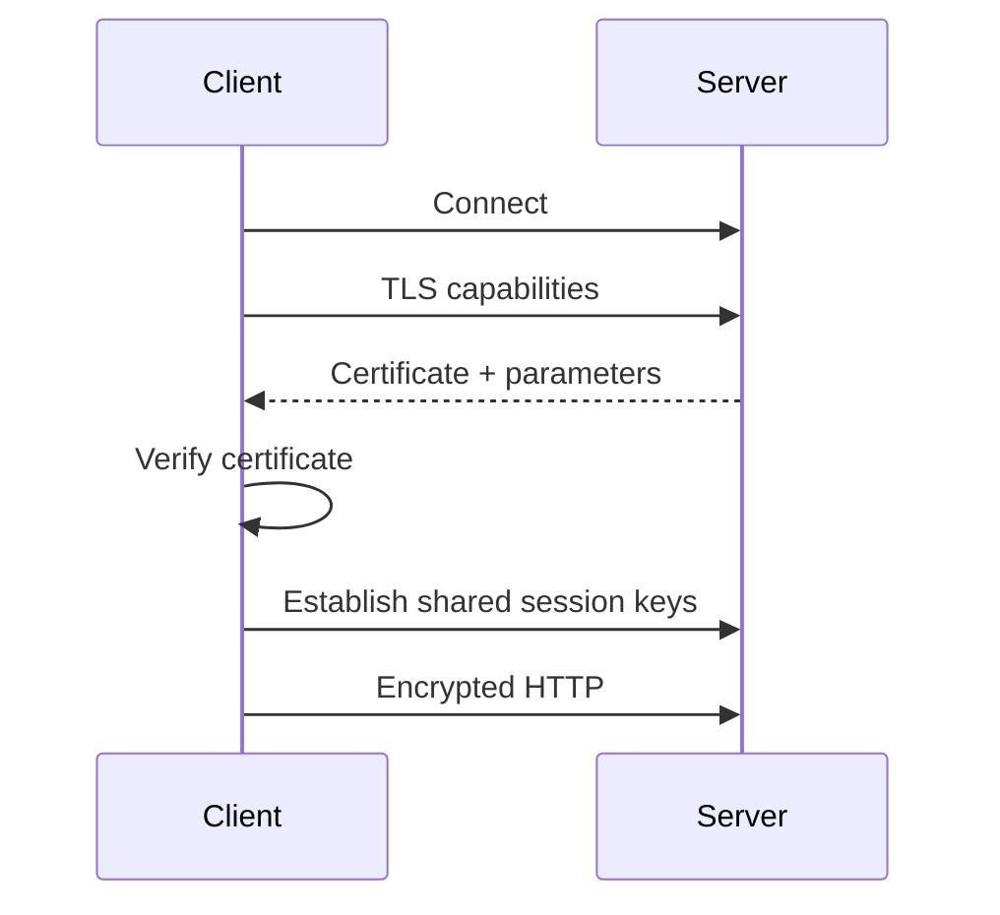

# Day 2 — HTTP & HTTPS Without the Fog

## Goal

Understand the HTTP concepts that matter when designing APIs and distributed systems.

## Timebox

- 10 min — request/response anatomy
- 15 min — methods, status codes, headers
- 10 min — HTTPS/TLS mental model
- 10 min — API exercise
- 5 min — retrieval quiz

---

## 1. HTTP is a contract

An HTTP request contains:

```http
GET /jobs/123 HTTP/1.1
Host: api.example.com
Authorization: Bearer <token>
Accept: application/json
```

A response might be:

```http
HTTP/1.1 200 OK
Content-Type: application/json
Cache-Control: no-store

{
  "id": "123",
  "status": "processing"
}
```

At the system-design level, focus on:

- method,
- path,
- headers,
- status code,
- body,
- caching semantics,
- idempotency.

---

## 2. Methods as intent

| Method | Typical meaning | Idempotent? |
|---|---|---|
| `GET` | Read | Yes |
| `POST` | Create/action | Usually no |
| `PUT` | Replace | Yes |
| `PATCH` | Partial update | Depends on operation |
| `DELETE` | Delete | Usually designed to be yes |

### Why idempotency matters

Networks fail in awkward places.

Client sends:

```http
POST /payments
```

Server completes the payment, but the response is lost.

The client retries.

Without an idempotency strategy, congratulations: you may have charged twice. 💸

For long-running jobs, idempotency keys are equally valuable.

---

## 3. Status codes worth knowing

You do not need to memorize the entire registry.

### Success

- `200 OK`
- `201 Created`
- `202 Accepted` — especially useful for async work
- `204 No Content`

### Client problems

- `400 Bad Request`
- `401 Unauthorized`
- `403 Forbidden`
- `404 Not Found`
- `409 Conflict`
- `429 Too Many Requests`

### Server problems

- `500 Internal Server Error`
- `502 Bad Gateway`
- `503 Service Unavailable`
- `504 Gateway Timeout`

### Important for transcription

Starting a long-running job should often look like:

```http
POST /jobs
→ 202 Accepted
```

The server is saying:

> “I accepted the work. The result is not ready yet.”

That is cleaner than keeping an HTTP request open for 45 minutes.

---

## 4. Headers are architecture signals

Useful examples:

```text
Authorization
Content-Type
Content-Length
Cache-Control
ETag
Retry-After
Idempotency-Key
Correlation-Id
```

They can influence authentication, caching, retries, observability, and concurrency control.

---

## 5. HTTPS and TLS: the useful mental model

HTTPS is HTTP transported over a TLS-protected connection.

TLS provides three important properties:

- **Confidentiality** — observers should not read the traffic.
- **Integrity** — tampering should be detectable.
- **Authentication** — certificates help the client verify the server identity.

Simplified connection setup:



Do not memorize cryptographic internals yet. Understand **why TLS adds connection work and security guarantees**.

---

## 6. Connection reuse

Creating connections repeatedly costs time.

Modern HTTP versions improve how multiple requests share network connections, but the core system-design lesson is:

> Connections are resources.

At scale, think about:

- connection pools,
- server connection limits,
- idle timeouts,
- downstream connection exhaustion.

---

## 7. Safe, idempotent, and retryable are not synonyms

These terms are easy to blur.

### Safe

A safe method is intended to be read-only from the user's point of view.

Typical example:

```http
GET /jobs/123
```

### Idempotent

Repeating the same intended operation has the same intended effect as performing it once.

```http
PUT /users/42/profile
```

can be designed idempotently.

### Retryable

Retryability is an application decision that also depends on failure semantics.

A `POST` can be made safely retryable using an application-level idempotency key:

```http
POST /jobs
Idempotency-Key: 2e2c...
```

The server records the key and returns the original operation/result for a duplicate request instead of starting duplicate work.

---

## 8. HTTP caching semantics

Caching is not “put Redis somewhere.” HTTP itself has caching semantics.

Important headers:

```text
Cache-Control
ETag
Last-Modified
If-None-Match
If-Modified-Since
Vary
```

### Example: versioned static asset

```http
Cache-Control: public, max-age=31536000, immutable
```

Great candidate for long caching.

### Example: private changing job status

```http
Cache-Control: no-store
```

may be safer, depending on requirements.

### Revalidation

An `ETag` lets a client ask whether its existing representation is still current:

```http
If-None-Match: "v17"
```

The server may respond:

```http
304 Not Modified
```

This reduces transferred data while still checking freshness.

---

## 9. HTTP/1.1 vs HTTP/2 vs HTTP/3 — system-design level

You do not need packet-level expertise yet.

### HTTP/1.1

Think:

- persistent connections are possible,
- request concurrency often requires multiple connections or careful pipelining behavior,
- head-of-line effects can appear.

### HTTP/2

Adds multiplexing of many HTTP streams over one connection and header compression.

System-design implication:

> A browser can make many requests without opening a separate TCP connection for every resource.

### HTTP/3

HTTP/3 runs over QUIC rather than TCP.

At this stage remember:

- QUIC uses UDP as its substrate,
- transport/security setup is redesigned,
- independent streams avoid some TCP-level head-of-line blocking effects,
- this does **not** mean UDP suddenly provides application reliability by itself; QUIC implements the needed behavior above UDP.

---

## 10. TLS beyond “encrypted”

TLS establishes security for the connection.

A useful certificate-chain mental model:

```text
Server certificate
      ↓ signed by
Intermediate CA
      ↓ signed by
Trusted root CA
```

The client also verifies that the certificate identity matches the hostname.

### Operational implications

TLS introduces things system designers care about:

- certificate renewal,
- termination location,
- connection setup cost,
- cipher/protocol compatibility,
- key management.

A load balancer may terminate TLS and then forward traffic internally according to your security architecture.

---

## 11. Timeouts and retry budgets

A retry without a timeout strategy can make an overloaded system worse.

Bad pattern:

```text
dependency slow
   ↓
request times out
   ↓
every client retries immediately
   ↓
dependency receives even more load
```

Later we will add exponential backoff, jitter, and circuit breakers.

For now remember:

> A retry is extra traffic. During overload, extra traffic is not free.

## Exercise — Design the async API

Sketch these endpoints:

```text
POST /uploads
POST /uploads/{id}/complete
GET  /jobs/{id}
```

For each endpoint write:

- request body,
- successful status code,
- one failure status code,
- whether a retry is safe.

### Example question

If `POST /uploads/{id}/complete` is retried twice, should it create two transcription jobs?

Your answer should be **no**. Now think about how the API can enforce that.

---

## Break it 💥

What should happen when:

1. Client times out after the server committed the operation.
2. User sends the same completion request twice.
3. API dependency is overloaded.
4. Authentication token is valid but the user does not own the job.

Map each case to an HTTP response and a backend behavior.

---

## Retrieval quiz

1. Why is `202 Accepted` useful for async systems?
2. What does idempotent mean?
3. Difference between `401` and `403`?
4. What three properties does TLS primarily give us?
5. Why can connection reuse improve performance?

## Exit criterion

You can design a simple HTTP API and explain which operations must be safe to retry.

---

# Practical Lab — Inspect HTTP

Try:

```bash
curl -i https://example.com
```

Look for:

- status code,
- cache headers,
- server/date headers,
- content type.

Then inspect a real API you control and answer:

1. Which endpoints are safe?
2. Which are idempotent?
3. Which `POST` operations need idempotency keys?
4. Which responses may be cached?
5. What is your timeout policy?

---

# Sources & Further Reading

## 🥋 Required

1. **RFC 9110 — HTTP Semantics**  
   https://www.rfc-editor.org/rfc/rfc9110.html  
   Read sections on methods, idempotency, and `202 Accepted`.

2. **MDN — HTTP request methods**  
   https://developer.mozilla.org/en-US/docs/Web/HTTP/Reference/Methods

3. **MDN — HTTP response status codes**  
   https://developer.mozilla.org/en-US/docs/Web/HTTP/Reference/Status

## 📚 Deep dive

4. **RFC 8446 — TLS 1.3**  
   https://www.rfc-editor.org/rfc/rfc8446.html  
   Do not read the entire RFC now. Read the introduction and use it as the source of truth when terminology gets fuzzy.

5. **Computer Networking: A Top-Down Approach, 9th ed.**  
   Read the HTTP and transport discussion, especially the modern HTTP/3/QUIC material.

## 🕳️ Rabbit holes

- MDN HTTP caching guide.
- `curl --http1.1`, `curl --http2`, and (if your build supports it) HTTP/3 experiments.
- Certificate inspection in browser DevTools.

## Source-check exercise

Find the exact RFC language for **idempotent** and compare it with your own definition. Rewrite your definition in one sentence without copying the RFC.
