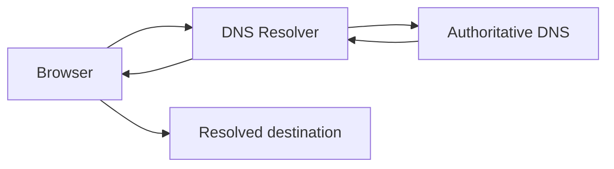
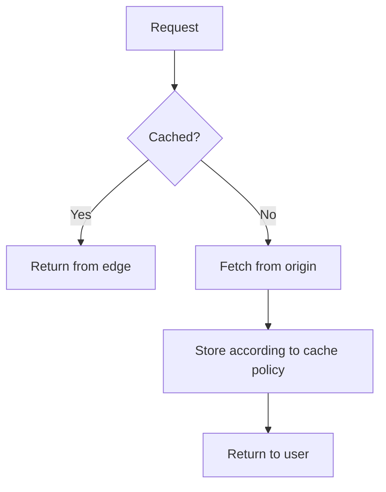

# Day 3 — DNS & CDN: The Internet's Receptionist and Warehouse

## Goal

Understand how users find services and how content can be delivered from the network edge.

## Timebox

- 15 min — DNS
- 15 min — CDN
- 15 min — architecture exercise
- 5 min — retrieval quiz

---

## 1. DNS answers “where?”

Humans like:

```text
api.example.com
```

Networks route using addresses.

DNS resolves names to records that help the client reach the correct destination.

A simplified resolution:



Real DNS has more layers and caching, but this is enough for today's mental model.

---

## 2. TTL

DNS answers can be cached.

The **TTL** controls how long a cached record may be reused before it should be refreshed.

Tradeoff:

### Long TTL

- fewer DNS lookups,
- lower resolver load,
- changes propagate more slowly.

### Short TTL

- changes can propagate sooner,
- more DNS lookups,
- more dependency on resolver availability.

This becomes relevant during migrations and failover.

---

## 3. CDN answers “can I serve this closer?”

A CDN places content at edge locations closer to users.

Without CDN:

```text
Luxembourg user ───────────────────→ origin server
```

With CDN:

```text
Luxembourg user → nearby edge cache
                       │
                       └── origin only on cache miss
```

Common CDN candidates:

- JavaScript bundles,
- CSS,
- images,
- downloadable media,
- cacheable public API responses.

---

## 4. Cache hit vs miss



A cache hit can reduce:

- latency,
- origin bandwidth,
- application server load.

But caching introduces the evergreen system-design villain:

> **stale data**.

---

## 5. CDN is not magic caching

You need a cache policy.

Questions include:

- Is the response public or user-specific?
- How long can it be stale?
- Can it be invalidated?
- Does the URL uniquely identify the content version?

For example, caching:

```http
GET /assets/app.4f92b1.js
```

for a long time is easy because the filename is versioned.

Caching:

```http
GET /jobs/123
```

is more sensitive because the status changes frequently and may be private.

---

## 6. Apply it to video transcription

Consider three resources:

1. Frontend JavaScript bundle.
2. Uploaded private video.
3. Completed transcript export.

Ask:

- Should a CDN be involved?
- Is content public or authenticated?
- Is the content mutable?
- What cache duration is safe?

There is no one rule for all three.

---

## 7. DNS hierarchy and roles

A more useful model than “DNS maps name to IP”:

```text
Client
  ↓
Recursive resolver
  ↓
Root
  ↓
TLD nameserver
  ↓
Authoritative nameserver
  ↓
Answer
```

Caching means the resolver often skips several of those steps.

### Useful record types

| Record | Rough purpose |
|---|---|
| `A` | name → IPv4 address |
| `AAAA` | name → IPv6 address |
| `CNAME` | name → another canonical name |
| `MX` | mail routing |
| `TXT` | arbitrary text, often verification/security policy |
| `NS` | nameservers authoritative for a zone |

You do not need to become a DNS administrator. You do need to recognize what kind of indirection an architecture uses.

---

## 8. DNS TTL is a deployment decision

Imagine moving:

```text
api.example.com
```

from old infrastructure to new infrastructure.

If a record has been cached for a long TTL, some resolvers can continue directing users to the old destination after you change authoritative DNS.

This gives a migration pattern:

```text
before migration:
lower TTL

wait for old TTLs to age out

change record

observe traffic

raise TTL later if appropriate
```

The exact plan depends on provider behavior and risk, but the principle is important: **caching policy affects operational agility**.

---

## 9. CDN cache keys

A CDN needs to decide when two requests represent the “same” cacheable object.

Potential cache-key inputs:

```text
scheme
hostname
path
query string
selected headers
```

If the cache key ignores something that changes the response, one user can receive the wrong representation.

That becomes especially dangerous with:

- authentication,
- language negotiation,
- device-specific responses,
- tenant-specific content.

---

## 10. Freshness vs validation vs invalidation

Three related but different ideas.

### Freshness

“How long can this cached response be reused without checking origin?”

### Validation

“Can I ask origin whether my cached copy is still valid?”

Examples:

```text
ETag
Last-Modified
```

### Invalidation/purge

“Can I actively remove cached content before its normal expiry?”

The hardest cache question is rarely “How do I store this?”

It is usually:

> **When does this value stop being correct?**

---

## 11. Private media and signed access

For your transcription product:

```text
uploaded video
```

is very different from:

```text
app.abc123.js
```

A private video can still be delivered through object storage/CDN infrastructure, but access control must survive caching.

Possible mechanisms include:

- short-lived signed URLs,
- signed cookies/tokens,
- authenticated origin/edge logic,
- strict cache policy.

We will treat authorization as a separate topic later. Today, simply recognize that **CDN ≠ public** and **cacheable ≠ safe to share**.

## Exercise — Place the CDN

Start with:

```text
Browser → FastAPI → PostgreSQL
```

Add:

- DNS
- CDN
- object storage

Then draw two flows:

### Flow A
Loading the web application.

### Flow B
Polling the status of a private transcription job.

Explain why the CDN plays a different role in each flow.

---

## Break it 💥

What happens when:

1. An old DNS record remains cached after a migration.
2. CDN serves an outdated asset.
3. Private user data is accidentally cached publicly.
4. Origin is unavailable but the CDN still has a fresh cached asset.

Which failures hurt availability? Which create security risk?

---

## Retrieval quiz

1. What problem does DNS solve?
2. What does TTL influence?
3. What is a CDN cache hit?
4. Why is static versioned content easy to cache?
5. Why should private changing data be cached carefully?

## Exit criterion

You can explain DNS and CDN without saying “it makes things faster” as the entire answer. 😄

---

# Practical Lab — DNS + Cache Evidence

### DNS

```bash
dig example.com
dig example.com A
dig example.com AAAA
```

Inspect:

- answer records,
- TTL,
- resolver used.

### HTTP cache headers

```bash
curl -I https://example.com
```

Look for:

```text
Cache-Control
Age
ETag
Last-Modified
Vary
```

Not every site exposes all of these.

---

# Sources & Further Reading

## 🥋 Required

1. **Cloudflare Learning Center — What is DNS?**  
   https://www.cloudflare.com/learning/dns/what-is-dns/

2. **Cloudflare Learning Center — What is caching?**  
   https://www.cloudflare.com/learning/cdn/what-is-caching/

3. **Cloudflare Cache docs — Get started**  
   https://developers.cloudflare.com/cache/get-started/

## 📚 Deep dive

4. **MDN — HTTP caching**  
   https://developer.mozilla.org/en-US/docs/Web/HTTP/Guides/Caching

5. **Computer Networking: A Top-Down Approach, 9th ed.**  
   Use the DNS/CDN sections to connect names, content distribution, and transport.

## 🕳️ Rabbit holes

- DNSSEC.
- Anycast routing.
- CDN origin shielding.
- Signed URLs for private object storage.
- Stale-while-revalidate / stale-if-error.

## Design prompt

Your private transcript export is immutable after generation.

Would you:

- serve it from FastAPI every time,
- return a short-lived signed object-storage URL,
- put a CDN in front of it,
- or combine approaches?

Write your requirements before your answer.
