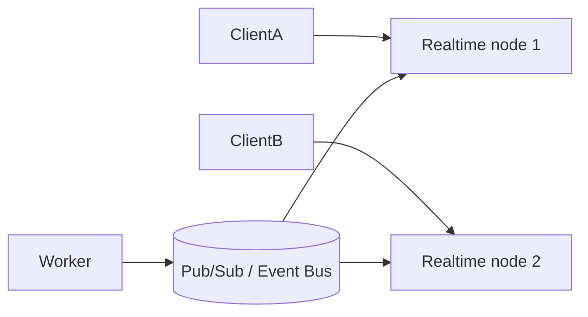

# Day 4 — TCP, UDP & WebSockets

## Goal

Understand transport and connection choices well enough to reason about APIs, realtime systems, and media workloads.

## Timebox

- 15 min — TCP
- 10 min — UDP
- 15 min — WebSockets
- 10 min — comparison exercise
- 5 min — retrieval quiz

---

## 1. TCP: reliable byte stream

TCP is designed to provide an ordered, reliable stream between endpoints.

Useful properties:

- connection-oriented,
- retransmission of lost data,
- ordered delivery,
- flow/congestion control.

The system-design intuition:

> TCP spends work to give applications a more reliable communication abstraction.

That reliability has cost in connection setup, state, and retransmission behavior.

---

## 2. UDP: datagrams with fewer guarantees

UDP sends independent datagrams and does not itself guarantee:

- delivery,
- ordering,
- retransmission.

That can be useful when timeliness matters more than perfect delivery, or when a higher-level protocol implements the needed guarantees differently.

Examples often include realtime media and protocols built on top of UDP.

Do not reduce the distinction to “TCP slow, UDP fast.” That is too crude to be useful.

---

## 3. HTTP and transport

The details differ across HTTP versions, but at a high level your application protocol ultimately relies on lower networking layers to move bytes.

For system design, the important questions are often:

- Is the interaction request/response?
- Do we need long-lived bidirectional communication?
- How much connection state will the server maintain?
- What happens when a connection drops?

---

## 4. WebSockets

WebSockets provide a long-lived, bidirectional communication channel between client and server.

Classic HTTP polling:

```text
Client → Any update?
Server → No
Client → Any update?
Server → No
Client → Any update?
Server → Yes, 68%
```

WebSocket-style flow:

```text
Client ⇄ persistent connection ⇄ Server

Server → progress 35%
Server → progress 52%
Server → progress 68%
```

Useful for:

- chat,
- live dashboards,
- collaborative apps,
- realtime progress.

But it introduces additional complexity:

- connection lifecycle,
- reconnect logic,
- routing many persistent connections,
- server state or connection registries,
- scaling across multiple instances.

---

## 5. Polling vs WebSockets for job progress

For a transcription job that runs 30 minutes:

### Polling

```http
GET /jobs/123
```

every few seconds.

Advantages:

- simple,
- stateless HTTP,
- easy to scale.

Costs:

- repeated requests,
- updates are only as fresh as the polling interval.

### WebSockets

Advantages:

- server pushes progress quickly,
- fewer redundant status requests.

Costs:

- more operational complexity,
- persistent connection management.

A senior answer is not “WebSockets are better.”

It is:

> “How realtime does this UX actually need to be?”

---

## 6. TCP connection setup and reliability intuition

A simplified TCP establishment:

```text
Client → SYN
Server → SYN-ACK
Client → ACK
```

After establishment, TCP provides a reliable ordered byte stream.

How does that intuition translate to failure?

If bytes are lost, TCP may retransmit them. Reliability is valuable, but waiting for missing data can increase latency.

TCP also implements flow and congestion control so endpoints and networks are not treated as infinitely fast pipes.

---

## 7. UDP: what “fewer guarantees” really buys you

UDP preserves message/datagram boundaries and does not provide TCP's reliability machinery.

That gives applications/protocols freedom to decide:

- whether old data is still useful,
- whether retransmission is worth it,
- whether order matters,
- what reliability mechanism to build above UDP.

This is why “UDP is faster” is the wrong mental model.

A better sentence:

> UDP gives the application fewer transport-level guarantees and therefore more responsibility/control.

---

## 8. QUIC and HTTP/3

Modern web networking makes a useful wrinkle:

```text
HTTP/1.1, HTTP/2
       ↓
      TCP
       ↓
       IP
```

while:

```text
HTTP/3
   ↓
 QUIC
   ↓
 UDP
   ↓
  IP
```

QUIC implements reliable streams, congestion control, and integrated cryptographic setup above UDP.

Why system designers care:

- connection establishment behavior,
- multiplexed streams,
- reduced coupling between independent stream loss,
- connection migration possibilities.

Do not dive into QUIC internals this week. Just avoid the false conclusion that “HTTP/3 is unreliable because UDP is underneath.”

---

## 9. WebSocket lifecycle

A WebSocket does not remove failure; it moves it into connection management.

You now need to think about:

```text
connect
authenticate
subscribe
heartbeat
disconnect
reconnect
resynchronize state
```

### Important principle

Do not make the WebSocket connection the only source of truth.

For job progress:

```text
durable truth → database/job state
live optimization → WebSocket events
```

If the connection drops, the client can fetch current state and continue.

---

## 10. WebSocket scaling

One server can maintain only a finite number of connections.

With multiple realtime nodes:



The event bus lets the worker publish:

```text
job 123 → progress 68%
```

without knowing which realtime node currently owns the user's connection.

Later topics:

- Redis Pub/Sub,
- streams,
- Kafka,
- dedicated realtime gateways.

---

## 11. Backpressure

What happens if a producer emits events faster than the receiver can consume them?

Potential outcomes:

- memory buffers grow,
- latency grows,
- messages are dropped,
- producer is slowed,
- connection fails.

This is **backpressure** territory.

The browser's classic `WebSocket` API does not provide automatic backpressure handling, which is one reason high-volume streaming needs careful design.

For transcription progress, this is usually easy to tame: do not emit 1,000 progress events/second. Coalesce updates.

---

## 12. Polling, SSE, WebSockets, and WebTransport

Add two options to your toolbox.

### Server-Sent Events (SSE)

Good when:

- server → client push is needed,
- client → server does not need the same persistent bidirectional channel,
- ordinary HTTP semantics are attractive.

### WebTransport

A newer, lower-level option built around modern transport capabilities. Powerful, but more complex and less universally appropriate.

### Decision table

| Requirement | Typical first candidate |
|---|---|
| CRUD request | HTTP |
| Job status every 3–5 seconds | Polling |
| Server-only live event stream | SSE |
| Chat / collaborative two-way messages | WebSocket |
| Specialized low-level realtime transport | Investigate WebTransport |

Always validate against actual requirements and client support.

## Exercise — Pick the communication model

Choose between ordinary HTTP, polling, WebSockets, or another suitable approach for:

1. Login request.
2. Get job history.
3. Upload a 2 GB video.
4. Display transcription progress.
5. Collaborative text editing.
6. Live multiplayer game positions.

For each, explain **why**.

---

## Break it 💥

For a WebSocket progress system, answer:

- What if the connection drops for 30 seconds?
- How does the client recover current progress?
- What if the user connects to API instance B after instance A had the original connection?
- What component could distribute events across multiple API instances?

Notice how adding realtime behavior creates a new distributed-systems problem.

---

## Retrieval quiz

1. What guarantee does TCP provide that UDP does not provide by itself?
2. Why is “UDP is faster” an incomplete explanation?
3. What makes a WebSocket different from normal request/response HTTP usage?
4. Give one reason to prefer polling.
5. Give one reason to prefer WebSockets.

## Exit criterion

You can compare polling and WebSockets using requirements and tradeoffs rather than fashion.

---

# Practical Lab — Realtime Failure Thinking

Design a job-progress client with these requirements:

- job lasts 90 minutes,
- progress updates at most once per second,
- browser can sleep for 5 minutes,
- connection may move between API instances,
- final state must never depend on receiving every live event.

Write:

```text
Source of truth:
Live transport:
Reconnect strategy:
Missed-event recovery:
Backpressure strategy:
```

---

# Sources & Further Reading

## 🥋 Required

1. **RFC 9293 — TCP**  
   https://www.rfc-editor.org/rfc/rfc9293.html  
   Use as the modern TCP specification. Read the introduction/key concepts, not the entire RFC.

2. **MDN — WebSocket API**  
   https://developer.mozilla.org/en-US/docs/Web/API/WebSockets_API  
   Pay attention to connection behavior and the note about backpressure.

3. **RFC 6455 — The WebSocket Protocol**  
   https://www.rfc-editor.org/rfc/rfc6455.html

## 📚 Deep dive

4. **RFC 768 — UDP**  
   https://www.rfc-editor.org/rfc/rfc768.html

5. **Computer Networking: A Top-Down Approach, 9th ed.**  
   Read the transport-layer material and its HTTP/3/QUIC update.

## 🕳️ Rabbit holes

- QUIC / HTTP/3.
- Server-Sent Events.
- WebTransport.
- TCP congestion control.
- Connection migration and mobile networks.

## Explain-it test

In 60 seconds, explain why:

> “TCP is reliable, UDP is unreliable, therefore TCP is better.”

is not a useful architecture rule.
