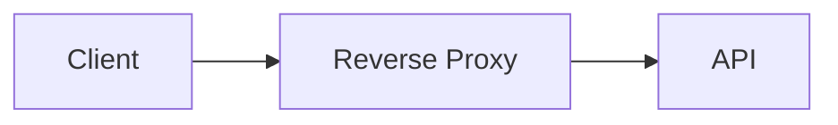
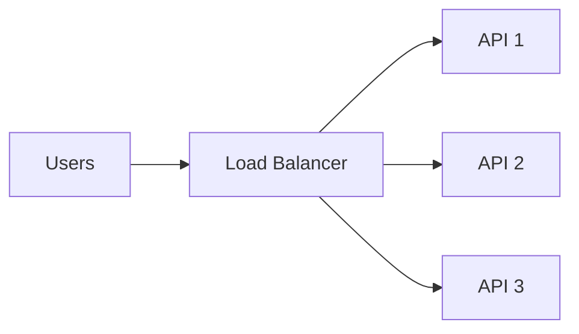
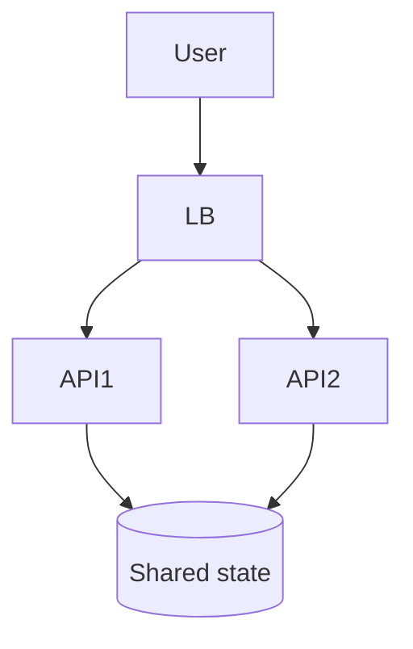

# Day 5 — Load Balancing, Reverse Proxies & Statelessness

## Goal

Understand how one backend becomes many backend instances without turning the system into chaos.

## Timebox

- 10 min — reverse proxy
- 15 min — load balancing
- 15 min — statelessness
- 10 min — scaling exercise
- 5 min — retrieval quiz

---

## 1. Reverse proxy

A reverse proxy accepts requests on behalf of backend services.



It can provide capabilities such as:

- TLS termination,
- request routing,
- compression,
- header manipulation,
- access control,
- observability,
- load balancing.

The terms “reverse proxy” and “load balancer” overlap in products and architectures, but conceptually load balancing is specifically about **distributing work across multiple backends**.

---

## 2. Why load balance?

One server has finite capacity.

```text
Client → API-1
```

As demand increases:



Benefits:

- increased capacity,
- improved availability,
- rolling deployments,
- isolation from single-instance failure.

But the load balancer itself now matters to availability.

System design is generous like that: every solution brings a new problem to the party. 🎉

---

## 3. Common strategies

### Round robin

Send requests across servers in rotation.

Useful when instances have similar capacity and requests have similar cost.

### Least connections

Prefer the backend with fewer active connections.

Can help when requests have uneven duration.

### Consistent/stable hashing

Route based on a key.

Useful for some locality or partitioning needs, but can reduce flexibility and complicate balancing.

Do not memorize algorithms without the workload that motivates them.

---

## 4. Health checks

A load balancer should avoid sending requests to unhealthy instances.

```text
LB → /health
```

But “process is running” and “service can safely handle traffic” are not always the same thing.

Think about:

- liveness,
- readiness,
- dependency health.

If the database is unavailable, should the API still be considered ready for every endpoint?

Good question. No universal answer.

---

## 5. Statelessness

Suppose API-1 stores session state only in local memory:

```text
User login → API-1 remembers user
Next request → API-2 → “Who are you?”
```

Oops.

A stateless API avoids depending on instance-local conversational state between requests.

State may instead live in:

- signed tokens,
- Redis,
- database,
- dedicated session service.

Then any API instance can serve the next request.



This makes horizontal scaling substantially easier.

---

## 6. Sticky sessions

A load balancer can try to keep the same user on the same backend.

That may be useful in some systems, but it can create:

- uneven load,
- harder failover,
- coupling to instance lifetime.

Treat sticky sessions as a tool, not the default answer.

---

## 7. Layer 4 vs Layer 7 load balancing

A useful simplification:

### Layer 4-ish routing

Makes decisions primarily from connection/network information.

Think:

```text
IP + port + connection
```

### Layer 7 routing

Understands application protocol information such as HTTP host/path/headers.

Example:

```text
/api/*      → API target group
/assets/*   → static service
/admin/*    → admin service
```

Do not obsess over OSI trivia. The design question is:

> What information must the balancer understand to make the routing decision?

---

## 8. Load balancing algorithms and workload shape

### Round robin

Good default when requests and instances are roughly comparable.

### Least outstanding / least connections

Can help when request duration varies.

### Hash-based routing

Useful when locality matters, but it can create skew or stronger coupling.

A routing algorithm cannot fix a fundamentally unbalanced workload.

Example:

```text
99 cheap requests
1 request that consumes 30 seconds of CPU
```

Request count alone is a poor measure of load.

---

## 9. Liveness, readiness, and dependency health

### Liveness

> “Is this process alive enough that restarting it might help?”

### Readiness

> “Should this instance receive new traffic right now?”

Those are different.

Example:

```text
process alive = yes
DB connection pool exhausted = yes
ready for DB-backed endpoints = probably no
```

Be careful with dependency checks too: if every service marks itself unhealthy whenever a shared database blips, you can amplify an outage.

---

## 10. Connection draining and graceful shutdown

When deploying or scaling down:

Bad:

```text
kill process immediately
→ active requests die
```

Better:

```text
mark unready
→ stop receiving new traffic
→ finish in-flight work
→ terminate
```

For WebSockets or long requests, draining can require special policy.

---

## 11. Stateless does not mean “there is no state”

A stateless application instance means:

> Correct handling of the next request does not depend on hidden state that exists only inside one particular instance.

Your system is still full of state:

```text
PostgreSQL
Redis
object storage
tokens
queues
```

The goal is to make important state **durable/shared/portable** enough that an instance can disappear.

---

## 12. Failure domains

Three API instances on one machine are not the same as three API instances across independent failure domains.

Think about:

- process,
- host,
- rack,
- availability zone,
- region,
- provider.

Week 1 rule:

> Replicas only improve availability for failures they do not share.

We will revisit multi-zone and multi-region design later.

## Exercise — Scale FastAPI

Start with:

```text
React → FastAPI → PostgreSQL
```

Now requirements change:

- traffic grows 20×,
- API instances should be deployable independently,
- any single API process may crash,
- authentication must keep working.

Draw the new architecture and explain:

1. Where the load balancer goes.
2. How many FastAPI instances exist conceptually.
3. Where user/session state lives.
4. How unhealthy instances are removed from traffic.

---

## Break it 💥

Predict what happens when:

1. API-2 crashes during a request.
2. API-1 is twice as slow as the others.
3. All API instances are healthy but PostgreSQL is saturated.
4. The load balancer routes all traffic to one backend due to bad configuration.
5. Session state exists only in memory on each API instance.

---

## Retrieval quiz

1. What problem does a load balancer solve?
2. What is a reverse proxy?
3. Why are stateless services easier to scale horizontally?
4. Why might sticky sessions be undesirable?
5. What is the difference between process liveness and readiness to serve traffic?

## Exit criterion

You can explain how to scale one API process to several without hand-waving about “the cloud.”

---

# Practical Lab — Make FastAPI Deployable

Draw this transition:

```text
single FastAPI process
        ↓
three instances behind a load balancer
```

Specify:

- readiness endpoint,
- liveness endpoint,
- auth/session storage,
- graceful shutdown behavior,
- database pool size per instance,
- what happens when one instance becomes slow rather than fully dead.

Bonus:

If each instance opens 30 DB connections, what happens when you scale from 3 to 50 API instances?

That question foreshadows why downstream capacity matters when horizontally scaling upstream services.

---

# Sources & Further Reading

## 🥋 Required

1. **AWS — What is Elastic Load Balancing?**  
   https://docs.aws.amazon.com/elasticloadbalancing/latest/userguide/what-is-load-balancing.html  
   Use it for concrete target groups, health checks, and routing concepts—not as a requirement to use AWS.

2. **Google SRE — Load Balancing at the Frontend**  
   https://sre.google/sre-book/load-balancing-frontend/

3. **Google SRE — Load Balancing in the Datacenter**  
   https://sre.google/sre-book/load-balancing-datacenter/

## 📚 Deep dive

4. **Google SRE — Handling Overload**  
   https://sre.google/sre-book/handling-overload/

5. **NGINX documentation — Reverse Proxy**  
   https://docs.nginx.com/nginx/admin-guide/web-server/reverse-proxy/

## 🕳️ Rabbit holes

- connection draining,
- zone-aware load balancing,
- power of two choices,
- consistent hashing,
- service discovery.

## Design test

Explain why this sentence is incomplete:

> “We can handle more traffic by adding more API instances.”

Name at least three downstream limits that might prevent that.
