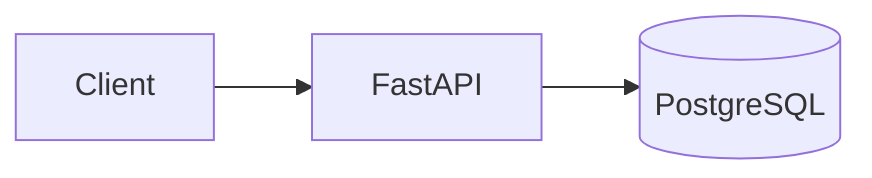
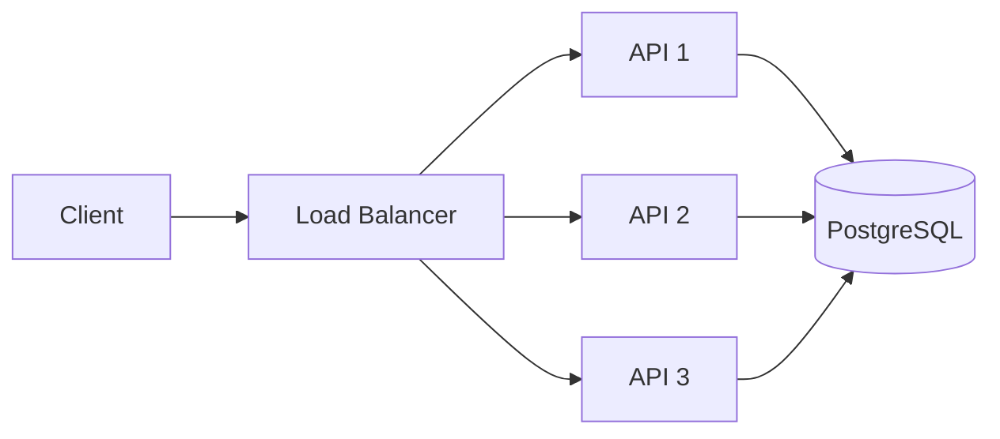
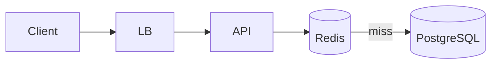

# Day 6 — Design Lab: `GET /users/:id` From 10 Users to 10 Million

## Mission

Today you combine everything from the week into one mini system-design exercise.

Do not chase the “perfect” architecture. Practice the **decision process**.

## Timebox

- 15 min — requirements
- 15 min — estimates
- 20 min — simple design
- 20 min — scale the design
- 20 min — failures + tradeoffs
- 10 min — write your design review

---

# Scenario

Design an API for fetching a public user profile:

```http
GET /users/{user_id}
```

Example response:

```json
{
  "id": "42",
  "displayName": "Ada",
  "avatarUrl": "https://...",
  "bio": "Distributed systems enthusiast"
}
```

---

# Step 1 — Requirements

## Functional

The system must:

- fetch a user profile by ID,
- return `404` for unknown users,
- serve public profile fields only.

## Non-functional

Assume we care about:

- low read latency,
- high availability,
- eventual growth to large read traffic,
- reasonable cost.

## Explicitly out of scope

For this lab:

- profile editing,
- authentication,
- search,
- followers/following.

This prevents the design from expanding into the entire internet before lunch.

---

# Step 2 — Rough scale

Start small:

```text
10 users
1 request/second
```

Then imagine:

```text
10 million registered users
5,000 profile reads/second at peak
```

You do not need perfect estimates. The goal is to understand whether architecture choices need to change.

---

# Step 2.5 — Define success before architecture

Add service objectives.

Example assumptions for the exercise:

```text
Availability target: 99.9% monthly
p50 latency: < 80 ms
p95 latency: < 200 ms
p99 latency: < 500 ms
Peak reads: 5,000 req/s
Profile freshness: updates visible within 60 s is acceptable
```

These are **exercise assumptions**, not universal targets.

Why do this?

Because “make it fast” is not a design requirement. A measurable target gives you something to test.

---

# Step 2.6 — Back-of-the-envelope estimation

Suppose:

```text
10,000,000 users
average public profile payload ≈ 2 KB
peak reads = 5,000 req/s
```

Raw profile response traffic:

```text
5,000 × 2 KB ≈ 10 MB/s
```

That is before protocol overhead, TLS, replication, cache misses, logs, etc.

Annual profile data itself:

```text
10,000,000 × 2 KB ≈ 20 GB
```

Again, rough—not a capacity quote.

The point is to ask:

- Is storage huge?
- Is read traffic huge?
- Is the workload read-heavy?
- Does locality make caching attractive?
- Which number dominates the design?

For this scenario, **read request volume** is more architecturally interesting than 20 GB of profile rows.

# Step 3 — Start stupidly simple



At low traffic this may be completely sufficient.

That is an important system-design lesson:

> The simplest architecture that satisfies the current requirements is often the best starting point.

---

# Step 4 — Find the first bottleneck

Questions:

- How many queries/sec can the database sustain?
- Are we querying by indexed primary key?
- Is the API CPU-bound or mostly waiting on DB/network?
- Are the same profiles read repeatedly?

The first optimization might simply be:

```sql
PRIMARY KEY (id)
```

Do not add Redis before checking whether you have a cache-shaped problem.

---

# Step 5 — Scale the API layer

If one API instance cannot reliably handle traffic:



The API should be stateless enough that any instance can handle any request.

---

# Step 6 — Consider caching

Suppose famous profiles are requested constantly.



Possible cache-aside behavior:

```text
1. Read Redis.
2. Hit → return profile.
3. Miss → read PostgreSQL.
4. Store profile with TTL.
5. Return profile.
```

Tradeoff: cached data may be briefly stale.

For a public bio, that may be acceptable.

For a bank balance, probably not. Context is king.

---

# Step 7 — Consider CDN caching

If profiles are public and cacheable, some responses might be cached nearer to users.

But ask first:

- Are responses identical for all users?
- How quickly must profile updates appear?
- How will cache invalidation work?

Do not blindly cache authenticated or personalized responses at a public edge.

---

# Step 8 — Failure analysis

Complete this table yourself before reading your own notes again:

| Failure | Expected behavior | Mitigation |
|---|---|---|
| One API instance dies | ? | ? |
| Redis unavailable | ? | ? |
| PostgreSQL slow | ? | ? |
| CDN has stale response | ? | ? |
| DNS points to old infrastructure | ? | ? |

A good design often degrades rather than instantly collapses.

For example, if Redis is only a cache, the system may fall back to PostgreSQL—while carefully avoiding a cache-miss stampede.

---

# Step 9 — 10× / 100× / 1000×

For each scale increase, write **the first thing you would measure**, not the first technology you would add.

### 10×

```text
Measure:
Decision:
Reason:
```

### 100×

```text
Measure:
Decision:
Reason:
```

### 1000×

```text
Measure:
Decision:
Reason:
```

This habit protects you from architecture-by-buzzword.

---

# Step 9.5 — Define what you will measure

Before scaling, pick telemetry.

## Golden signals for this API

```text
Latency
Traffic
Errors
Saturation
```

Possible metrics:

```text
http_request_duration_seconds
http_requests_total
http_5xx_total
db_query_duration_seconds
db_pool_in_use
redis_hit_ratio
redis_errors_total
cpu_utilization
```

### Example trigger

Bad:

> “At 10 million users, add Redis.”

Better:

> “If DB read saturation or p95 latency rises and repeated-key locality is high, test a cache-aside layer and measure hit ratio + stale-data behavior.”

---

# Step 9.6 — Load-test plan

A design is a hypothesis until measured.

Write a test matrix:

| Test | Purpose |
|---|---|
| 100 req/s | baseline |
| 1,000 req/s | observe scaling |
| 5,000 req/s | target peak |
| 7,500 req/s | headroom |
| hot-key workload | cache/locality behavior |
| DB slowdown | degradation |
| Redis outage | cache fallback |
| one API killed | availability |

Track p50/p95/p99, error rate, saturation, and DB/cache metrics.

---

# Step 9.7 — Cost belongs in the tradeoff

Two designs can both satisfy latency.

Ask:

```text
How many API instances?
How much DB capacity?
How much cache memory?
How much egress?
How much operational complexity?
```

System design is optimization under multiple constraints—not a contest for the largest architecture diagram.

# Step 10 — Write the design review

Use this structure:

```text
Requirements
Scale assumptions
API
Data model
Initial architecture
Scaling path
Failure handling
Tradeoffs
Open questions
```

## Example conclusion style

> Start with a stateless API and PostgreSQL indexed by user ID. Add horizontal API scaling when application capacity requires it. Introduce caching only after measuring repeated read pressure and acceptable staleness. Keep Redis non-authoritative so cache failure degrades performance rather than correctness.

Notice the wording: **requirements → evidence → decision**.

---

# Bonus — Connect it to transcription

Compare:

```http
GET /users/42
```

with:

```http
GET /jobs/123
```

Ask:

- Which changes more frequently?
- Which is private?
- Which can tolerate stale data?
- Which might need realtime updates?

Same components. Different requirements. Different design.

---

# Design Review Rubric

Score yourself 0–2 on each:

| Dimension | 0 | 1 | 2 |
|---|---|---|---|
| Requirements | vague | partial | explicit functional + NFR |
| Estimation | none | numbers without impact | numbers drive decisions |
| Simplicity | overbuilt | mostly sensible | minimum viable architecture |
| Bottlenecks | guesses | some measurement | clear evidence/metrics |
| Reliability | ignored | obvious failures | graceful degradation + recovery |
| Caching | buzzword | justified | freshness/invalidation/failure included |
| Scaling | technology-first | partial | trigger-based path |
| Tradeoffs | missing | listed | contextual and defended |
| Observability | missing | generic | concrete signals/SLOs |
| Communication | hard to follow | understandable | crisp narrative + diagram |

Target: **16+/20** before calling the lab complete.

---

# Sources & Further Reading

## 🥋 Required

1. **Google SRE — Monitoring Distributed Systems**  
   https://sre.google/sre-book/monitoring-distributed-systems/

2. **Google SRE — Service Level Objectives**  
   https://sre.google/sre-book/service-level-objectives/

3. **System Design Interview, Vol. 1 — Alex Xu**  
   Use the early chapters on scaling, estimation, and interview framework as practice material.

## 📚 Deep dive

4. **Designing Data-Intensive Applications, 2nd ed.**  
   Chapters 1–2: architecture tradeoffs and non-functional requirements.

5. **Google SRE Workbook — Introducing Non-Abstract Large System Design**  
   https://sre.google/workbook/non-abstract-design/

## 🕳️ Rabbit holes

- load testing with k6 or Locust,
- cache stampede prevention,
- request hedging,
- error budgets,
- capacity planning.

## Portfolio deliverable

Save your final answer as:

```text
designs/users-api-v1.md
```

Then one week later, redesign it **without reading your previous solution first**. Compare the two designs and write what changed.
