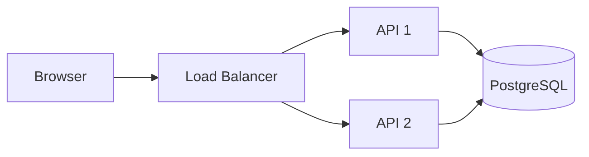

# Day 7 — Week 1 Review & Retrieval Quiz

## Goal

Prove what you can reconstruct **without notes**.

Reading something twice feels productive. Retrieving it from memory is what actually exposes gaps.

## Timebox

- 10 min — blank-page architecture
- 20 min — quiz
- 15 min — explain concepts aloud
- 10 min — reflection and corrections

---

# Part 1 — Blank page challenge

Without opening any previous file, draw:

```text
Browser → ? → ? → ? → API → Database
```

Add:

- DNS
- CDN
- load balancer

Then annotate:

- which component resolves names,
- which can serve cached content,
- which distributes requests,
- where TLS fits conceptually.

---

# Part 2 — 20-question quiz

## Request lifecycle

1. What is latency?
2. What is throughput?
3. Why can end-to-end latency be high when API execution time is low?
4. Name four network/application boundaries where failure can occur.

## HTTP / HTTPS

5. Why is `202 Accepted` useful?
6. Define idempotency.
7. Why are idempotency keys useful for retried operations?
8. Difference between `401` and `403`?
9. What does TLS provide?

## DNS / CDN

10. What problem does DNS solve?
11. What does DNS TTL control?
12. What is a CDN cache hit?
13. Why are versioned static assets excellent CDN candidates?
14. What is dangerous about publicly caching personalized data?

## Networking / realtime

15. What reliability property does TCP provide?
16. What is one reason to choose polling over WebSockets?
17. What is one reason to choose WebSockets over polling?

## Scaling

18. What does a load balancer do?
19. Why do stateless API instances scale more easily?
20. What is one downside of sticky sessions?

---

# Part 3 — Explain it like an engineer

Give yourself 90 seconds per prompt:

### Prompt A

> Explain what happens when I type a URL into a browser.

### Prompt B

> Why do we need load balancers?

### Prompt C

> Polling or WebSockets for a 45-minute transcription job?

### Prompt D

> Why might adding a CDN improve performance but complicate correctness?

If your explanation uses a technology name, explain **what requirement it satisfies**.

---

# Part 4 — Architecture debugging

Consider:



Answer:

1. What happens when API 1 fails?
2. What happens when the database fails?
3. Is the load balancer itself a dependency?
4. Where would you add caching if profile reads are repetitive?
5. What happens if API 1 stores session state locally and the next request reaches API 2?

---

# Part 5 — Score yourself

| Score | Meaning |
|---|---|
| 18–20 | Strong — move on |
| 15–17 | Good — review weak topics |
| 11–14 | Revisit 2–3 lessons before Week 2 |
| ≤10 | Rebuild the request lifecycle from scratch |

Do not optimize for the score. Optimize for being able to **explain why**.

---

# Week 1 final deliverable

Create one Mermaid diagram called:

```text
my-request-lifecycle.md
```

It should show a request from browser to database, plus a short paragraph answering:

> What are the three most likely bottlenecks in this architecture, and what evidence would I collect before changing the design?

That final sentence is the seed of everything you will do in the next 11 weeks.

---

# Part 6 — Advanced Retrieval Round

Answer without notes.

21. What is the difference between p50 and p99 latency?
22. Why can adding API replicas increase pressure on PostgreSQL?
23. What is a DNS recursive resolver?
24. Name three DNS record types and their purpose.
25. What is the difference between cache freshness and cache validation?
26. What can go wrong if a CDN cache key ignores a response-varying header?
27. Why is a POST not automatically unsafe to retry forever?
28. What does an idempotency key solve?
29. Why is a `202 Accepted` response useful for background work?
30. What is backpressure?
31. Why should a WebSocket event stream not be the durable source of truth for job progress?
32. Give one use case where SSE may be simpler than WebSockets.
33. What is the system-design relevance of HTTP/3 using QUIC?
34. Why are readiness and liveness different?
35. What is connection draining?
36. Why does “stateless service” not mean “system without state”?
37. What is a failure domain?
38. Name Google's four golden signals.
39. What evidence would justify adding Redis to a read-heavy API?
40. What evidence would tell you Redis made the system worse?

---

# Part 7 — Scenario Drills

## Scenario A — The mysterious slowdown

At 09:00:

```text
p50 = 60 ms
p95 = 130 ms
p99 = 400 ms
```

At 12:00:

```text
p50 = 65 ms
p95 = 500 ms
p99 = 4.2 s
```

CPU is 45%.

Questions:

1. Why is “CPU is fine” not enough?
2. Which downstream metrics do you inspect next?
3. What could create this tail-latency shape?
4. What change would you **not** make before evidence?

## Scenario B — Redis disappeared

Redis is used only for profile caching.

Questions:

1. Should correctness fail?
2. What new risk appears if all cache misses instantly hit PostgreSQL?
3. What mitigations could reduce a cache stampede?
4. Which metrics should alert you?

## Scenario C — Realtime progress

A 90-minute job emits progress through WebSockets. User's laptop sleeps for 10 minutes.

Questions:

1. How does the client recover?
2. Where is authoritative progress stored?
3. Does the server need to replay every percentage event?
4. Would polling have been sufficient?

---

# Part 8 — Oral Defense

Record yourself answering each in **2 minutes maximum**:

1. Trace a request from browser to database.
2. Explain HTTP idempotency to another senior engineer.
3. Explain CDN caching without using the phrase “it makes it faster” as your only justification.
4. Choose polling vs SSE vs WebSockets for transcription progress.
5. Explain how to horizontally scale a FastAPI service without overwhelming PostgreSQL.
6. Defend your `GET /users/:id` architecture.

Listen back once.

Mark any sentence where you:

- name a technology without a requirement,
- say “scalable” without explaining a limit,
- say “faster” without a metric,
- say “reliable” without a failure scenario.

That is your Week 1 correction list.

---

# Part 9 — Spaced Repetition

Schedule:

```text
+1 day   → 10-minute quiz
+7 days  → redraw request lifecycle + users API
+21 days → explain Week 1 concepts aloud
+45 days → redesign users API under a new constraint
```

Suggested new constraint at +45 days:

> 40% of users are in Europe, 35% in North America, 25% in Asia; p95 profile read latency should remain under 200 ms.

Do not solve it now. Future-you gets that problem. 😈

---

# Answer Key

A separate answer key is included as:

```text
answer-key.md
```

Do the retrieval exercises before opening it.
