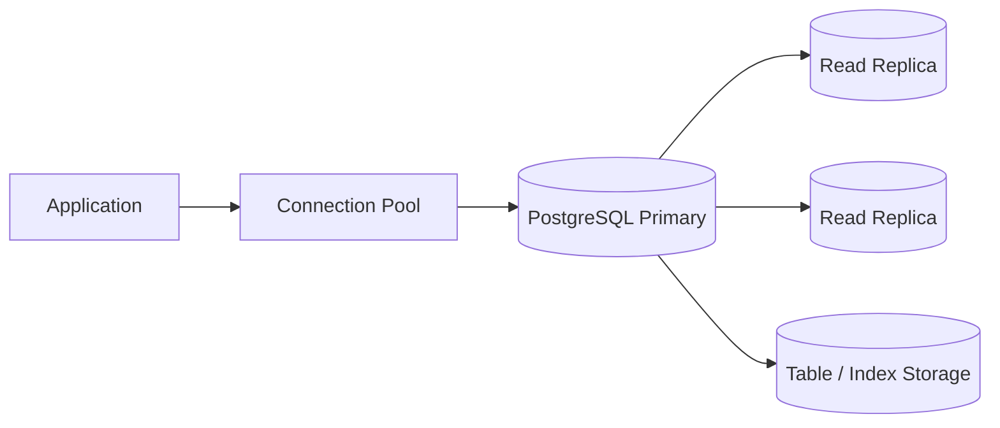

# Week 2 — Databases & Storage

## Mission

By the end of this week, you should be able to design a PostgreSQL-backed data model from requirements, explain the cost of your schema choices, and know when scaling the database means **better queries**, **more connections**, **replicas**, **partitions**, or—only much later—**shards**.

This week is not about memorizing SQL syntax. It is about building judgment around **data ownership, access patterns, consistency, and scale**.



## Reference system

Use **PostgreSQL 18** throughout the week.

Why PostgreSQL?

- mature relational model,
- excellent transactional guarantees,
- rich indexing,
- JSONB for semi-structured data,
- physical and logical replication,
- declarative partitioning,
- widely used in production SaaS systems.

The goal is not "PostgreSQL is always best." The goal is to learn durable database principles through one concrete system.

---

# Learning outcomes

By the end of Day 7, you should be able to:

- Compare SQL and NoSQL using workload requirements instead of fashion.
- Model one-to-one, one-to-many, and many-to-many relationships.
- Explain why primary keys and foreign keys are more than syntax.
- Choose useful indexes from concrete query patterns.
- Read the important parts of `EXPLAIN ANALYZE`.
- Explain transactions, ACID, MVCC, and isolation levels.
- Identify when connection count becomes a database bottleneck.
- Explain why connection pooling exists and what it cannot fix.
- Explain primary/replica architecture and replica lag.
- Distinguish replication from backups.
- Distinguish partitioning from sharding.
- Explain why sharding is usually a late-stage optimization.
- Design the persistence model for the transcription platform.
- Defend a PostgreSQL vs object-storage decision for transcript text.

---

# Daily plan

| Day | Topic | Time | Deliverable |
|---|---|---:|---|
| 1 | SQL vs NoSQL + workload-first data modeling | 60–75 min | Database decision matrix |
| 2 | Primary keys, foreign keys, constraints & relationships | 60–75 min | First transcription ER model |
| 3 | Indexes & query plans | 75–90 min | Index plan + `EXPLAIN` lab |
| 4 | Transactions, ACID, MVCC & isolation | 75–90 min | Safe job-state transaction |
| 5 | Connections, pooling & database saturation | 60–75 min | Pool sizing thought exercise |
| 6 | Replication, read replicas, partitioning & sharding | 90–120 min | Scaling decision tree |
| 7 | Design lab + review | 120 min | Full transcription data design review |

---

# The Week 2 rule

For every database decision, ask five questions:

1. **What are the dominant reads and writes?**
2. **What consistency guarantees do we need?**
3. **What grows fastest: rows, bytes, connections, or query rate?**
4. **What failure mode does this choice create?**
5. **What is the simplest design that satisfies today's requirements?**

That last question matters. A lot.

A database design that works at 100 users and can evolve cleanly is often better than a "planet scale" design that nobody can operate.

---

# How to study this week

Use the same three-layer model as Week 1.

## 🥋 Core — required

Read the daily lesson and complete the retrieval questions.

## 📚 Deep dive — recommended

Read one PostgreSQL documentation section or book section listed in [`resources.md`](./resources.md).

## 🕳️ Rabbit hole — optional

Go deeper only when the topic is especially relevant. Do not spend Tuesday accidentally implementing Raft. 😄

---

# Local lab

A PostgreSQL lab is included in [`labs/local-postgres.md`](./labs/local-postgres.md).

You'll use it to:

- create the transcription schema,
- insert sample data,
- add/remove indexes,
- run `EXPLAIN ANALYZE`,
- simulate transactions,
- inspect database sessions.

---

# Week 2 capstone

Your final design is:

```text
User
 ↓
Upload
 ↓
Job
 ↓
Chunk
 ↓
Transcript
```

But your job is to decide what those arrows **actually mean**.

You will answer questions such as:

- Can one upload have multiple jobs?
- Can a job be retried without creating duplicate chunk rows?
- Is job status authoritative in PostgreSQL?
- Should chunks be deleted after the final transcript is merged?
- Should transcript text be one row, many segment rows, JSONB, or an object in R2?
- What happens when a user deletes an upload?
- Which queries need indexes?
- What happens when the jobs table reaches 500 million rows?

There is no magic diagram. There is only **requirements → evidence → decision**.
