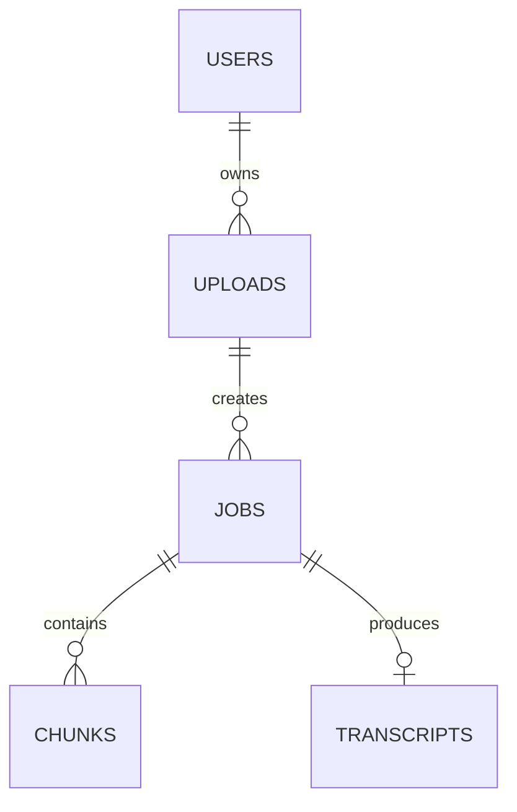

# Day 2 — Primary Keys, Foreign Keys & Relational Integrity

## Goal

Model ownership and lifecycle rules explicitly enough that the database helps protect correctness.

## Timebox

- 15 min — keys and identity
- 20 min — relationships + foreign keys
- 15 min — constraints + delete behavior
- 15 min — transcription ER model
- 10 min — retrieval quiz

---

# 1. Primary keys answer "which exact row?"

A primary key identifies a row uniquely.

```sql
CREATE TABLE users (
    id uuid PRIMARY KEY,
    email text NOT NULL UNIQUE
);
```

In PostgreSQL, a primary key implies:

```text
UNIQUE + NOT NULL
```

and PostgreSQL automatically creates a unique B-tree index for it.

But the design question comes first:

> What identity should survive across the lifetime of this entity?

---

# 2. Natural vs surrogate keys

## Natural key

A business value acts as identity.

```text
email
ISBN
country code
```

Potential problem:

Business values can change.

If email is the primary key, changing an email becomes an identity migration.

## Surrogate key

Use an artificial stable identifier:

```text
UUID
integer identity
```

Then:

```sql
id uuid PRIMARY KEY,
email text NOT NULL UNIQUE
```

Now:

```text
identity = id
business uniqueness = email UNIQUE
```

This separation is useful in SaaS systems.

---

# 3. UUIDs in a distributed application

UUIDs let application instances create identifiers without asking one central database sequence for every ID.

Tradeoffs:

- larger than a 64-bit integer,
- index locality can matter,
- easier client/service-side generation,
- convenient across distributed systems.

PostgreSQL 18 includes `uuidv7()`, which provides timestamp-ordered UUID generation and can improve locality compared with fully random UUID ordering.

You do not need UUIDv7 to pass the lesson. You need to understand why **identifier shape can affect storage/index behavior**.

---

# 4. Foreign keys answer "is this relationship valid?"

```sql
CREATE TABLE uploads (
    id uuid PRIMARY KEY,
    user_id uuid NOT NULL REFERENCES users(id)
);
```

The foreign key means:

> An upload cannot point to a user that does not exist.

That is **referential integrity**.

Without the constraint, application code can accidentally create:

```text
upload.user_id = ghost-user
```

and now your data is lying to you.

---

# 5. Relationship cardinality

## One-to-one

```text
User 1 ─── 1 UserPreferences
```

Often implemented with a unique foreign key.

## One-to-many

```text
User 1 ─── N Uploads
Upload 1 ─── N Jobs
Job 1 ─── N Chunks
```

The foreign key lives on the "many" side.

## Many-to-many

```text
Users N ─── N Teams
```

Use a join table:

```sql
CREATE TABLE team_members (
    team_id uuid REFERENCES teams(id),
    user_id uuid REFERENCES users(id),
    PRIMARY KEY (team_id, user_id)
);
```

---

# 6. Design the transcription relationships

A first version might be:



But do not blindly accept it.

Ask:

- Can an upload be reprocessed with different categories/models?
- If yes, one upload may have many jobs.
- Can one job have multiple transcript versions?
- Do chunks belong to the job or upload?
- Does a transcript exist before a job completes?

Your cardinality comes from product behavior.

---

# 7. Delete behavior is architecture

Imagine deleting a user.

Options include:

```text
RESTRICT
CASCADE
SET NULL
application-managed deletion
```

Example:

```sql
user
 ↓ CASCADE
uploads
 ↓ CASCADE
jobs
 ↓ CASCADE
chunks
```

Looks convenient.

But what about:

```text
R2 video
R2 transcript export
billing records
audit records
```

A database cascade cannot delete external objects atomically.

This becomes a distributed workflow.

Important lesson:

> Database referential integrity and cross-system lifecycle management are different problems.

---

# 8. Foreign-key indexing trap

PostgreSQL automatically indexes the **referenced** primary/unique key.

It does **not automatically create an index on the referencing foreign-key column**.

For example:

```sql
jobs(user_id)
```

If you frequently query:

```sql
SELECT * FROM jobs WHERE user_id = $1;
```

or delete a user and PostgreSQL needs to find dependent rows, an index on `jobs.user_id` may be very important.

```sql
CREATE INDEX idx_jobs_user_id ON jobs(user_id);
```

This is one of those tiny details that becomes a very non-tiny production problem.

---

# Exercise — First transcription schema

Design tables for:

```text
users
uploads
jobs
chunks
transcripts
```

For each table define:

- primary key,
- required fields,
- foreign keys,
- uniqueness constraints,
- lifecycle/delete behavior.

Then answer:

1. Can one upload have several jobs?
2. Can two chunks share the same `(job_id, chunk_index)`?
3. What prevents duplicate chunk indexes?
4. Should deleting a job delete its chunks?
5. Should deleting a user immediately cascade everything?

Hint for #3:

```sql
UNIQUE (job_id, chunk_index)
```

---

# Break it 💥

Predict the bad data each missing constraint allows:

1. No primary key on `chunks`.
2. No FK between `jobs.upload_id` and `uploads.id`.
3. No `NOT NULL` on `jobs.status`.
4. No uniqueness rule on `(job_id, chunk_index)`.
5. `ON DELETE CASCADE` everywhere without thinking about audit retention.

---

# Retrieval quiz

1. What guarantees does a PostgreSQL primary key provide?
2. Natural key vs surrogate key?
3. Why might email be a poor primary key?
4. What does a foreign key protect?
5. Where does the foreign key live in a one-to-many relationship?
6. Does PostgreSQL automatically index a referencing FK column?
7. Why can `ON DELETE CASCADE` be dangerous in a system using object storage?
8. What constraint would prevent two chunk rows with the same index for one job?

## Exit criterion

You can draw the transcription ER model and explain every relationship and constraint as a product rule—not just as SQL syntax.
