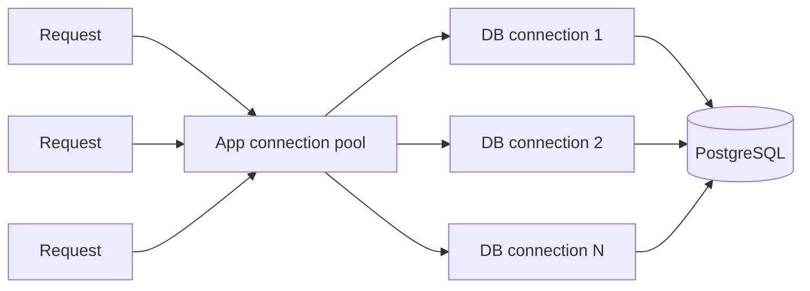
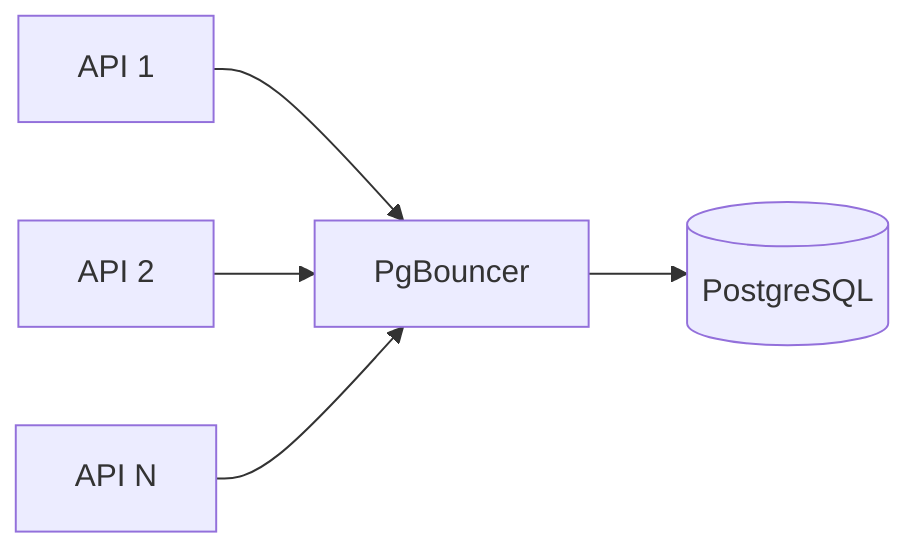

# Day 5 — Connections, Pooling & Database Saturation

## Goal

Understand why "the API can scale horizontally" does not mean "the database can accept infinite connections," and learn how connection pooling protects PostgreSQL from connection explosions.

## Timebox

- 15 min — connection cost
- 20 min — app pools vs PgBouncer
- 15 min — pool sizing
- 15 min — failure/saturation exercise
- 10 min — retrieval quiz

---

# 1. Database connections are not free

A PostgreSQL connection consumes server resources.

If you deploy:

```text
20 API instances
× 20 DB connections each
= 400 potential connections
```

then autoscaling to 100 API instances means:

```text
100 × 20 = 2,000
```

Your stateless API layer just created a stateful database problem. 🎉

---

# 2. Why opening a connection per request is bad

Naive flow:

```text
HTTP request
 ↓
open PostgreSQL connection
 ↓
query
 ↓
close connection
```

Repeated connection setup adds overhead and can overwhelm the database under bursts.

Instead applications typically reuse a bounded pool.



---

# 3. Pooling is controlled scarcity

A pool says:

> We have N expensive database connections. More application requests can wait instead of creating unlimited DB work.

This introduces **backpressure**.

Possible states:

```text
request gets connection immediately
request waits briefly
request times out waiting
```

That waiting time is an important metric.

---

# 4. Bigger pools are not automatically faster

Suppose PostgreSQL can efficiently execute 80 concurrent queries for your workload.

A pool of 800 may create:

- context switching,
- memory pressure,
- lock contention,
- storage I/O contention,
- worse tail latency.

This is a general systems lesson:

> Concurrency beyond the bottleneck increases queueing; it does not create capacity.

---

# 5. Client-side pool vs PgBouncer

Most application/database drivers have connection pooling.

But many application instances can still multiply the total connection count.

PgBouncer sits between clients and PostgreSQL:



PgBouncer can reuse a smaller number of PostgreSQL server connections across many client connections.

---

# 6. PgBouncer pooling modes

## Session pooling

A server connection belongs to a client for the client session.

```text
most PostgreSQL features work
less aggressive multiplexing
```

## Transaction pooling

A server connection is assigned only for the duration of a transaction, then returned to the pool.

```text
more multiplexing
some session-level PostgreSQL features become incompatible
```

## Statement pooling

Most aggressive; multi-statement transactions are not allowed.

For a normal FastAPI/PostgreSQL application, you should understand session vs transaction pooling before considering anything else.

---

# 7. Pooling cannot fix a slow query

If one query takes 10 seconds because it scans 100M rows:

```text
PgBouncer + 10-second query = still a 10-second query
```

Pooling helps manage connection/concurrency pressure.

It does not replace:

- indexes,
- query optimization,
- sufficient CPU/RAM/I/O,
- good transaction design.

---

# 8. Pool sizing thought model

Do not memorize a universal pool formula.

Start with:

```text
DB capacity
expected query duration
request concurrency
number of app instances
headroom
```

Then measure:

```text
active DB connections
waiting clients
query latency p95/p99
CPU
I/O
locks
pool wait time
```

If application pods autoscale, the **sum** of their pools matters.

---

# 9. Transcription workload nuance

Your transcription workers should not each hold DB connections while doing 5 minutes of AI processing.

Bad:

```text
BEGIN transaction
 ↓
call transcription provider for 5 min
 ↓
UPDATE database
 ↓
COMMIT
```

Better:

```text
read needed metadata
release DB connection
perform slow external work
acquire connection
write result in short transaction
release connection
```

Database connections should not babysit remote AI calls.

---

# Exercise — Connection explosion

Assume:

```text
API instances: 30
Worker instances: 80
API pool size: 10
Worker pool size: 5
```

Calculate maximum potential DB connections.

Then traffic doubles and autoscaling doubles both instance counts.

Answer:

1. What is the new theoretical connection count?
2. What would you measure first?
3. Where could PgBouncer help?
4. What happens if pool wait time grows while DB CPU is only 25%?
5. What happens if pool wait time grows and DB CPU is 100%?

Those two last situations have different root causes.

---

# Break it 💥

Predict the failure mode:

1. Every request opens a new connection.
2. Every service has a pool of 100 "to be safe."
3. Workers hold transactions open while calling an AI provider.
4. PgBouncer transaction pooling is enabled but the app relies on session-level state.
5. Pool size is increased whenever latency rises, without checking DB saturation.

---

# Retrieval quiz

1. Why are DB connections a finite resource?
2. What problem does an application connection pool solve?
3. What is backpressure in this context?
4. Why can a larger pool make latency worse?
5. What additional problem appears when many app instances each have a pool?
6. What does PgBouncer do?
7. Session pooling vs transaction pooling?
8. Why should workers release DB connections during long external AI calls?
9. Name five metrics useful for diagnosing DB connection saturation.

## Exit criterion

You can explain the path from "we horizontally scaled FastAPI" to "we accidentally exhausted PostgreSQL connections," and propose a measured pooling strategy.
