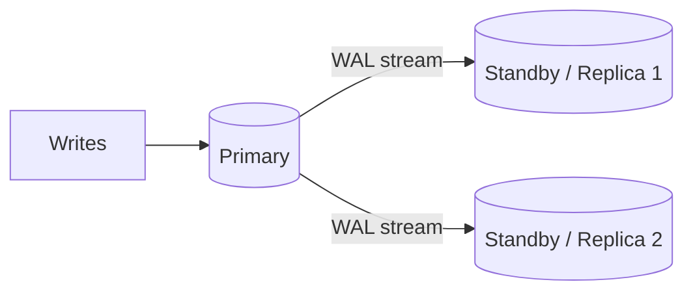
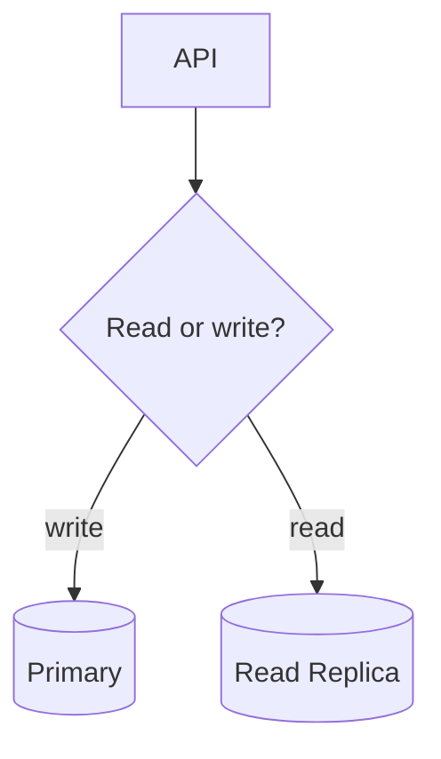
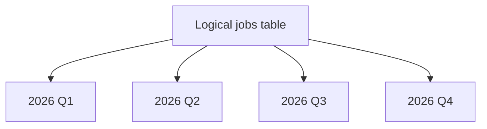
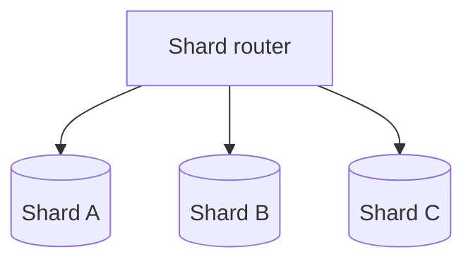

# Day 6 — Replication, Read Replicas, Partitioning & Sharding

## Goal

Learn four words people often throw into one "scale the database" bucket—and understand that they solve different problems.

## Timebox

- 25 min — replication + read replicas
- 15 min — replica lag + consistency
- 20 min — partitioning
- 25 min — sharding
- 20 min — scaling decision exercise
- 10 min — retrieval quiz

---

# 1. Start with the bottleneck

Database "scale" can mean different things:

```text
Need higher availability?        → replication/failover
Too many read queries?           → read replicas/cache/query tuning
One huge table is unwieldy?      → partitioning might help
One server cannot hold/serve data? → sharding may eventually help
Too many DB connections?         → pooling, not sharding
Slow query?                      → index/query plan, not replicas by default
```

The technology comes **after** the bottleneck.

---

# 2. Replication

Replication copies changes from one database server to another.

Simplified PostgreSQL physical streaming architecture:



Possible goals:

- failover/high availability,
- disaster recovery building block,
- read scaling,
- maintenance/migration options.

Replication is **not the same thing as a backup**.

If you accidentally delete data and that delete replicates, congratulations: the replicas can faithfully copy your mistake. 😅

You still need backups/PITR strategy.

---

# 3. Synchronous vs asynchronous replication

## Asynchronous

Primary can commit before a replica confirms applying/receiving the change (exact semantics depend on configuration).

Pros:

- lower write latency,
- replica network does not necessarily sit directly on every commit path.

Tradeoff:

- replica can lag,
- failover can risk losing the most recent changes depending on durability configuration/state.

## Synchronous

Commit waits for configured standby acknowledgment.

Pros:

- stronger durability/failover guarantees.

Tradeoff:

- write latency now includes more distributed coordination,
- slow/unavailable synchronous standby can hurt write availability/latency depending on setup.

Classic distributed systems law:

> Stronger guarantees usually move cost somewhere visible.

---

# 4. Read replicas

A hot standby can accept read-only queries.



Possible read-replica candidates:

```text
analytics dashboard
historical job list
internal reporting
large exports
```

But think about **read-after-write consistency**.

User starts a job:

```text
POST /jobs → primary commits job
GET /jobs/123 → routed immediately to lagging replica
```

Replica says:

```text
404
```

The data exists. The replica simply has not caught up yet.

Solutions can include:

- route freshness-sensitive reads to primary,
- accept eventual consistency,
- session stickiness/read-your-writes techniques,
- wait for replication position in advanced designs.

Do not casually put all GET requests on replicas.

---

# 5. Physical vs logical replication

## Physical replication

Replicates lower-level database changes/WAL to maintain standby servers.

Excellent for PostgreSQL HA/read replica patterns.

## Logical replication

Replicates selected logical data changes using publication/subscription concepts.

Useful for:

- subset of tables,
- migrations,
- version/platform transitions,
- feeding another PostgreSQL system,
- selective data distribution.

Different tool, different goal.

---

# 6. Partitioning

Partitioning splits **one logical table** into smaller physical tables/partitions inside the PostgreSQL system.



PostgreSQL supports:

```text
RANGE
LIST
HASH
```

Potential benefits:

- prune irrelevant data during queries,
- easier lifecycle/drop of old ranges,
- maintenance of very large tables,
- potentially smaller per-partition indexes.

But partitioning adds:

- schema/operational complexity,
- partition-key constraints,
- planning overhead if designed badly,
- migration complexity.

Do not partition a 100k-row table because the diagram looks advanced.

---

# 7. Partition-key choice

Imagine partitioning `jobs`.

## By `created_at`

Useful if:

- most queries target time windows,
- retention deletes old data,
- data is naturally append-heavy.

## By `user_id` hash

Could distribute rows more evenly across partitions, but may not help queries that do not include the partition key.

The best partition key follows access and lifecycle patterns.

---

# 8. Sharding

Sharding distributes data across **independent database nodes**.



Possible rule:

```text
hash(user_id) → shard
```

Now each node stores only part of the total dataset.

This can increase total write/storage capacity.

It also creates hard problems:

- cross-shard joins,
- cross-shard transactions,
- rebalancing,
- hot shards,
- global uniqueness,
- operational failover per shard,
- schema migrations everywhere,
- routing metadata,
- observability complexity.

Sharding is powerful.

Sharding is also a bill you should not pay before the bottleneck exists.

---

# 9. Partitioning ≠ sharding

## Partitioning

```text
one PostgreSQL system
one logical table
multiple physical partitions
```

## Sharding

```text
multiple independent database nodes
subset of data on each node
application/middleware must route requests
```

A database can be partitioned without being sharded.

A sharded system may additionally partition tables inside each shard.

---

# 10. Transcription platform scaling path

A sane evolution may look like:

```text
1. Single PostgreSQL primary
      ↓
2. Better indexes/query plans
      ↓
3. Connection pooling
      ↓
4. Larger DB instance / storage tuning
      ↓
5. Read replica for suitable reads
      ↓
6. Partition giant append-heavy tables if evidence supports it
      ↓
7. Shard only if one-node write/storage ceiling becomes real
```

Not:

```text
MVP → Kafka → 12 shards → existential regret
```

---

# Exercise — Pick the scaling mechanism

For each symptom, choose the **first thing you would investigate**, then a likely technique.

### A

`GET /jobs` p99 is high; one query does sequential scans over 80M rows.

### B

Primary CPU is 35%, but app instances frequently fail to obtain DB connections.

### C

Analytics queries consume most primary I/O but can tolerate 5 seconds of staleness.

### D

Deleting 3 years of audit rows creates massive maintenance pressure; queries are almost always date-bounded.

### E

One database server is genuinely at storage/write throughput limits even after optimization; dataset and write load keep doubling.

Candidates:

```text
index/query tuning
pooling
read replica
partitioning
sharding
```

Explain why the tempting wrong answers are wrong.

---

# Break it 💥

1. Replica lag is 8 seconds. Which endpoints break semantically?
2. Primary dies. What determines whether failover loses recent data?
3. You delete a transcript by mistake. Why don't replicas replace backups?
4. You partition by `user_id`, but all cleanup is time-based. What got harder?
5. One enterprise tenant produces 40% of writes and you shard by tenant. What is a hot shard?
6. You need a transaction touching users on two shards. What complexity appeared?

---

# Retrieval quiz

1. What problem does replication solve?
2. Why is replication not a backup?
3. Async vs synchronous replication tradeoff?
4. What is replica lag?
5. Give a read-after-write anomaly caused by a replica.
6. What is a hot standby/read replica?
7. Physical vs logical replication?
8. What does partitioning do?
9. Name PostgreSQL's three declarative partitioning strategies.
10. Why can partitioning help retention deletes?
11. What is sharding?
12. Name four new problems sharding creates.
13. Why should sharding usually be a late-stage choice?
14. Partitioning vs sharding in one sentence?

## Exit criterion

Given a database bottleneck, you can choose among query tuning, pooling, replicas, partitioning, and sharding based on the actual constraint rather than "scale" as a vague word.
