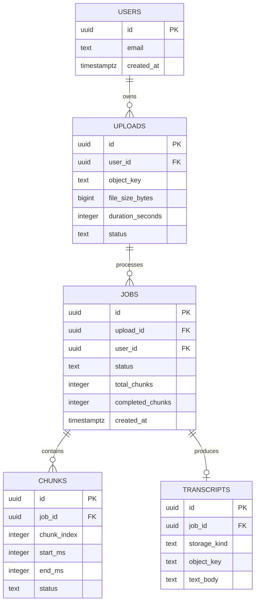

# Day 7 — Design Lab: Data Model for the Transcription Platform

## Mission

Design the persistence layer for a video transcription SaaS where most videos are longer than one hour.

Today combines:

- relational modeling,
- keys/constraints,
- indexes,
- transactions,
- connection pressure,
- replication,
- partitioning/sharding judgment,
- PostgreSQL vs object-storage tradeoffs.

Do not chase the "perfect schema."

Practice the **decision process**.

## Timebox

- 15 min — requirements
- 15 min — access patterns + scale assumptions
- 25 min — logical model
- 20 min — physical PostgreSQL schema
- 15 min — indexes
- 15 min — transaction invariants
- 20 min — transcript storage decision
- 15 min — scale/failure review
- 10 min — write design conclusion

---

# Scenario

The platform accepts long video uploads and asynchronously produces categorized transcripts.

Starting relationship:

```text
User
 ↓
Upload
 ↓
Job
 ↓
Chunks
 ↓
Transcript
```

Your task is to turn this sketch into a defensible persistence design.

---

# Step 1 — Functional requirements

The system must support:

- users owning uploads,
- videos commonly 1–3 hours long,
- resumable upload metadata,
- multiple processing attempts/configurations for one upload,
- chunk-based processing,
- chunk-level retries,
- job progress,
- final transcript retrieval,
- category extraction results,
- exports,
- GDPR deletion workflows.

---

# Step 2 — Non-functional requirements

Assume:

```text
strong ownership integrity
job status should be authoritative
chunk retries must be idempotent
job history should load quickly
completed transcript read can tolerate object-storage fetch latency
raw videos are GB-scale
```

Possible future scale:

```text
100,000 registered users
10,000 uploads/day
average video duration = 90 min
~90 chunks/video if 60-second chunks
~900,000 new chunk rows/day
```

Do the arithmetic yourself for:

```text
30 days
1 year
```

Now "chunks is a big table" becomes concrete instead of vibes.

---

# Step 3 — Define entities

At minimum:

```text
users
uploads
jobs
chunks
transcripts
```

Optional:

```text
categories
transcript_segments
exports
job_events
```

For each entity write:

```text
identity:
ownership:
lifecycle:
write frequency:
read patterns:
size:
```

---

# Step 4 — Decide cardinality

Answer before reading further:

```text
User 1 → N Uploads ?
Upload 1 → N Jobs ?
Job 1 → N Chunks ?
Job 1 → 1 Transcript ?
Transcript 1 → N Segments ?
```

Question:

> If the user reprocesses the same upload with a different language/model/category set, is that a new job or mutation of the old job?

A good audit/debugging story often favors immutable-ish job attempts over overwriting history.

But state your own requirement.

---

# Step 5 — Draft the ER diagram

Start here and modify it:



Notice the deliberate awkwardness:

```text
transcripts has both object_key and text_body
```

You must decide whether that is appropriate.

---

# Step 6 — Ownership duplication question

`jobs` can infer user through:

```text
jobs.upload_id
   ↓
uploads.user_id
```

So should `jobs` also contain `user_id`?

Arguments for normalization:

```text
avoid duplicated ownership truth
```

Arguments for denormalization:

```text
job-history query can filter directly by user_id
simpler authorization query
possible partition/sharding key later
```

But duplication creates a consistency invariant:

```text
jobs.user_id must equal uploads.user_id
```

PostgreSQL cannot express every cross-table equality invariant as a simple CHECK.

Decide deliberately.

---

# Step 7 — Constraints

At minimum consider:

```sql
users.email UNIQUE
chunks(job_id, chunk_index) UNIQUE
transcripts.job_id UNIQUE
```

And sensible:

```text
NOT NULL
FK relationships
status CHECK or enum/domain strategy
positive duration/file sizes
```

Write the invariants first; then choose SQL constraints.

---

# Step 8 — Index from queries

Design indexes for these operations.

## Job history

```sql
SELECT id, status, created_at
FROM jobs
WHERE user_id = $1
ORDER BY created_at DESC
LIMIT 50;
```

## Job status

```sql
SELECT status, completed_chunks, total_chunks
FROM jobs
WHERE id = $1;
```

Primary key already helps here.

## Merge chunks

```sql
SELECT chunk_index, text
FROM chunks
WHERE job_id = $1
ORDER BY chunk_index;
```

## Retry queue lookup

```sql
SELECT id
FROM chunks
WHERE status = 'retryable'
  AND next_retry_at <= now()
ORDER BY next_retry_at
LIMIT 100;
```

Could a partial index be useful?

---

# Step 9 — Transaction invariants

Design atomic transitions for:

## A. Upload completion

```text
upload.pending → upload.ready
create processing job exactly once
```

What prevents duplicate jobs if the client retries `complete`?

## B. Chunk completion

```text
store chunk result
mark chunk done
update job progress exactly once
```

## C. Job finalization

```text
all chunks done
create transcript exactly once
mark job complete
```

For each write:

```text
invariant:
transaction boundary:
unique constraint:
retry behavior:
```

---

# Step 10 — The big question

> Should transcript text live in PostgreSQL or object storage?

Do not answer with ideology.

Evaluate both.

## Option A — PostgreSQL `text`

Potential advantages:

- transactional with metadata,
- simple fetch,
- searchable/queryable,
- easy row-level ownership model,
- backups include transcript content.

Potential costs:

- large text increases DB size,
- backups/replication carry all transcript bytes,
- primary database storage becomes expensive/heavy,
- serving large documents uses DB connections/bandwidth.

## Option B — Object storage

Store:

```text
transcript.json
transcript.txt
```

PostgreSQL stores:

```text
object_key
checksum
byte_size
version
```

Potential advantages:

- cheap scalable blob storage,
- DB stays focused on metadata/state,
- easy lifecycle policies,
- large artifacts don't inflate replicas/backups as much.

Potential costs:

- DB row and object cannot commit atomically together,
- extra network fetch,
- full-text/ad-hoc SQL search is harder,
- orphan/missing object lifecycle must be handled.

## Option C — Hybrid

For example:

```text
PostgreSQL:
- searchable segments / metadata / category results

Object storage:
- canonical full transcript artifact
- export formats
```

Or:

```text
PostgreSQL full text initially
→ move canonical large artifact to R2 when size/scale proves necessary
```

The correct answer depends on:

```text
transcript size
dominant read pattern
search requirements
retention
backup/replication cost
export behavior
consistency requirements
```

Write your decision in an ADR-style paragraph.

---

# Step 11 — Growth analysis

Assume:

```text
900,000 chunk rows/day
```

Ask:

- When do chunk rows get deleted?
- Do we retain them after the final transcript exists?
- Are they audit data or temporary workflow state?
- Is time-based partitioning useful?
- Which query would benefit from partition pruning?
- Would partitioning make deletion/retention easier?

Then ask:

> Do we need sharding?

Your default answer should not be "yes because 900k/day sounds big."

Estimate first.

Consider:

- row size,
- actual table/index size,
- write IOPS,
- query rate,
- PostgreSQL node capacity,
- retention period.

---

# Step 12 — Read replica decision

Which reads can tolerate replica lag?

Possible:

```text
historical completed-job analytics
admin reporting
large export/report queries
```

Potentially freshness-sensitive:

```text
GET /jobs/{id} immediately after creation
job progress
billing/entitlement changes
```

Classify each endpoint.

---

# Step 13 — Failure analysis

Complete this table.

| Failure | User-visible effect | Correctness risk | Mitigation |
|---|---|---|---|
| Primary PostgreSQL unavailable | ? | ? | ? |
| Read replica 10s behind | ? | ? | ? |
| PgBouncer pool exhausted | ? | ? | ? |
| R2 transcript object missing | ? | ? | ? |
| Duplicate worker runs chunk | ? | ? | ? |
| Transaction deadlocks | ? | ? | ? |
| Partition maintenance fails | ? | ? | ? |

---

# Step 14 — Write the design review

Use:

```text
1. Requirements
2. Access patterns
3. Scale assumptions
4. Entity model
5. Constraints
6. Index strategy
7. Transaction invariants
8. Transcript storage decision
9. Connection strategy
10. Read scaling strategy
11. Partition/sharding strategy
12. Failure handling
13. GDPR deletion lifecycle
14. Tradeoffs
15. Open questions
```

---

# Final challenge

Explain your design in **5 minutes without notes**.

You must answer:

1. Why PostgreSQL?
2. Why these tables?
3. What are your three most important constraints?
4. What are your three most important indexes?
5. What transaction is most correctness-sensitive?
6. PostgreSQL or R2 for transcript text—and why?
7. When would you add a read replica?
8. When would you partition?
9. What evidence would make you shard?

If you can answer those cleanly, Week 2 did its job.
