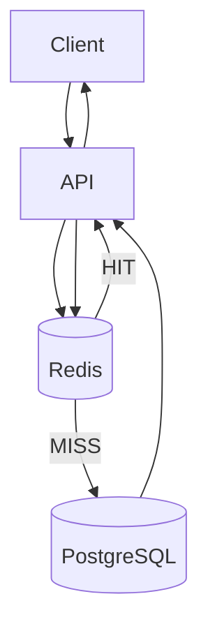
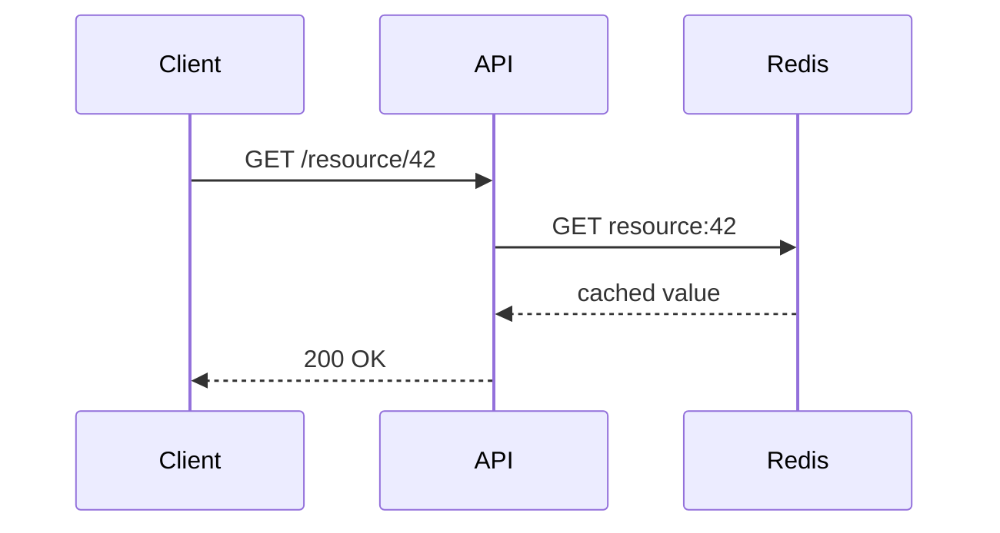
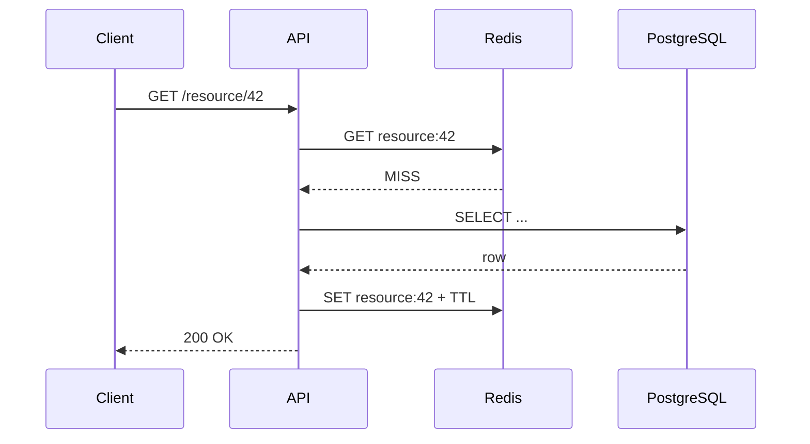

# Week 3 — Caching with Redis

## Mission

By the end of this week, you should be able to introduce a cache into a system **without treating it like magic**.

You will learn how Redis changes the latency, load, failure, and consistency profile of a system—and how to decide whether caching is actually justified.

The reference architecture is:



This week is not about memorizing Redis commands.

It is about learning a more important skill:

> **Cache only when you can explain what becomes faster, what becomes stale, and what new failure mode you just introduced.**

---

# Learning outcomes

By the end of Day 7, you should be able to:

- Explain what a cache is and what problem it solves.
- Explain why Redis is commonly used as a distributed cache.
- Distinguish a source of truth from a derived cached copy.
- Implement and explain the cache-aside pattern.
- Calculate and reason about cache hit ratio.
- Choose a TTL from a staleness requirement instead of guessing.
- Distinguish expiration from eviction.
- Explain write invalidation and common invalidation races.
- Explain negative caching and when it is useful.
- Explain cache stampede / thundering-herd behavior.
- Explain hot keys and why sharding alone does not eliminate them.
- Distinguish local, distributed, and multi-level caches.
- Explain at a high level how Redis Cluster distributes keys.
- Design cache keys deliberately.
- Decide whether the transcription platform should cache job state, user metadata, transcript results, or nothing at all.
- Design a low-latency URL-shortening service using PostgreSQL + Redis.
- Defend your design using latency, freshness, load, memory, failure, and cost.

---

# Daily plan

| Day | Topic | Time | Deliverable |
|---|---|---:|---|
| 1 | Cache fundamentals + Redis mental model | 60–75 min | Cache suitability matrix |
| 2 | Cache-aside, hits, misses & key design | 75–90 min | Working cache-aside flow |
| 3 | TTL, expiration, eviction & invalidation | 75–90 min | Freshness policy |
| 4 | Stampedes, hot keys & negative caching | 90 min | Failure mitigation playbook |
| 5 | Distributed caching & Redis Cluster | 90–120 min | Distributed-cache architecture |
| 6 | Reliability, observability & transcription cache review | 90 min | Cache design review |
| 7 | URL shortener system-design capstone | 120–150 min | Full system design + ADR |

---

# The Week 3 rule

For every cached value, answer these seven questions:

1. **What is the authoritative source?**
2. **Why is this value worth caching?**
3. **What is the cache key?**
4. **How stale may the value become?**
5. **How does it get invalidated?**
6. **What happens when Redis is unavailable?**
7. **What evidence tells us the cache is helping?**

If you cannot answer those questions, adding Redis is probably premature.

---

# Core architecture

## Cache hit



## Cache miss



---

# How to study

Use three layers.

## 🥋 Core — required

Read the lesson and complete the retrieval quiz.

## 🧪 Lab — required

Run Redis locally and execute the commands or code for the day.

## 📚 Deep dive — recommended

Read one authoritative source from [`resources.md`](./resources.md).

## 🕳️ Rabbit hole — optional

Explore advanced internals only after you can explain the basic tradeoff clearly.

Do not spend an evening learning every Redis data structure before you can answer:

> “Why are we caching this thing?”

---

# Week 3 capstone

Design a URL shortener:

```text
POST /links
      ↓
PostgreSQL
      ↓
short_code

GET /{short_code}
      ↓
Redis?
      ↓
PostgreSQL on MISS
      ↓
redirect
```

Your design must reason about:

- redirect latency,
- read/write ratio,
- unique short-code generation,
- database indexes,
- cache hit ratio,
- TTL,
- expiration,
- deleted links,
- hot/popular URLs,
- stampede behavior,
- Redis outage,
- edge/CDN caching,
- `301` vs `302/307`,
- metrics,
- cost.

The point is not to draw Redis in the middle.

The point is to explain **why it is there**.
