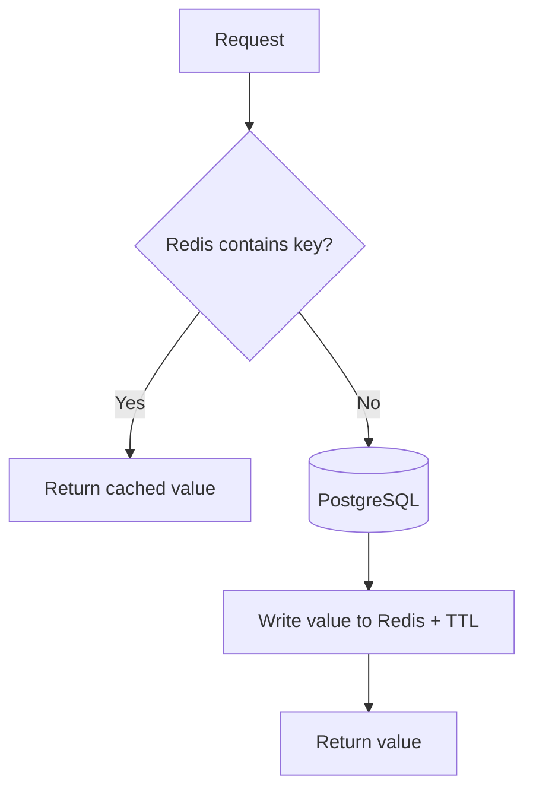
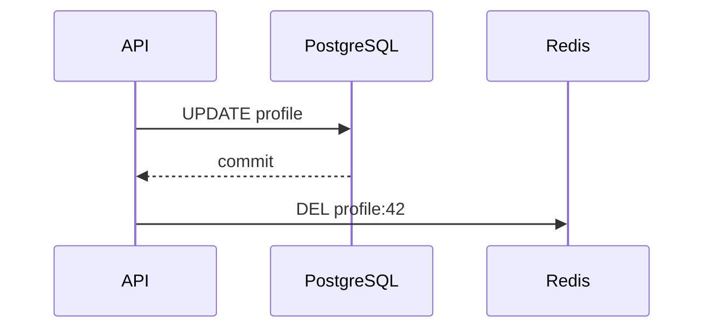

# Day 2 — Cache-Aside, Hits, Misses & Key Design

## Goal

Implement the cache-aside pattern and reason about key design, misses, negative caching, and cache correctness.

## Timebox

- 20 min — cache-aside
- 15 min — key design
- 15 min — negative caching
- 25 min — code lab
- 10 min — failure exercise
- 10 min — retrieval quiz

---

# 1. Cache-aside

The application owns the caching logic.

Read path:



Pseudo-code:

```python
def get_profile(user_id):
    key = f"profile:{user_id}"

    cached = redis.get(key)

    if cached is not None:
        return deserialize(cached)

    profile = postgres.get_profile(user_id)

    if profile is None:
        return None

    redis.set(key, serialize(profile), ex=300)

    return profile
```

The critical property:

```text
PostgreSQL remains authoritative.
```

---

# 2. Why "aside"?

Redis does not magically query PostgreSQL.

Your application explicitly:

```text
checks cache
falls back to DB
fills cache
```

This gives flexibility.

It also makes your application responsible for:

- invalidation,
- TTL,
- serialization,
- miss behavior,
- race conditions,
- failures.

---

# 3. Cache hit

```text
GET profile:42
→ value
```

Request avoids the origin.

Useful metric:

```text
cache_hit = true
```

You want traces/logs that can tell hit and miss paths apart.

Otherwise one endpoint can have two radically different latency profiles and you will not know why.

---

# 4. Cache miss

Misses are normal.

A cold cache starts with almost nothing:

```text
Redis = empty
```

Initial traffic gradually warms it.

But a miss has extra work:

```text
Redis check
+
PostgreSQL read
+
Redis fill
```

So miss latency can be slightly worse than having no cache at all.

That is okay if repeated hits repay the cost.

---

# 5. Key design is architecture

Bad:

```text
42
```

Better:

```text
profile:42
```

More explicit:

```text
prod:profile:v1:42
```

Useful concerns:

- namespace,
- environment,
- entity type,
- entity ID,
- schema/version,
- tenant when applicable.

Example:

```text
tenant:acme:url:abc123
```

But do not make 400-byte keys just to admire your naming scheme.

---

# 6. Versioning keys

Suppose the cached JSON shape changes.

Old:

```json
{"name":"Ada"}
```

New:

```json
{"displayName":"Ada","avatarUrl":"..."}
```

A versioned key:

```text
profile:v2:42
```

can avoid attempting to deserialize old cached values.

Eventually v1 keys expire or are deleted.

This can be simpler than a full cache migration.

---

# 7. Cache full objects or fragments?

Option A:

```text
profile:42 -> entire JSON
```

Option B:

```text
profile:42:name
profile:42:avatar
profile:42:bio
```

Whole-object caching:

- simple,
- fewer round trips,
- easy invalidation.

Fragment caching:

- can avoid large rewrites,
- can update parts,
- increases key/consistency complexity.

Choose from access patterns.

---

# 8. Missing records create traffic too

Imagine bots repeatedly request:

```text
GET /users/does-not-exist
```

If "not found" is never cached:

```text
Redis miss
↓
PostgreSQL lookup
↓
404
```

every single time.

This is **cache penetration**.

One mitigation is negative caching:

```text
profile:missing-user -> NOT_FOUND
TTL = 20 seconds
```

Now repeated misses can avoid hammering the origin.

But negative caching introduces a freshness problem:

```text
record did not exist
↓
negative cache stored
↓
record is created
↓
cache still says NOT_FOUND
```

So negative TTLs are usually short.

---

# 9. Cache-aside write path

Suppose profile 42 changes.

A common pattern:

```text
1. Write PostgreSQL.
2. Delete Redis key.
```



The next read repopulates the cache.

Why delete instead of blindly updating both?

Because keeping two writable copies synchronized is harder than keeping one authority plus a disposable derived copy.

---

# 10. A subtle failure

What if:

```text
PostgreSQL update succeeds
Redis DEL fails
```

Then stale cache data remains.

TTL provides an upper bound if every cache item expires.

For stricter requirements, you may need stronger invalidation mechanisms, events, or a transactional outbox-style design.

The correct choice depends on the staleness tolerance.

---

# 11. Read-your-own-write

A user updates their profile and immediately reloads.

If Redis still contains the old value, the product feels broken.

Options:

- invalidate synchronously after DB commit,
- bypass cache immediately after the write,
- use a very short TTL,
- update cache carefully,
- accept temporary staleness if UX permits.

"Eventually consistent" is not a magical excuse for bad UX.

---

# Lab — cache-aside

Run:

[`labs/cache_aside_demo.py`](./labs/cache_aside_demo.py)

Observe:

```text
first read  → MISS
second read → HIT
update DB
invalidate
next read   → MISS
following   → HIT
```

Add logging for:

```text
CACHE HIT
CACHE MISS
CACHE INVALIDATE
```

---

# Exercise — design cache keys

Design keys for:

1. URL redirect target.
2. User profile.
3. Transcription job summary.
4. Plan/pricing configuration.
5. Missing short code.

For each, specify:

```text
key
value
TTL
source of truth
invalidation event
```

---

# Break it 💥

Consider:

```text
A reads DB value V1 after cache miss
B updates DB to V2 and deletes cache
A then writes V1 into Redis
```

Now Redis is stale again.

This is one of the classic cache-aside race shapes.

You do not need to solve every race today.

But you must learn to **see it**.

Possible mitigations later include:

- version checks,
- shorter TTL,
- delayed/double invalidation in some workloads,
- event-driven refresh,
- locking/single-flight,
- accepting bounded staleness.

---

# Retrieval quiz

1. What steps happen on a cache-aside miss?
2. Who owns cache-aside logic?
3. Why can miss latency be worse than no-cache latency?
4. Why might keys include a schema version?
5. What is negative caching?
6. What is cache penetration?
7. Why are negative TTLs often shorter?
8. What happens if DB update succeeds but cache invalidation fails?
9. Why is "write DB then delete cache" a common pattern?
10. Describe one cache-aside race.

## Exit criterion

You can draw cache-aside from memory and explain both its **performance benefit** and its **consistency weakness**.
