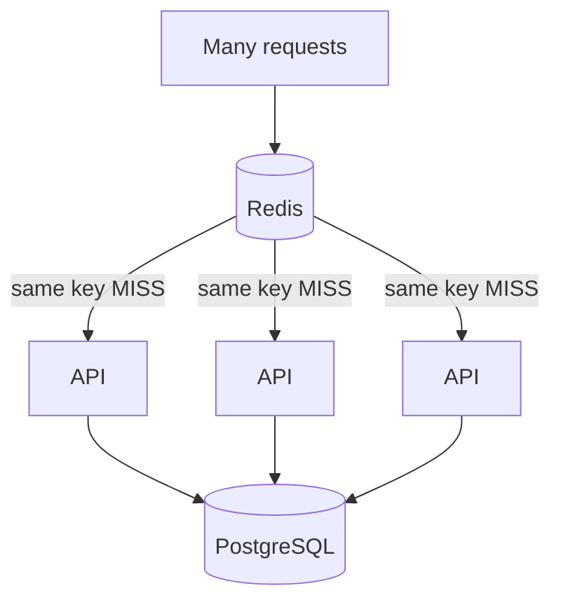

# Day 4 — Cache Stampedes, Hot Keys & Negative Caching

## Goal

Understand the failure patterns that appear only after your cache becomes popular enough to matter.

## Timebox

- 20 min — stampede / thundering herd
- 20 min — hot keys
- 15 min — negative caching / penetration
- 20 min — mitigation patterns
- 15 min — incident exercise
- 10 min — retrieval quiz

---

# 1. A cache can amplify failure

Caching reduces origin load during normal operation.

That can make the origin **less prepared** for a sudden wave of misses.

Example:

```text
steady state:
100,000 req/s
99% cache hit

DB receives ~1,000 req/s
```

Then the cache disappears.

```text
DB suddenly sees ~100,000 req/s
```

Your cache outage becomes a database outage.

This is why:

> Cache failure strategy is part of database capacity planning.

---

# 2. Cache stampede

Suppose a highly popular key expires.

At the same instant:

```text
10,000 requests
↓
all MISS
↓
10,000 origin reads
```

This is a cache stampede / thundering herd.

Diagram:



The cache intended to protect the DB.

At expiry time, it attacks the DB. Charming. 😅

---

# 3. Mitigation: request coalescing / single flight

Allow only one request to rebuild the value.

Conceptually:

```text
MISS
 ↓
Does another worker own refresh?
 ├─ yes → wait/use stale value
 └─ no  → fetch DB and refill
```

This is often called:

- request coalescing,
- single-flight,
- mutex/lock around refresh.

Be careful:

A distributed lock creates its own timeout, ownership, and failure questions.

---

# 4. Mitigation: stale-while-revalidate

If the product can tolerate it:

```text
serve slightly stale value
+
refresh asynchronously
```

This protects latency and the origin.

But now your freshness contract explicitly permits stale data.

That is a product decision.

---

# 5. Mitigation: probabilistic / early refresh

Instead of waiting for hard expiry:

```text
key still valid
but close to expiration
↓
some request refreshes early
```

This spreads refresh work.

You do not need the mathematics this week.

Understand the purpose:

```text
avoid synchronized hard misses
```

---

# 6. Hot keys

A hot key is accessed far more frequently than normal keys.

Example:

```text
url:superbowl
```

gets:

```text
200,000 GET/s
```

while ordinary keys get:

```text
1 GET/s
```

Even if your distributed cache has many shards:

```text
one key
↓
one partition/shard
```

So a hot key can overload one shard.

Sharding spreads **different keys**.

It does not split one ordinary key across every node automatically.

---

# 7. Why hot keys are different from a hot cache

A healthy cache can be busy overall.

A hot-key problem is **skew**:

```text
Shard A = 90% CPU
Shard B = 15%
Shard C = 12%
```

because a small number of keys dominate traffic.

Metrics need per-key/per-shard visibility.

---

# 8. Hot-key mitigation ideas

Depending on the use case:

## CDN / edge caching

For public cacheable data:

```text
users
↓
CDN
↓
origin Redis only on edge miss
```

The best Redis optimization may be avoiding Redis entirely.

## Local L1 cache

```text
API memory
↓
Redis L2
↓
DB
```

A tiny short-lived local cache can absorb extreme hot-key reads.

Tradeoff:

more invalidation complexity.

## Replicated logical copies

Application can deliberately spread a very hot immutable-ish value across multiple cache keys.

Example:

```text
url:abc:0
url:abc:1
url:abc:2
```

Client chooses a replica.

Tradeoff:

invalidation gets harder.

## More capacity

Sometimes the simple answer is bigger/stronger cache nodes.

Measure before inventing cleverness.

---

# 9. Negative caching revisited

Repeated invalid lookups can bypass the cache:

```text
attacker/random code
↓
Redis MISS
↓
DB MISS
```

Negative cache:

```text
url:missing:xQz9 → NOT_FOUND
TTL 10–30 sec
```

helps absorb repeated misses.

But be careful with:

- newly created records,
- attacker-generated unbounded key cardinality,
- memory pressure.

You do not want an attacker to fill Redis with billions of negative keys.

---

# 10. Cache pollution

Not every requested object deserves residency.

Imagine a one-time crawler reads ten million unique URLs.

Cache-aside can fill memory with objects never read again.

That can evict genuinely useful hot data.

Possible mitigations:

- shorter TTL for one-off data,
- admission policies,
- LFU-style eviction,
- skip caching low-value paths,
- separate caches/workloads.

Cache-aside loads "what is requested," not necessarily "what is valuable."

---

# 11. Cache avalanche

Related failure shape:

```text
many keys expire around same time
+
cache node failure
+
traffic spike
↓
mass origin load
```

Mitigations overlap:

- TTL jitter,
- staged warmup,
- graceful degradation,
- rate limiting/admission control,
- origin headroom,
- multi-level caching.

---

# Incident exercise

Traffic:

```text
100k redirect requests/sec
98% hit ratio
DB normally sees 2k reads/sec
```

At 14:03:

```text
Redis node fails
hit ratio = 0
DB CPU → 100%
API p99 → 8 sec
timeouts explode
```

Answer:

1. What failed first?
2. Why did PostgreSQL fail even though PostgreSQL itself did not initially break?
3. What would circuit breaking do?
4. Should every miss immediately fall back to DB?
5. Could CDN caching help the URL-shortener use case?
6. How much origin capacity should you retain?
7. Which dashboard metrics would have made the chain obvious?

---

# Redis hot-key observation

Modern Redis provides tooling to identify hot-key behavior; older/common operational workflows also use LFU-based sampling via `redis-cli --hotkeys`.

What matters for the course:

```text
detect skew
↓
identify dominant keys
↓
understand why
↓
mitigate at the right layer
```

Do not run expensive diagnostic commands blindly in production.

---

# Break it 💥

Design mitigation for:

1. One key receives 50% of all reads.
2. 500k keys expire within the same second.
3. Attackers generate random nonexistent URL codes.
4. Redis outage sends all traffic to PostgreSQL.
5. A lock used for stampede prevention never releases.
6. CDN caches a deleted short URL longer than Redis.

For each, write:

```text
root cause
user impact
first metric
mitigation
tradeoff
```

---

# Retrieval quiz

1. What is a cache stampede?
2. Why can a cache outage overload a healthy database?
3. What is request coalescing?
4. What does stale-while-revalidate trade?
5. What is a hot key?
6. Why does sharding not automatically solve a single hot key?
7. How can edge caching reduce hot-key pressure?
8. What is cache penetration?
9. How can negative caching create its own memory problem?
10. What is cache pollution?
11. Why add TTL jitter?
12. What new failure mode does a distributed refresh lock introduce?

## Exit criterion

You can explain why **a cache can become a load amplifier** during failure and name concrete mitigation strategies.
