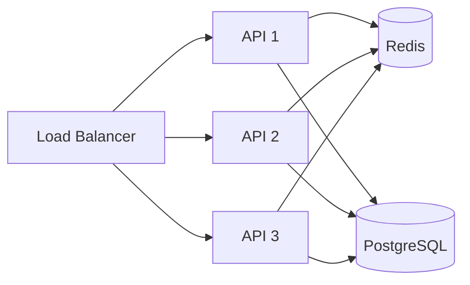
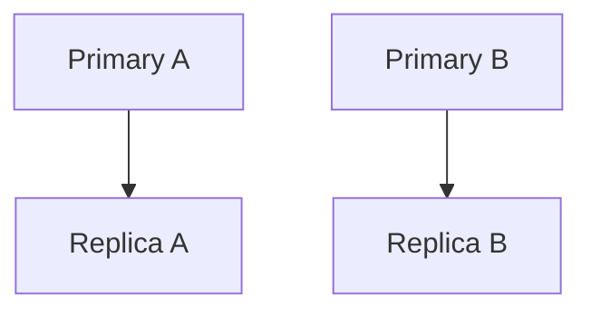
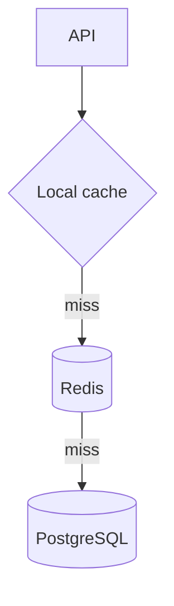

# Day 5 — Distributed Caching & Redis Cluster

## Goal

Understand why a shared cache becomes a distributed-system component and how key distribution changes scaling, failure, and consistency.

## Timebox

- 20 min — local vs shared cache
- 20 min — distribution / hashing
- 20 min — Redis Cluster mental model
- 15 min — multi-level cache
- 20 min — failure and resharding exercise
- 10 min — retrieval quiz

---

# 1. Why distribute a cache?

One Redis process has finite:

```text
memory
CPU
network bandwidth
connections
availability
```

As workload grows, you may need:

```text
more memory
more request capacity
failure tolerance
```

That leads to distribution.

---

# 2. Shared distributed cache



Benefits compared with API-local caches:

- one shared working set,
- simpler cross-instance invalidation,
- application instances remain stateless-ish,
- no need for sticky routing.

But Redis now sits on a major request path.

---

# 3. Partitioning the cache

Suppose one node cannot hold the working set.

Conceptually:

```text
key
↓
hash(key)
↓
partition
```

Example:

```text
profile:1 → shard A
profile:2 → shard C
profile:3 → shard B
```

The goal is to distribute many keys across nodes.

---

# 4. Redis Cluster mental model

Redis Cluster divides key space into **16,384 hash slots**.

Conceptually:

```text
key
↓
CRC/hash slot
↓
node responsible for slot
```

Example:

```text
slots 0–5000      → node A
slots 5001–10000  → node B
slots 10001–16383 → node C
```

Real slot assignment does not need to be equal contiguous ranges; this is a mental model.

---

# 5. Client routing

A cluster-aware Redis client knows—or learns—which node owns a slot.

So:

```text
API
↓
Redis client
↓
correct cluster node
```

This is different from imagining one magical endpoint that centrally forwards every operation.

---

# 6. Multi-key operations become interesting

Suppose:

```text
key A → slot 100
key B → slot 9000
```

They may live on different nodes.

Some multi-key operations require keys to be colocated.

Redis Cluster supports **hash tags** to deliberately place related keys into the same slot.

Example:

```text
{user:42}:profile
{user:42}:settings
```

The substring in `{...}` can drive slot selection.

Use deliberately.

If you force too many keys into one slot, congratulations—you have invented skew. 😄

---

# 7. Distribution does not remove hotspots

Uniform hashing helps when:

```text
many independent keys
roughly balanced access
```

But:

```text
one key = 40% traffic
```

still maps to one slot.

Therefore:

```text
sharding solves capacity across many keys
hot-key mitigation solves skew
```

Different problem.

---

# 8. Replicas and failover

Distributed Redis deployments can replicate data for availability.

Conceptually:



If a primary disappears, a replica can potentially take over.

But ask:

- Was replication synchronous or asynchronous?
- Can acknowledged writes be lost?
- How quickly is failure detected?
- What does the client see during failover?
- Are stale replica reads acceptable?

Remember: the cache is often disposable, but an outage can still be operationally severe.

---

# 9. Redis Cluster is not your source of truth

For ordinary cache-aside:

```text
Redis Cluster lost
↓
cache rebuild
```

Painful:

```text
latency spike
DB load spike
cold cache
```

but business truth still exists in PostgreSQL.

This design boundary is extremely valuable.

---

# 10. Multi-level caching

You can combine:

```text
L1 = API in-process cache
L2 = Redis distributed cache
L3 = PostgreSQL
```



Potential benefits:

- ultra-low latency for hottest values,
- less Redis traffic,
- hot-key protection.

Costs:

- two invalidation layers,
- per-instance staleness,
- memory duplication,
- harder debugging.

Do not add L1 + L2 because a conference slide looked cool.

---

# 11. Cache key cardinality

Distributed cache capacity depends on:

```text
number of keys
average key bytes
average value bytes
metadata overhead
TTL metadata
replication factor
headroom
```

Back-of-envelope:

```text
10 million cached redirects
average key+value+overhead ≈ 300 bytes

raw ≈ 3 GB
```

Then add:

```text
allocator overhead
replication
fragmentation
headroom
```

Never size Redis from payload bytes alone.

---

# 12. Resharding

When nodes are added/removed:

```text
some slots move
```

Operational questions:

- What happens to requests during movement?
- Does client topology update?
- Does latency spike?
- How much network traffic does migration create?
- What if a very large/hot key moves?

Distributed caches have lifecycle operations—not just steady state.

---

# 13. Global/multi-region caching

Imagine:

```text
Europe users → EU Redis
US users     → US Redis
```

Now invalidation is cross-region.

Questions:

- Is each region allowed to be stale?
- Who publishes updates?
- Is Redis still only a cache?
- Could edge/CDN caching solve the problem more naturally?
- Does sensitive data belong in a global shared cache?

Multi-region is not "Redis, but twice."

---

# Exercise — distribute the URL cache

Assume:

```text
50 million stored links
5 million active cached links
100,000 redirects/sec
99% reads
```

Design:

```text
API replicas
Redis topology
PostgreSQL
```

Answer:

1. Why one Redis node might eventually be insufficient.
2. What the cache key is.
3. What determines shard placement.
4. What happens to a super-popular short code.
5. How failover affects redirect latency.
6. Whether CDN/edge caching belongs before Redis.
7. Whether you need L1 caching.

---

# Break it 💥

Predict behavior when:

1. One Redis shard dies.
2. Client cluster topology is stale.
3. A hot key sits on the overloaded shard.
4. Resharding starts during peak traffic.
5. Local L1 caches hold a deleted URL.
6. PostgreSQL is healthy but Redis Cluster is fully cold after restart.

Write:

```text
user symptom
data correctness risk
origin risk
mitigation
```

---

# Retrieval quiz

1. Why distribute a cache?
2. Difference between a local and distributed cache?
3. What is a Redis Cluster hash slot?
4. How many hash slots does Redis Cluster use?
5. Why do cluster-aware clients matter?
6. What are hash tags for?
7. Why can hash tags create skew?
8. Why doesn't a cluster automatically solve hot keys?
9. Why is a cold-cache restart dangerous?
10. What is a multi-level cache?
11. What complexity does L1 + L2 add?
12. Why should cache capacity include overhead and replication, not only payload bytes?

## Exit criterion

You can explain Redis Cluster as **partitioned cache keyspace + failure/resharding tradeoffs**, not "Redis but scalable."
