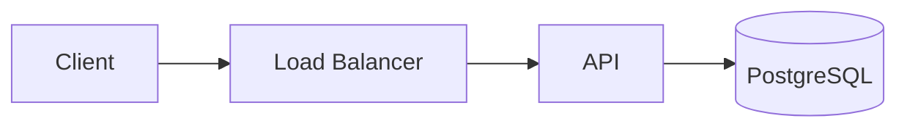
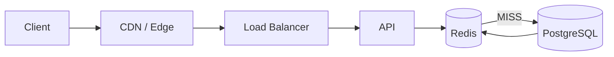

# Day 7 — Design Lab: URL Shortener

## Mission

Design a production-minded URL shortener where the redirect path is extremely read-heavy and latency-sensitive.

This lab combines:

- Week 1 request-path thinking,
- Week 2 database/index thinking,
- Week 3 caching thinking.

The goal is not to copy Bitly.

It is to practice:

> **requirements → estimates → data model → access path → cache → failure → tradeoff**

---

# Timebox

- 15 min — requirements
- 20 min — rough scale
- 20 min — API + data model
- 25 min — redirect path
- 25 min — cache/failure design
- 20 min — hot URL + expiration analysis
- 15 min — observability + cost
- 15 min — write design review

Total:

```text
~2–2.5 hours
```

---

# Scenario

Users create short URLs:

```text
https://sho.rt/aB91x
```

that redirect to:

```text
https://example.com/very/long/article
```

---

# Step 1 — Requirements

## Functional

Must support:

```http
POST /links
GET  /{short_code}
DELETE /links/{id}
```

Optional:

```http
PATCH /links/{id}
GET   /links/{id}
```

A link may optionally expire.

---

# Non-functional

Assume:

- redirect latency matters a lot,
- availability matters,
- reads greatly exceed writes,
- short codes must be unique,
- expired/deleted links must stop redirecting,
- service should scale horizontally.

---

# Out of scope

For the base design:

- rich analytics pipeline,
- custom domains,
- abuse detection implementation,
- billing,
- QR codes.

You may discuss them as extensions.

---

# Step 2 — Rough scale

Assume:

```text
10 million new links/day
1 billion redirects/day
```

Average redirect rate:

```text
1,000,000,000 / 86,400
≈ 11,574 redirects/sec
```

Peak could easily be several times average.

Assume:

```text
peak = 60,000 redirects/sec
```

Read/write ratio:

```text
~100 : 1
```

This is cache-shaped.

---

# Step 3 — API design

## Create

```http
POST /links
Content-Type: application/json

{
  "targetUrl": "https://example.com/article",
  "expiresAt": "2026-09-30T00:00:00Z"
}
```

Possible response:

```http
201 Created
```

```json
{
  "id": "...",
  "shortCode": "aB91x",
  "shortUrl": "https://sho.rt/aB91x"
}
```

Questions:

- Client-chosen alias?
- Server-generated code?
- Idempotency key?
- Validation of target URL?
- Maximum lifetime?

---

# Step 4 — Redirect semantics

```http
GET /aB91x
```

Server returns a redirect.

Consider:

```text
301 / 308 = stronger permanent semantics, more client/edge caching
302 / 307 = temporary semantics, more control remains at service
```

Tradeoff:

If clients permanently cache the redirect, your backend sees less traffic.

Great for scale.

But:

- edits/deletes propagate less predictably,
- redirect analytics may be bypassed,
- bad target becomes harder to correct.

Do not choose status code based only on performance.

---

# Step 5 — Data model

PostgreSQL:

```sql
CREATE TABLE links (
    id UUID PRIMARY KEY,
    short_code VARCHAR(16) NOT NULL UNIQUE,
    target_url TEXT NOT NULL,
    created_at TIMESTAMPTZ NOT NULL,
    expires_at TIMESTAMPTZ NULL,
    deleted_at TIMESTAMPTZ NULL
);
```

Critical access path:

```sql
SELECT target_url, expires_at, deleted_at
FROM links
WHERE short_code = $1;
```

The unique constraint/index on:

```text
short_code
```

is fundamental.

This comes directly from Week 2:

> Index the query pattern.

---

# Step 6 — Start without cache



At moderate traffic, this may work.

Measure before adding Redis.

But at very high redirect volume, repeated popular-code reads can make caching attractive.

---

# Step 7 — Add cache-aside



Cache key:

```text
url:v1:{short_code}
```

Value:

```json
{
  "targetUrl": "https://example.com/article",
  "expiresAt": "..."
}
```

---

# Step 8 — Redirect read flow

```text
GET /aB91x
↓
Redis GET url:v1:aB91x
↓
HIT?
├─ yes → validate cached expiry → redirect
└─ no
   ↓
   PostgreSQL lookup
   ↓
   missing/deleted/expired?
   ├─ yes → 404/410 + maybe short negative cache
   └─ no
      ↓
      cache + TTL
      ↓
      redirect
```

---

# Step 9 — TTL design

Suppose normal cache TTL:

```text
10 minutes
```

but the link expires in:

```text
2 minutes
```

Then:

```text
cache_ttl =
min(10 minutes, remaining link lifetime)
```

If deleted links must disappear immediately:

```text
DB delete/soft-delete
↓
DEL url:v1:aB91x
```

TTL remains a safety net.

---

# Step 10 — Negative caching

Unknown random code:

```text
Redis MISS
DB MISS
```

If repeated:

```text
cache NOT_FOUND for 15 sec
```

But do not cache unlimited attacker-generated misses indefinitely.

Potential controls:

- short TTL,
- admission limits,
- rate limits,
- edge protections.

---

# Step 11 — Hot URLs

Imagine:

```text
/aB91x = celebrity livestream link
300,000 redirects/sec
```

One cache key can become a hot key.

Possible mitigations:

## Edge cache

Best if redirect semantics permit.

```text
users
↓
CDN edge
↓
Redis sees far fewer requests
```

## Local L1

Short TTL local cache:

```text
API memory → Redis → DB
```

## Logical replication of hot key

Advanced and more complex.

Ask first:

> Can HTTP/edge caching solve this at a better layer?

---

# Step 12 — Cache stampede

Popular key expires.

```text
50k simultaneous requests
↓
MISS
↓
PostgreSQL
```

Mitigations:

- request coalescing,
- TTL jitter,
- early refresh,
- stale-while-revalidate,
- edge caching.

For a URL redirect, stale data may be unacceptable after deletion.

So stale-while-revalidate must respect product semantics.

---

# Step 13 — Redis outage

Bad design:

```text
Redis down
↓
every redirect hits DB
↓
DB dies
```

Options:

- circuit breaker,
- fallback concurrency limit,
- rate limiting/load shedding,
- CDN/edge still serves cached redirects,
- retain DB headroom,
- degrade noncritical features.

Write your exact policy.

---

# Step 14 — Cache hit math

Assume:

```text
peak traffic = 60,000 redirects/sec
hit ratio = 98%
```

DB reads:

```text
60,000 × 0.02
= 1,200 reads/sec
```

At:

```text
99.9%
```

DB reads:

```text
60,000 × 0.001
= 60 reads/sec
```

Small hit-ratio changes can dramatically alter origin traffic at scale.

But remember:

```text
hit ratio is not the only metric
```

---

# Step 15 — Cache sizing

Assume:

```text
5 million actively cached links
average cache footprint estimate = 250 bytes
```

Raw:

```text
5,000,000 × 250
≈ 1.25 GB
```

Then add:

- Redis object overhead,
- allocator fragmentation,
- replication,
- headroom,
- key growth.

Do not provision exactly 1.25 GB.

---

# Step 16 — Expiration cleanup in PostgreSQL

Cache expiration does not delete authoritative records.

For expired links you may:

- keep rows for audit/history,
- periodically archive/delete,
- partition by time if justified later,
- rely on query checks.

The redirect query must correctly reject expired records even if cleanup has not run.

Correctness must not depend on background cleanup timing.

---

# Step 17 — Observability

Track:

## Redirect

```text
request rate
p50/p95/p99 redirect latency
3xx rate
404/410 rate
5xx rate
```

## Cache

```text
hit ratio
Redis p95/p99
misses/sec
evictions/sec
memory
hot keys
timeouts
```

## PostgreSQL

```text
redirect lookup QPS
query p95/p99
connections
CPU
index hit/use
```

## Dependency/fallback

```text
Redis bypass/fallback rate
stampede lock waits
edge hit ratio
```

---

# Step 18 — Failure table

Complete:

| Failure | User impact | Secondary risk | Mitigation |
|---|---|---|---|
| Redis unavailable | ? | ? | ? |
| PostgreSQL unavailable | ? | ? | ? |
| One API instance dies | ? | ? | ? |
| Hot key overloads one shard | ? | ? | ? |
| Many TTLs expire together | ? | ? | ? |
| Cache invalidation fails after delete | ? | ? | ? |
| CDN holds stale redirect | ? | ? | ? |
| Short-code collision | ? | ? | ? |

---

# Step 19 — Architecture tradeoffs

## PostgreSQL-only

Pros:

- simple,
- strong source-of-truth path,
- fewer dependencies.

Cons:

- repeated reads hit DB,
- may need more read capacity at scale.

## PostgreSQL + Redis

Pros:

- low-latency repeated reads,
- major origin-load reduction.

Cons:

- staleness,
- invalidation,
- cache failure cascades,
- memory/ops cost.

## PostgreSQL + Redis + CDN

Pros:

- extreme hot-link offload,
- lower regional/origin latency.

Cons:

- another cache layer,
- invalidation semantics,
- redirect analytics/control tradeoffs.

---

# Step 20 — Write the design review

Use:

```text
Requirements
Scale assumptions
API
Data model
Short-code strategy
Initial architecture
Redirect path
Index strategy
Cache key/value
TTL/invalidation
Expiration
Hot-key strategy
Stampede mitigation
Failure behavior
Observability
Cost
Security/abuse notes
Tradeoffs
Open questions
```

---

# Bonus — connect to your transcription platform

Compare:

```text
GET /aB91x
```

with:

```text
GET /jobs/123
```

URL redirect:

```text
very read-heavy
small value
often stable
public-ish
latency critical
```

Job status:

```text
frequently changing
private
short-lived hot period
read-after-write freshness more visible
```

Same Redis.

Different workload.

Different decision.

That is the whole point of system design.

---

# Scoring rubric — 20 points

| Area | Points |
|---|---:|
| Requirements & scope | 2 |
| Scale estimation | 2 |
| API design | 2 |
| Data model + index | 3 |
| Cache-aside design | 3 |
| TTL/invalidation/expiration | 2 |
| Hot key + stampede | 2 |
| Failure handling | 2 |
| Observability | 1 |
| Tradeoff clarity | 1 |

Interpretation:

```text
17–20 = strong
14–16 = good; review weak spots
10–13 = repeat key sections
<10    = rebuild from requirements
```

Do not optimize for the score.

Optimize for **why**.
