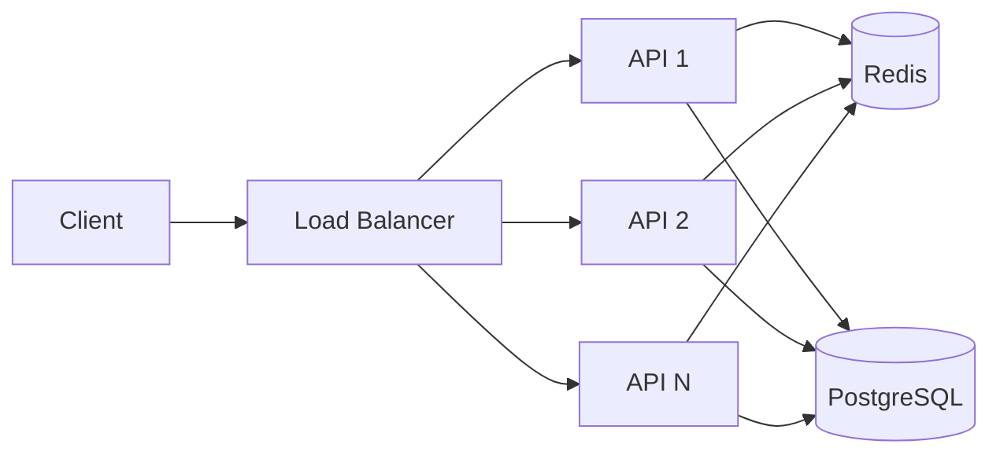
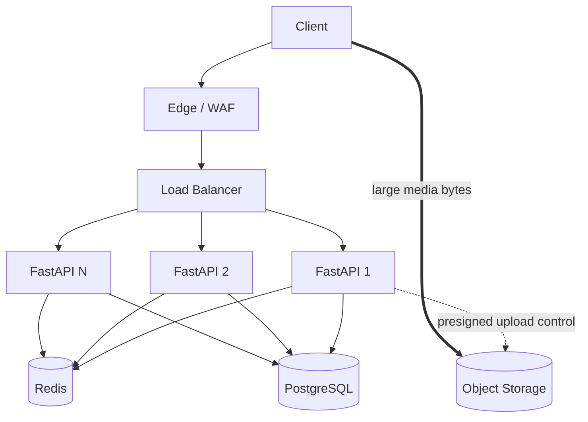

# Week 4 — Horizontal Scaling, Traffic Management & Overload Protection

## Mission

By the end of this week, you should be able to take a simple service:

```text
React → FastAPI → PostgreSQL
```

and evolve it into a horizontally scalable architecture:



without pretending that “add more servers” solves every bottleneck.

This week focuses on **traffic management**:

- stateless services,
- vertical vs horizontal scaling,
- load balancing,
- health and readiness,
- sticky sessions,
- autoscaling,
- rate limiting,
- backpressure,
- load shedding,
- overload protection.

The capstone applies all of this to the transcription platform:

> **What happens if 10,000 users upload videos simultaneously?**

The goal is to identify where capacity is consumed, what can be scaled horizontally, what remains shared, and where the system must deliberately say **“not yet”** or **“slow down.”**

---

# Learning outcomes

By the end of Day 7, you should be able to:

- Explain vertical and horizontal scaling using workload characteristics.
- Explain why stateless API instances are easier to scale and replace.
- Distinguish multiple FastAPI worker processes from multiple service replicas.
- Explain L4 vs L7 load balancing at a useful system-design level.
- Compare round-robin, least-connections, hashing, and weighted routing.
- Explain liveness, readiness, startup, and connection draining.
- Explain sticky sessions and why they can reduce flexibility.
- Model autoscaling as a delayed feedback/control loop.
- Choose scaling signals such as CPU, RPS, concurrency, or queue depth deliberately.
- Explain why autoscaling does not replace capacity planning.
- Compare fixed-window, sliding-window, token-bucket, and leaky-bucket rate limiting.
- Explain local vs distributed/global rate limits.
- Use `429 Too Many Requests` and `Retry-After` appropriately.
- Distinguish rate limiting, backpressure, admission control, and load shedding.
- Explain retry storms and why overload can cascade.
- Design bounded concurrency instead of infinite queues.
- Identify shared bottlenecks such as PostgreSQL connections and Redis saturation.
- Design direct-to-object-storage uploads so FastAPI remains a control plane.
- Produce a bottleneck map for 10,000 concurrent uploads.
- Defend scaling decisions with capacity, latency, reliability, fairness, and cost.

---

# Daily plan

| Day | Topic | Time | Deliverable |
|---|---|---:|---|
| 1 | Vertical vs horizontal scaling + stateless services | 75–90 min | Scaling decision table |
| 2 | Load balancing, health checks + sticky sessions | 90 min | Multi-instance request-path diagram |
| 3 | Autoscaling + capacity signals | 90–120 min | Autoscaling policy |
| 4 | Rate limiting + quotas | 90–120 min | Distributed limiter design |
| 5 | Backpressure, admission control + load shedding | 90–120 min | Overload protection policy |
| 6 | Scalable upload architecture | 120 min | Upload bottleneck map |
| 7 | Design lab: 10,000 simultaneous uploads | 150 min | Full system design + scaling ADR |

---

# The Week 4 rule

For every scaling mechanism, ask:

1. **Which resource is saturated?**
2. **What metric proves it?**
3. **Does adding instances actually increase that resource?**
4. **Which shared dependency becomes the next bottleneck?**
5. **How quickly can capacity arrive?**
6. **What protects the system while capacity is arriving?**
7. **What does the user experience when we are overloaded?**

If your answer to question 1 is “the system,” you have not diagnosed the problem yet.

---

# Mental model: capacity is a chain

```text
Client network
   ↓
Edge / Load balancer
   ↓
API CPU + memory + connections
   ↓
Redis
   ↓
PostgreSQL connection pool + queries
   ↓
Object storage / downstream services
```

Your request capacity is constrained by the weakest relevant link.

Adding API replicas helps only when the API tier is actually constraining useful throughput.

---

# Reference architecture for the week



The thick arrow matters:

> **Large upload bytes should not normally pass through your API tier.**

FastAPI authorizes and coordinates the upload. Object storage receives the media.

---

# How to study

Use four layers.

## 🥋 Core — required

Read the lesson and explain the concept without notes.

## 🧪 Lab — required

Run the local multi-instance FastAPI + NGINX exercise and the rate-limit/load-test exercises.

## 📚 Deep dive — recommended

Read one primary source from [`resources.md`](./resources.md).

## 💥 Break it — required

Every day includes an overload/failure exercise.

Scaling knowledge that only works in the happy path is decorative architecture.

---

# Capstone preview

Assume:

```text
10,000 users
1 GB average video
uploads begin during the same 15-minute window
```

That represents approximately:

```text
10 TB of media
```

If all bytes arrived uniformly within 15 minutes, aggregate ingress would be on the order of:

```text
~89 Gbit/s
```

The exact number is not the point.

The architectural question is:

> **Which component is being asked to carry those bytes?**

If the answer is “FastAPI,” you have probably designed the wrong upload path.

By Day 7 you will turn the burst into two different problems:

```text
CONTROL PLANE
10,000 authenticated upload-session requests

DATA PLANE
10 TB of media transferred directly to object storage
```

That distinction is one of the most important ideas in the week.
