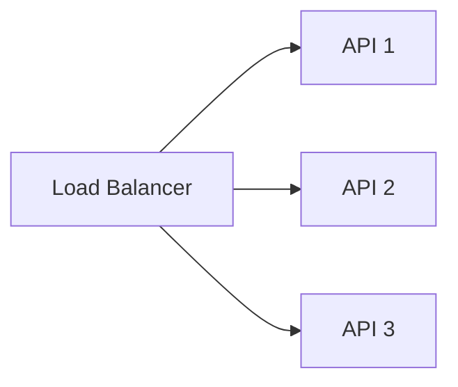
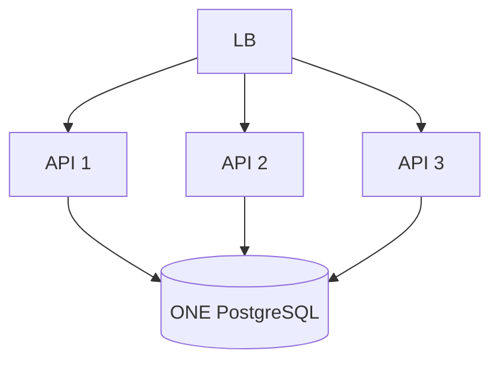
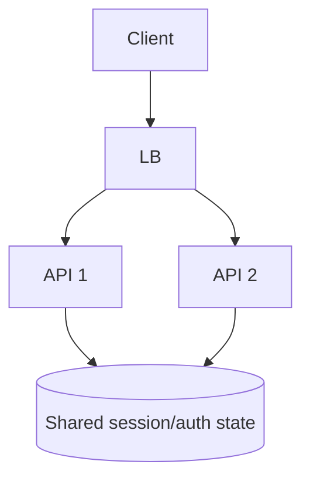

# Day 1 — Vertical vs Horizontal Scaling & Stateless Services

## Goal

Understand what “scaling” actually means before adding replicas, containers, or Kubernetes.

By the end of the lesson, you should be able to explain:

> **Which resource needs more capacity, and why horizontal scaling does or does not solve it.**

---

# Timebox

- 15 min — capacity mental model
- 20 min — vertical vs horizontal scaling
- 20 min — statelessness
- 15 min — FastAPI process vs replica
- 15 min — exercise
- 10 min — break-it drill + quiz

---

# 1. Scaling starts with a bottleneck

“Scale the backend” is not a complete requirement.

A system can be constrained by:

- CPU,
- memory,
- network bandwidth,
- open connections,
- file descriptors,
- database connections,
- database IOPS,
- lock contention,
- cache capacity,
- downstream rate limits,
- object-storage API limits,
- or simply a bad query.

Before scaling, ask:

```text
What is saturated?
How do we know?
```

Examples:

```text
API CPU = 95%
request queue growing
p99 latency rising
```

may indicate API compute pressure.

But:

```text
API CPU = 25%
PostgreSQL connections = 100%
p99 DB query latency = 1.8s
```

suggests that adding API instances may make the database problem worse.

---

# 2. Vertical scaling

Vertical scaling means making one machine/process environment larger.

```text
4 vCPU / 8 GB RAM
        ↓
16 vCPU / 64 GB RAM
```

Advantages:

- simple mental model,
- fewer moving parts,
- no distributed coordination just to add capacity,
- often the fastest short-term fix.

Costs:

- machine sizes have limits,
- larger instances may be expensive,
- upgrades/restarts can create larger failure blast radius,
- one machine remains one failure domain,
- scale changes may be coarse-grained.

Vertical scaling is not “bad architecture.”

It can be a perfectly rational choice when the workload is modest and operational simplicity matters.

---

# 3. Horizontal scaling

Horizontal scaling means adding more independently serving instances.



Potential benefits:

- more aggregate serving capacity,
- improved instance-failure tolerance,
- rolling deployments,
- smaller failure domains,
- elastic capacity.

But horizontal scaling creates requirements:

- traffic distribution,
- shared/externalized state,
- health checks,
- deployment coordination,
- connection-budget management,
- observability across many instances.

And it does **not** automatically scale shared dependencies.



You scaled the API tier.

You did not magically clone PostgreSQL.

---

# 4. Statelessness

A stateless service does not require the next request from a user to reach the same application instance because important durable/session state lives elsewhere or travels with the request.

## Stateful instance-local design

```text
User logs in
   ↓
API-1 stores session in local RAM
   ↓
next request reaches API-2
   ↓
API-2 has no session
```

Oops.

## Externalized state



Possible state locations:

- signed access tokens,
- Redis,
- PostgreSQL,
- object storage,
- a dedicated session service.

The important part is not “stateless means no state.”

Every useful application has state.

It means:

> **A specific API instance is not the only place that knows something necessary for the next request.**

---

# 5. Categorize state in the transcription platform

| State | Good instance-local home? | Better home |
|---|---|---|
| authenticated user identity | usually no | signed token / auth service |
| upload record | no | PostgreSQL |
| video bytes | absolutely not | object storage |
| job status | no | PostgreSQL / shared state |
| rate-limit counter | not if limit must be global | Redis / gateway service |
| request-local variables | yes | process memory |
| compiled code/config cache | often yes | local memory |

This is the useful distinction:

```text
request-local temporary state ✅
durable or cross-request ownership state ❌ local-only
```

---

# 6. FastAPI workers vs service replicas

These are related but not identical.

## Multiple worker processes on one host/container

```text
machine
├── FastAPI worker 1
├── FastAPI worker 2
├── FastAPI worker 3
└── FastAPI worker 4
```

This can use more CPU cores on one machine.

It is still one host/failure domain.

## Multiple service replicas

```text
Load Balancer
├── container/VM A
├── container/VM B
└── container/VM C
```

These replicas can live on different machines and scale independently.

In a cluster environment, a common model is:

```text
one application process per container
×
many container replicas
```

but this is a deployment choice, not a universal law.

---

# 7. Capacity math

Suppose one API instance safely handles:

```text
250 requests/sec
at p95 < 150 ms
and CPU < 70%
```

Peak requirement:

```text
1,500 requests/sec
```

Naive minimum:

```text
1,500 / 250 = 6 instances
```

But production design adds headroom.

Maybe target:

```text
~50–60% steady utilization
```

so losing one instance or receiving a burst does not immediately push the service into nonlinear overload.

Capacity is not merely:

```text
observed peak / theoretical maximum
```

You need failure and burst margin.

---

# 8. The hidden database connection multiplier

Suppose:

```text
1 API instance
× 20 DB pool connections
= 20 possible DB connections
```

Scale to:

```text
20 API replicas
× 20 connections
= 400 possible DB connections
```

Horizontal scaling can turn an API problem into a database connection problem.

This connects directly to Week 2.

Always model:

```text
replica_count × per_replica_resource_budget
```

for shared resources.

---

# Exercise — Scaling decision table

For each workload, choose **vertical**, **horizontal**, **fix bottleneck first**, or **it depends**.

| Situation | Decision | Evidence you need |
|---|---|---|
| CPU-bound image resize on one 2-core VM | ? | ? |
| API CPU 20%, DB query p99 = 2s | ? | ? |
| one API instance crashes and causes outage | ? | ? |
| memory leak grows until every replica dies | ? | ? |
| 1 GB uploads proxy through FastAPI | ? | ? |
| traffic varies 10× during the day | ? | ? |

For each answer, write:

```text
Bottleneck:
Scaling action:
New bottleneck introduced:
```

---

# Apply it to transcription

Start:

```text
React → FastAPI → PostgreSQL
```

Ask:

1. Which requests are CPU-heavy?
2. Which requests are bandwidth-heavy?
3. Which state must survive instance replacement?
4. Which shared resources grow when API replicas grow?
5. Should video bytes pass through the API at all?

Do not redesign yet.

Just classify.

---

# Break it 💥

Predict what happens when:

1. One of three API instances dies.
2. Session state exists only in that dead instance.
3. Ten new API replicas start and each opens 30 DB connections.
4. CPU is low but all outbound sockets are exhausted.
5. Autoscaling adds APIs while PostgreSQL is already saturated.
6. A 2 GB upload occupies one API connection for 40 minutes.

For each:

```text
symptom
root bottleneck
mitigation
```

---

# Retrieval quiz

1. Define vertical scaling.
2. Define horizontal scaling.
3. Why can horizontal scaling increase database pressure?
4. What does stateless mean in an API context?
5. Does stateless mean the application has no state?
6. Difference between FastAPI workers and service replicas?
7. Why is headroom part of capacity planning?
8. Name four resources other than CPU that can bottleneck a service.
9. Why is local-memory session state awkward with horizontal scaling?
10. What metric would you inspect before deciding to add API replicas?

---

# Exit criterion

You can look at a performance problem and say:

> “I would not scale yet. First I need to know which resource is saturated.”

…and then name the metrics that would answer the question.
