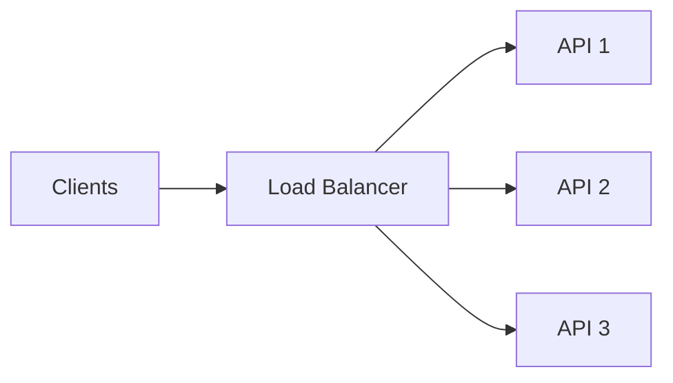

# Day 2 — Load Balancing, Health Checks & Sticky Sessions

## Goal

Understand how traffic reaches multiple healthy service instances—and what assumptions a load balancer can accidentally hide.

---

# Timebox

- 15 min — L4 vs L7 mental model
- 20 min — balancing algorithms
- 20 min — health/readiness
- 15 min — sticky sessions
- 15 min — graceful removal / draining
- 15 min — lab + quiz

---

# 1. Why a load balancer exists

Once you have multiple serving instances:

```text
API-1
API-2
API-3
```

you need a component to decide where each new request/connection goes.



A load balancer can improve:

- capacity utilization,
- availability,
- rollout safety,
- failure isolation.

But it becomes another important part of the serving path.

---

# 2. L4 vs L7

## Layer 4-style balancing

Makes routing decisions primarily from transport/network information such as IP and port.

Useful mental model:

```text
TCP/UDP connection
      ↓
L4 balancer
      ↓
backend
```

Pros:

- protocol-agnostic at application layer,
- low routing overhead,
- good for connection-oriented traffic.

## Layer 7-style balancing

Understands application protocol such as HTTP.

```text
HTTP request
   ↓
L7 proxy/LB
   ↓
route based on host/path/header/etc.
```

Can support:

- path routing,
- host routing,
- header-based policy,
- TLS termination,
- HTTP-aware retries/timeouts,
- canary routing.

Do not memorize “L4 fast, L7 smart.”

Ask what routing information and control you need.

---

# 3. Common balancing algorithms

## Round robin

```text
request 1 → API-1
request 2 → API-2
request 3 → API-3
request 4 → API-1
```

Good when:

- instances are similar,
- request costs are similar.

Potential weakness:

One request might last 2 ms while another lasts 20 seconds.

Round robin does not know that just from request count.

## Least connections

Prefer the backend with fewer active connections.

Useful when request/connection durations vary.

Still imperfect:

```text
1 cheap long-lived connection
≠
1 expensive long-lived connection
```

## Weighted balancing

More capable instances receive more work.

```text
API-1 weight 2
API-2 weight 1
```

Useful during mixed-capacity fleets or gradual rollout.

## Hash-based routing

Route based on a stable key such as client identity or another hash input.

Can improve locality or session affinity.

Tradeoff:

- less flexible redistribution,
- hotspots can follow skewed keys,
- failover/remapping must be considered.

---

# 4. Healthy does not mean “the process exists”

A service can be:

```text
alive but not ready
```

Examples:

- process started but model/config still loading,
- application running but DB migration not complete,
- service shutting down,
- dependency unavailable,
- connection pool exhausted.

Useful concepts:

## Liveness

> Should this process/container be restarted?

## Readiness

> Should new traffic be sent here right now?

## Startup

> Has initialization completed enough to judge normal health?

These should not blindly be identical checks.

---

# 5. Readiness and dependency design

Imagine:

```text
API works for /health
but PostgreSQL is down
```

Should readiness fail?

It depends on what the instance can still serve.

If every meaningful endpoint requires PostgreSQL, marking the instance ready may only route guaranteed errors.

But if some endpoints are independent, a global “DB down = unready” rule may remove capacity unnecessarily.

Health checks encode architecture policy.

---

# 6. Sticky sessions

Sticky/session-persistent routing attempts to keep a client on the same backend.

```text
user A → API-2
user A → API-2
user A → API-2
```

Why teams use it:

- local session state,
- connection affinity,
- local caches,
- legacy application assumptions.

Costs:

- uneven load,
- harder failover,
- coupling to instance lifetime,
- rollout/draining complications,
- can hide state-placement problems.

A useful heuristic:

> Prefer stateless serving when practical; use affinity when a requirement justifies it.

Do not use sticky sessions merely because horizontal scaling exposed a bad session design.

---

# 7. WebSockets and connection affinity

A WebSocket connection is already attached to one server for the life of that connection.

That is different from saying:

> “All future HTTP requests from this user must always reach that server.”

On reconnect, the client may land on a different instance.

Therefore important realtime state/events often require shared infrastructure rather than assuming the original instance survives forever.

---

# 8. Graceful removal and connection draining

Suppose API-2 is being deployed.

Bad sequence:

```text
kill API-2 immediately
↓
in-flight requests reset
```

Better conceptual sequence:

```text
mark not-ready
      ↓
stop new traffic
      ↓
allow in-flight work to finish within deadline
      ↓
terminate
```

This is connection/request draining.

Scaling down and deployments must consider active work, not only replica counts.

---

# 9. Load balancer failure domain

If every request passes through one load balancer process:

```text
all clients → ONE LB → APIs
```

then that balancer can become a single point of failure.

Managed/cloud balancers or redundant proxy tiers exist partly to hide this operational burden.

At system-design-interview level, you usually do not need to implement HAProxy HA from scratch.

But you should notice:

> The load balancer is part of the availability path.

---

# 10. Lab — watch NGINX distribute requests

Use:

[`labs/fastapi-scale/README.md`](./labs/fastapi-scale/README.md)

You will start three FastAPI instances behind NGINX.

Each instance returns its hostname.

Repeated requests should show traffic reaching different replicas.

Then:

1. stop one replica,
2. observe behavior,
3. switch to least-connections,
4. compare.

---

# Exercise — Choose the balancing policy

For each workload, choose an initial policy and explain why.

### A — simple REST API

Requests usually complete in 30–80 ms.

### B — report generation endpoint

Some requests take 20 seconds, others 500 ms.

### C — mixed-size instances

Half the fleet has twice the CPU.

### D — legacy app

Session exists only in local process memory.

### E — long-lived WebSocket dashboard

Connections stay open for hours.

Your answer must include:

```text
policy
requirement
failure tradeoff
```

---

# Break it 💥

What happens when:

1. API-2 is alive but stuck and responds in 20 seconds.
2. readiness checks only test `return 200` without dependencies.
3. sticky-session node dies.
4. one backend is half as powerful as the others.
5. a deployment kills 30% of instances simultaneously.
6. LB retries a non-idempotent request after a connection failure.

---

# Retrieval quiz

1. What problem does a load balancer solve?
2. Difference between L4 and L7 balancing?
3. When might least-connections beat round robin?
4. What is weighted balancing for?
5. Difference between liveness and readiness?
6. Why mark a node unready before termination?
7. What is a sticky session?
8. Name two disadvantages of sticky sessions.
9. Does a WebSocket require all future user HTTP requests to stick to one node?
10. Why is the load balancer part of your availability story?

---

# Exit criterion

You can explain how a backend joins, serves, drains, and leaves a horizontally scaled pool without saying only:

> “The cloud handles it.”
