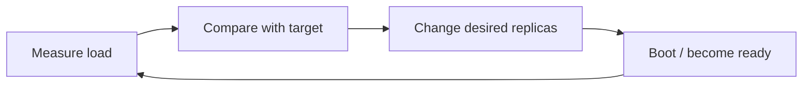

# Day 3 — Autoscaling, Capacity Signals & Control Loops

## Goal

Understand autoscaling as a **delayed feedback system**, not as infinite instant capacity.

---

# Timebox

- 15 min — autoscaling mental model
- 20 min — signals
- 20 min — HPA/control-loop behavior
- 15 min — headroom + cold starts
- 15 min — policy design
- 15 min — quiz

---

# 1. What autoscaling really does

A simple loop:



Autoscaling has delays:

```text
metric collection
+
controller decision
+
scheduler/provisioning
+
container startup
+
application warmup
+
readiness
```

Therefore:

> **Autoscaling cannot protect you from every sudden burst by itself.**

You still need spare capacity and overload protection.

---

# 2. Vertical vs horizontal autoscaling

## Vertical

Give existing instances more CPU/memory.

Useful when:

- workload benefits from larger single-node resources,
- horizontal partitioning is hard,
- restart/resizing cost is acceptable.

## Horizontal

Change number of serving instances.

```text
3 replicas → 8 replicas
```

Works best when work can be distributed among interchangeable replicas.

---

# 3. Pick the metric that represents pressure

Possible signals:

- CPU utilization,
- memory utilization,
- requests/sec,
- active requests/concurrency,
- request queue length,
- p95/p99 latency,
- connection count,
- downstream saturation,
- custom business metrics.

The easy metric is not always the right metric.

---

# 4. CPU is useful—but not universal

CPU-driven scaling works well when:

```text
more requests → more CPU
and
more replicas → lower CPU per replica
```

But imagine an API mostly waiting on PostgreSQL:

```text
CPU = 25%
DB = saturated
latency = terrible
```

CPU-based HPA may conclude:

```text
“No scaling needed.”
```

Even worse, scaling the API could add DB connections and increase pressure.

---

# 5. RPS as a scaling signal

Suppose load tests show:

```text
one replica safely handles 200 RPS
```

Target perhaps:

```text
120 RPS / replica
```

At:

```text
1,200 RPS
```

rough target:

```text
10 replicas
```

RPS is useful when request cost is reasonably stable.

But:

```text
100 cheap GETs
≠
100 expensive report requests
```

So request classes may need separate services/pools or concurrency controls.

---

# 6. Concurrency as a signal

A service may care more about work currently in flight.

Example:

```text
max safe concurrency per replica ≈ 100
```

Then:

```text
1,000 concurrent requests
```

suggests around:

```text
10+ replicas plus headroom
```

Concurrency can be more useful than CPU for I/O-heavy services.

---

# 7. Queue depth as a future signal

You will study queues deeply in Week 5.

For now know:

```text
work arriving faster than workers finish
        ↓
backlog grows
```

Queue depth and oldest-message age can become powerful worker-autoscaling signals.

Do not use queue length blindly:

```text
10 tiny jobs ≠ 10 two-hour jobs
```

---

# 8. Kubernetes HPA mental model

Kubernetes Horizontal Pod Autoscaler is a useful concrete example.

Conceptually:

```text
desired replicas
≈
current replicas × (current metric / target metric)
```

If current utilization is roughly double target, the controller tends toward roughly double replicas, subject to policy and constraints.

The important lesson is not the exact formula.

It is that HPA is a **periodic control loop** using observed metrics.

---

# 9. Min and max replicas

A policy usually defines:

```text
minimum capacity
maximum capacity
```

Why minimum matters:

- sudden bursts,
- failover capacity,
- cold-start latency,
- dependency protection.

Why maximum matters:

- cost control,
- DB connection budgets,
- downstream API quotas,
- preventing runaway scaling from hiding a fault.

Example:

```text
max replicas = 100
DB pool / replica = 20
potential connections = 2,000
```

If PostgreSQL only supports a fraction of that safely, your HPA limit must respect database capacity or use pooling architecture that does.

---

# 10. Scaling lag and cold starts

Imagine traffic jumps:

```text
500 RPS → 5,000 RPS in 2 seconds
```

but new capacity takes:

```text
45 seconds to become ready
```

For those 45 seconds you need:

- headroom,
- rate limiting,
- bounded queues,
- load shedding,
- graceful degradation.

Autoscaling and overload protection are complementary.

---

# 11. Thrashing and stabilization

Without damping:

```text
load ↑ → scale up
load falls briefly → scale down
load ↑ → scale up
```

This can churn capacity.

Mechanisms include:

- stabilization windows,
- cooldowns,
- asymmetric scale-up/scale-down rules,
- conservative downscaling.

Scale-up is often allowed faster than scale-down because removing useful capacity too aggressively can create instability.

---

# 12. Readiness affects autoscaling

A replica only helps when it can actually serve traffic.

If startup requires:

```text
20s imports
+
20s config/model warmup
+
DB connection establishment
```

then counting it as useful capacity too early distorts the control loop.

Readiness and startup signals are therefore part of scaling design.

---

# Exercise — Design an autoscaling policy

Service:

```text
POST /uploads/init
GET  /jobs/{id}
POST /uploads/{id}/complete
```

Assume load testing finds:

```text
safe per-replica capacity: 300 RPS
startup to Ready: 20 seconds
normal peak: 1,200 RPS
launch/event peak: 4,000 RPS
```

Design:

```text
min replicas:
max replicas:
primary scaling metric:
target:
scale-up behavior:
scale-down behavior:
protection while scaling:
DB connection budget:
```

Then explain why CPU alone may or may not be enough.

---

# Break it 💥

1. HPA scales API from 10 to 50 replicas; DB reaches max connections.
2. Metrics are delayed by 60 seconds.
3. New pods take 2 minutes to warm up.
4. Traffic oscillates every 90 seconds.
5. A bug causes CPU = 100% even at zero useful throughput.
6. Dependency latency rises, requests stay open longer, concurrency explodes.

For each ask:

```text
Will autoscaling help?
Could it make things worse?
What other protection is needed?
```

---

# Retrieval quiz

1. Why is autoscaling a control loop?
2. Name four delays in a scale-up path.
3. When is CPU a useful signal?
4. Give a case where CPU is misleading.
5. Why might concurrency be a better signal for I/O-heavy APIs?
6. Why set a max replica count?
7. How can autoscaling exhaust PostgreSQL?
8. Why keep minimum warm capacity?
9. What is scaling thrash?
10. Why should readiness be accurate during autoscaling?

---

# Exit criterion

You can explain:

> “Our autoscaler adds capacity based on X, but because capacity takes Y seconds to arrive, we use Z to remain stable during bursts.”
