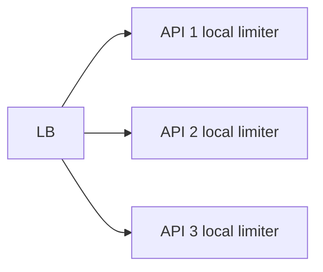
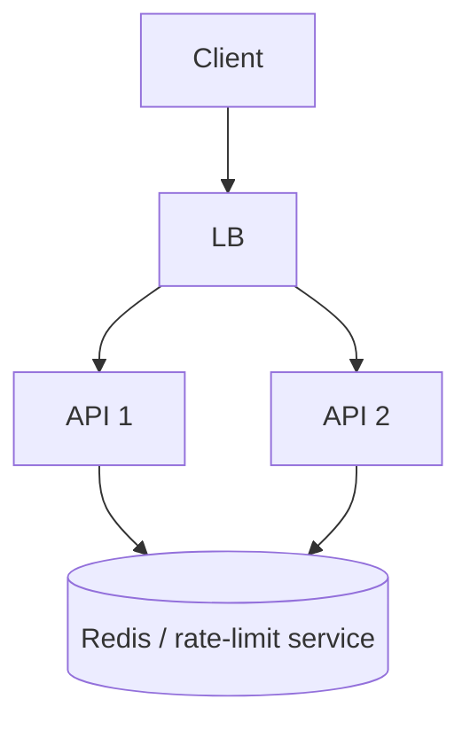

# Day 4 — Rate Limiting, Quotas & Fairness

## Goal

Learn to protect finite capacity **before** overload turns into a cascading failure.

Rate limiting is not only an anti-abuse feature.

It is a capacity-allocation mechanism.

---

# Timebox

- 15 min — why rate limit
- 25 min — algorithms
- 15 min — local vs global
- 15 min — Redis implementation thinking
- 10 min — HTTP behavior
- 15 min — transcription exercise

---

# 1. Why rate limit?

Possible goals:

- protect service capacity,
- prevent abuse,
- ensure fairness,
- enforce plan limits,
- protect expensive downstream APIs,
- control spend,
- bound noisy-neighbor impact.

Examples:

```text
Free plan: 5 upload initializations/minute
Pro plan: 30/minute
```

or:

```text
Maximum 3 active multipart uploads/user
```

Those solve different problems.

---

# 2. Rate vs quota vs concurrency limit

## Rate limit

```text
100 requests / minute
```

controls arrival rate.

## Quota

```text
20 hours of transcription / month
```

controls total entitlement/consumption.

## Concurrency limit

```text
3 active uploads at once
```

controls simultaneous resource occupancy.

A robust system may use all three.

---

# 3. Fixed window counter

Example:

```text
100 requests per minute
```

Counter key:

```text
rl:user:42:2026-08-25T21:17
```

Advantages:

- simple,
- cheap,
- easy with Redis atomic counters.

Weakness:

Boundary burst.

A user can send:

```text
100 requests at 12:00:59
100 requests at 12:01:00
```

So 200 requests arrive almost together while still respecting each window.

---

# 4. Sliding window

Track activity across a rolling interval.

More accurately represents:

```text
“100 requests in any 60-second period.”
```

Tradeoffs:

- more state/operations,
- implementation complexity,
- exact vs approximate variants.

Useful when fairness across window boundaries matters.

---

# 5. Token bucket

Mental model:

```text
bucket capacity = burst allowance
refill rate     = sustained allowance
```

Example:

```text
bucket = 20 tokens
refill = 5 tokens/sec
```

This allows a short burst up to available tokens while enforcing approximately 5 requests/sec over time.

Great when:

- bursts are acceptable,
- sustained rate must be bounded.

---

# 6. Leaky-bucket intuition

Think of requests entering a bucket that drains at a controlled rate.

Useful when you want smoother output toward a fragile dependency.

At Week 4 depth, focus on the difference:

```text
token bucket → permits bounded bursts
leaky bucket → smooths outgoing rate
```

Implementations vary.

---

# 7. Which key are you limiting?

Possible identities:

- IP address,
- authenticated user,
- account/tenant,
- API key,
- endpoint,
- destination resource,
- global service capacity.

Be careful with IP-only limits:

```text
corporate NAT
mobile carrier NAT
shared household
```

Many legitimate users can share an address.

Authenticated account/tenant limits are often more meaningful for SaaS behavior.

---

# 8. Local rate limit

Each API instance tracks its own counter.



Suppose each allows:

```text
100 req/min
```

With three nodes, a client distributed across nodes might receive roughly:

```text
300 req/min
```

if limits are independent.

Local limits are excellent for coarse overload protection.

They are not automatically a precise global entitlement.

---

# 9. Distributed/global rate limit

Shared counter/state:



Advantages:

- consistent account-wide limit,
- centralized policy.

Costs:

- another network hop,
- shared dependency,
- hot keys,
- failure-policy decision.

Sometimes combine:

```text
local coarse limiter
      +
global fine-grained limiter
```

so the global service is not itself overwhelmed by an attack/burst.

---

# 10. Redis atomicity

A rate limit must avoid races such as:

```text
read count = 99
request A decides allow
request B decides allow
both increment
```

Use atomic server-side operations/transactions/scripts or native commands designed for the pattern.

Do not implement a distributed limiter as:

```text
GET
if okay:
    SET old+1
```

across separate non-atomic operations.

---

# 11. HTTP response

When a client exceeds a request rate limit:

```http
HTTP/1.1 429 Too Many Requests
Retry-After: 30
```

The exact response body is product-specific.

Useful fields:

```json
{
  "error": "rate_limit_exceeded",
  "retryAfterSeconds": 30
}
```

Do not force clients to hammer the endpoint to discover when capacity returns.

---

# 12. 429 vs 503

Useful distinction:

## `429 Too Many Requests`

The client/identity has exceeded a policy/rate.

## `503 Service Unavailable`

The service cannot safely handle the request right now due to general unavailability/overload.

Reality can be nuanced, but this distinction gives clients better behavior signals.

---

# 13. Fail open or fail closed?

If Redis/rate-limit service is unavailable, should the request be allowed?

## Fail open

Allow traffic.

Pros:

- limiter outage does not block legitimate users.

Risk:

- protected downstream may be overwhelmed,
- quotas may be bypassed.

## Fail closed

Reject traffic.

Pros:

- capacity/security rule remains enforced.

Risk:

- limiter outage becomes service outage.

Decision depends on what the limit protects.

Example:

```text
marketing analytics endpoint → maybe fail open
expensive paid AI execution → perhaps stricter
login brute-force defense → security-sensitive
```

---

# 14. Transcription upload policy

Possible layered policy:

```text
per-user upload-init rate
+
per-user active-upload concurrency
+
account monthly minute quota
+
global emergency admission limit
```

Notice these are not interchangeable.

---

# Lab

See:

[`labs/rate_limit_demo.py`](./labs/rate_limit_demo.py)

The exercise uses Redis to implement a simple window counter.

Then you redesign it conceptually as a token bucket.

---

# Exercise — design upload limits

Assume:

```text
Free
- 2 active uploads
- 5 upload-init requests/min
- 10 hours/month

Pro
- 10 active uploads
- 30 upload-init requests/min
- 100 hours/month
```

Design keys and ownership for:

```text
rate limit
concurrency limit
quota
```

Then answer:

1. Which belongs in Redis?
2. Which belongs durably in PostgreSQL/billing state?
3. What happens when Redis fails?
4. What should be globally coordinated?
5. Which responses use 429?

---

# Break it 💥

1. One user creates 1,000 API keys to bypass a per-key limit.
2. Redis goes down during a traffic spike.
3. A fixed-window limit allows a large boundary burst.
4. Every API instance keeps independent counters.
5. Rate-limit key for a giant customer becomes hot.
6. Client immediately retries every 429 without delay.

---

# Retrieval quiz

1. Why rate limit besides abuse prevention?
2. Difference between rate, quota, and concurrency limit?
3. What weakness does fixed-window counting have?
4. What does token-bucket capacity represent?
5. What does token-bucket refill rate represent?
6. Why can local per-instance limits exceed intended global limits?
7. Why might Redis be useful for distributed limits?
8. What does HTTP 429 mean?
9. Why include `Retry-After`?
10. What is the fail-open vs fail-closed decision?

---

# Exit criterion

You can describe **who** is limited, **what** resource is protected, **which algorithm** matches the policy, and **what happens when the limiter itself fails**.
