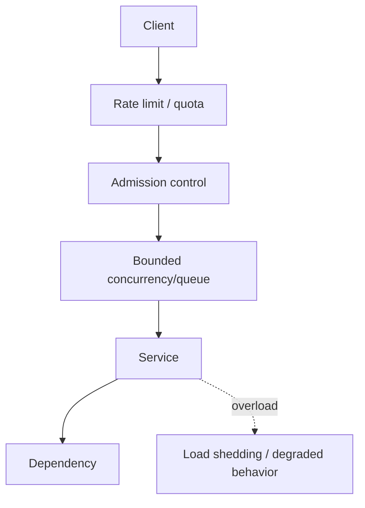

# Day 5 — Backpressure, Admission Control & Load Shedding

## Goal

Learn how a system remains useful when demand exceeds capacity.

The most dangerous scaling assumption is:

> “We will just queue everything until more servers arrive.”

Infinite waiting is not resilience.

---

# Timebox

- 15 min — overload curve
- 20 min — backpressure
- 15 min — admission control
- 15 min — bounded queues/concurrency
- 15 min — load shedding
- 15 min — retries/deadlines
- 10 min — exercise + quiz

---

# 1. Overload is nonlinear

At low/moderate load:

```text
more requests → more useful throughput
```

Near capacity:

```text
queues grow
latency rises
memory grows
connection occupancy rises
```

Past a certain point:

```text
more offered load
→ less useful throughput
→ timeouts
→ retries
→ even more load
```

This is where cascading failure begins.

---

# 2. Backpressure

Backpressure means a slower downstream communicates or causes upstream work to slow, pause, or be rejected instead of allowing unbounded accumulation.

Mental model:

```text
Producer faster than Consumer
        ↓
without backpressure
        ↓
unbounded queue/memory/latency
```

With backpressure:

```text
Consumer saturated
        ↓
upstream slows / bounded wait / rejects
```

Backpressure can appear as:

- bounded queues,
- semaphore/concurrency limits,
- flow-control windows,
- clients waiting before sending more,
- consumer pull rates,
- explicit retry-after responses.

---

# 3. Rate limiting vs backpressure

## Rate limiting

Policy-based cap:

```text
user ≤ 10 requests/sec
```

## Backpressure

Capacity feedback:

```text
service is currently full → slow/reject new work
```

A service can be below the user's rate limit and still be overloaded globally.

---

# 4. Admission control

Admission control asks:

> **Should we accept this new unit of work at all?**

Possible decisions:

```text
accept now
queue within bound
reject temporarily
reject permanently
```

Examples:

- max active uploads per user,
- max global in-flight expensive requests,
- refuse new transcodes when worker backlog age is too high,
- reject oversized requests before reading the body.

Admission control protects work already in progress.

---

# 5. Bounded concurrency

Imagine a service can safely handle:

```text
200 expensive operations in flight
```

A semaphore can enforce:

```text
max in-flight = 200
```

Request 201 may:

- wait briefly in a bounded queue,
- return a retryable response,
- be redirected to async processing.

What it should not do is create an unbounded task and hope memory survives.

---

# 6. Bounded queues

Queueing can absorb short bursts.

But a queue creates latency.

Suppose:

```text
arrival = 120 jobs/sec
service = 100 jobs/sec
```

backlog growth:

```text
20 jobs/sec
```

After 10 minutes:

```text
12,000 jobs waiting
```

If the service rate never exceeds arrivals, “queueing” has only delayed failure.

Important queue signals:

- depth,
- oldest item age,
- arrival rate,
- completion rate,
- rejection/drop rate.

Week 5 goes much deeper here.

---

# 7. Load shedding

Load shedding deliberately rejects some work so the service can continue serving useful work within capacity.

Possible triggers:

- active requests too high,
- CPU/memory threshold,
- queue too deep,
- downstream unavailable,
- latency budget exceeded.

Response could be:

```http
503 Service Unavailable
Retry-After: 10
```

or a domain-specific degraded response.

The goal is:

> Preserve useful throughput instead of allowing every request to fail slowly.

---

# 8. Graceful degradation

Not every feature has equal value.

During overload you might disable:

- nonessential analytics,
- expensive enrichments,
- high-resolution previews,
- optional recommendations,
- secondary metadata calls.

For transcription:

```text
accept upload
but delay optional AI summary
```

could be better than failing the core transcription path.

---

# 9. Deadlines and timeouts

Every in-flight request consumes resources.

If the caller no longer cares after 5 seconds, continuing for 2 minutes may waste capacity.

Use deliberate:

- connect timeout,
- request timeout,
- downstream deadline,
- cancellation propagation where possible.

Do not leave “infinite” as an accidental default.

---

# 10. Retry storms

A dependency becomes slow.

Clients time out and retry.

```text
normal traffic = 1,000 RPS
10% time out
all retry immediately
        ↓
+100 RPS
        ↓
more overload
        ↓
more timeouts
        ↓
more retries
```

Now imagine several layers each retry three times.

Retries are load.

Mitigations:

- retry only transient/idempotent operations,
- cap attempts,
- exponential backoff,
- jitter,
- retry at one appropriate layer,
- respect deadlines,
- load shed retries too.

---

# 11. Backpressure for browser uploads

Client-side multipart upload can create excessive concurrency.

Imagine:

```text
10,000 users
× 20 parallel parts each
= 200,000 concurrent part transfers
```

More parallelism is not automatically faster.

Use a bounded per-client concurrency such as:

```text
4–8 parts in flight
```

then tune based on:

- browser/network behavior,
- object-storage performance,
- part size,
- cost/operation count,
- retry behavior.

Backpressure exists at the client too.

---

# 12. Protection layers



No single mechanism does everything.

---

# Exercise — overload states

Define three service states:

## Green

```text
normal
```

## Amber

```text
near capacity
```

## Red

```text
overloaded
```

For each define:

```text
metrics
admission policy
rate limits
features disabled
HTTP behavior
retry guidance
autoscaling behavior
```

Use the upload-init API as your example.

---

# Break it 💥

1. PostgreSQL latency rises; APIs keep accepting unlimited requests.
2. All clients retry 503 instantly.
3. Autoscaling takes 90 seconds; queue is unbounded.
4. Queue has 1 million items but consumers can never catch up.
5. Optional AI enrichment saturates the same DB pool as core job status.
6. Load balancer sends traffic to a pod already at its safe concurrency limit.

---

# Retrieval quiz

1. Define backpressure.
2. Difference between rate limiting and backpressure?
3. What is admission control?
4. Why should queues be bounded?
5. What is load shedding?
6. Why can load shedding improve availability?
7. Why do retries make overload worse?
8. Why add jitter to backoff?
9. What is graceful degradation?
10. Why should client-side multipart concurrency be bounded?

---

# Exit criterion

You can answer:

> “What does the system do when demand is greater than capacity?”

without replying:

> “Autoscaling will fix it.”
