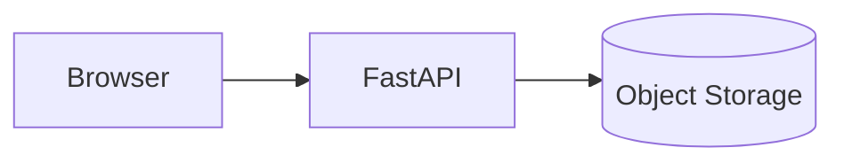
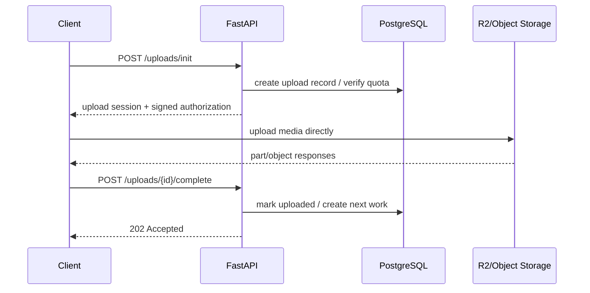

# Day 6 — Scalable Upload Architecture: Control Plane vs Data Plane

## Mission

Prepare for the capstone by redesigning the transcription upload path so large files do not turn the API tier into a bandwidth proxy.

---

# Timebox

- 20 min — classify upload traffic
- 20 min — control/data-plane split
- 20 min — multipart + resumability
- 20 min — API/database bottlenecks
- 20 min — rate/backpressure policy
- 20 min — bottleneck map

---

# 1. Start with the dangerous design



If a user uploads a 1 GB video through FastAPI:

```text
client bytes
   ↓
API network ingress
   ↓
API connection stays occupied
   ↓
API network egress
   ↓
object storage
```

Your application tier now carries the media bytes.

At 10,000 users that can dominate:

- bandwidth,
- sockets/connections,
- proxy buffers,
- memory,
- timeout behavior,
- autoscaling cost.

---

# 2. Split control plane and data plane

Better architecture:



Now:

## FastAPI carries

- authentication,
- authorization,
- quota decisions,
- metadata,
- signed upload authorization,
- completion/idempotency.

## Object storage carries

- GB-scale media bytes,
- multipart state/data,
- transfer bandwidth.

This is the central Week 4 architecture move.

---

# 3. Why multipart for long videos

For large files, multipart upload gives:

- resumability,
- retry only failed parts,
- bounded parallelism,
- progress visibility.

Conceptual flow:

```text
video.mp4
├── part 1
├── part 2
├── part 3
└── ...
```

Client controls a small in-flight window:

```text
4 parts at once
```

rather than opening every part simultaneously.

---

# 4. R2 reference behavior

Current Cloudflare R2 guidance treats:

```text
single PUT → small/medium objects
multipart  → large files or resumability/parallelism
```

For your design, the exact vendor limit matters less than the principle:

> Long video uploads should use direct multipart/resumable object-store transfer.

Keep provider-specific limits in the implementation docs, not hard-coded into your mental model.

---

# 5. 10,000-upload scale math

Assume:

```text
10,000 users
1 GB average file
```

Total data:

```text
10,000 GB
≈ 10 TB
```

If the burst occurs within 15 minutes:

```text
10 TB × 8 / 900 seconds
≈ 89 Gbit/s aggregate
```

That is **media data-plane traffic**.

Now compare API control-plane traffic.

If all 10,000 users request an upload session over one minute:

```text
10,000 / 60
≈ 167 init requests/sec average
```

167 RPS is very different from 89 Gbit/s of media.

This is why classifying traffic matters.

---

# 6. Bottleneck map

## Client

Potential bottlenecks:

- home/mobile uplink,
- browser memory,
- too much part concurrency,
- unstable network,
- battery/mobile interruption.

Mitigations:

- multipart resume,
- bounded parallelism,
- retry with backoff,
- persisted upload state.

## Load balancer / edge

Handles control API requests, not media bytes in the direct-upload design.

Watch:

- connection rate,
- TLS handshakes,
- request rate,
- 4xx/5xx.

## FastAPI

Watch:

- RPS,
- concurrency,
- CPU,
- p95/p99 latency,
- DB wait time,
- outbound calls,
- readiness.

## Redis

If used for rate/admission state:

- ops/sec,
- latency,
- hot keys,
- memory,
- availability.

## PostgreSQL

Likely shared bottlenecks:

- connection count,
- insert/update contention,
- indexes,
- transaction latency,
- storage/IO.

## Object storage

Carries the big bytes.

Watch provider limits, request failures, upload-part latency, completion rate, and cost.

## Processing handoff

After completion, transcription work begins.

Week 5 will introduce queues/workers deeply.

For now:

> Do not make the upload-complete request synchronously transcribe the video.

---

# 7. Database pressure during an upload burst

A single upload may produce multiple control-plane writes:

```text
create upload
mark multipart session
complete upload
create job
```

If 10,000 users finish around the same time, completion can create a second burst.

Design questions:

- Are writes indexed efficiently?
- Are completion requests idempotent?
- How many DB connections can all API replicas open?
- Can the job creation transaction be short?
- Are expensive validations happening inside the transaction?

The database can become the bottleneck even though video bytes bypass it completely.

---

# 8. Rate limiting and admission policy

Possible layers:

```text
per-user init rate
per-user concurrent uploads
per-account quota
global emergency admission cap
```

Example:

```text
Free: max 2 active uploads
Pro:  max 10 active uploads
```

If global health is degraded:

```text
new uploads may receive temporary rejection
while existing uploads continue
```

This protects work already in progress.

---

# 9. Autoscaling API tier

Good candidate signals:

- request rate per replica,
- active requests,
- CPU if correlated with request load,
- p95 latency as alert/context,
- DB pool saturation as a **constraint**, not necessarily a reason to add API replicas.

Example policy:

```text
min replicas: 3
scale at ~60% tested capacity
max replicas constrained by DB connection budget
```

Do not choose numbers from this lesson for production.

Load test your actual service.

---

# 10. Upload session idempotency

Network uncertainty means:

```text
client calls /complete
server commits
response is lost
client retries
```

Second call must not create a second transcription job.

Possible design:

```text
unique upload_id
+
transactional state transition
+
unique job relationship / idempotency key
```

This is horizontal-scaling-friendly because correctness lives in shared durable state, not process memory.

---

# 11. Observability dashboard

Track at least:

## API

```text
upload_init_rps
upload_complete_rps
p50/p95/p99 latency
active_requests
429 rate
503 rate
```

## Database

```text
pool_wait_time
active_connections
transaction_latency
insert/update errors
```

## Uploads

```text
active_uploads
bytes_started
bytes_completed
multipart_retry_rate
abandoned_uploads
completion_latency
```

## Capacity

```text
replica_count
CPU/memory
load-balancer request rate
rate-limit rejects
admission rejects
```

---

# Exercise — draw three paths

Draw separately:

## A — Upload initialization

```text
Client → LB → FastAPI → Redis/PostgreSQL → signed session
```

## B — Media upload

```text
Client → Object Storage
```

## C — Completion

```text
Client → LB → FastAPI → PostgreSQL → async handoff
```

For every arrow annotate:

```text
payload size
expected frequency
retry behavior
failure behavior
```

---

# Break it 💥

1. 10,000 users upload through FastAPI instead of R2 directly.
2. 10,000 clients each open 50 parallel multipart requests.
3. upload-init autoscaling creates too many DB connections.
4. Redis rate limiter fails during the burst.
5. completion endpoint is not idempotent.
6. object storage slows down but API remains healthy.
7. client loses network after uploading 80%.
8. completion burst happens at the same time for thousands of videos.

---

# Exit criterion

You can look at “10,000 simultaneous uploads” and immediately separate:

```text
API control traffic
from
media data traffic
```

and explain why they scale differently.
