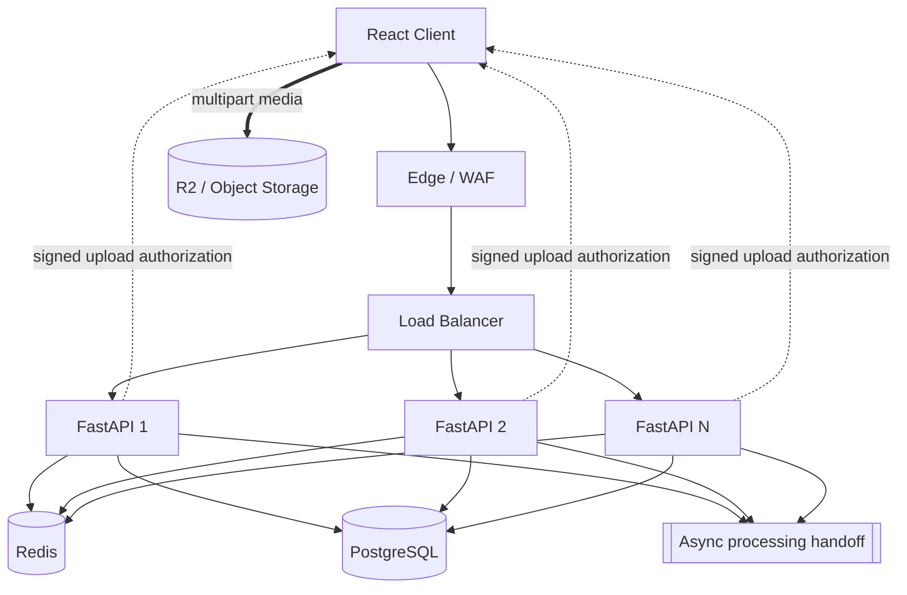

# Day 7 — Design Lab: 10,000 Simultaneous Video Uploads

## Mission

Design a production-minded upload system for the transcription platform that survives a burst of **10,000 users uploading long videos at roughly the same time**.

This lab combines:

- Week 1 — request lifecycle,
- Week 2 — PostgreSQL, indexes, transactions, connection pooling,
- Week 3 — Redis/caching/shared state,
- Week 4 — horizontal scaling, load balancing, autoscaling, rate limiting, and backpressure.

Do not optimize for the prettiest diagram.

Optimize for:

> **requirements → capacity → bottlenecks → protection → tradeoffs**

---

# Timebox

- 15 min — requirements
- 20 min — scale estimates
- 20 min — classify control vs data plane
- 25 min — high-level architecture
- 25 min — bottleneck map
- 20 min — overload/failure policy
- 15 min — observability
- 15 min — cost + tradeoffs
- 15 min — write design review

Total:

```text
~2.5 hours
```

---

# Scenario

The product accepts long-form videos for asynchronous transcription.

Most videos are:

```text
60–120+ minutes
```

Assume for the exercise:

```text
10,000 users start uploads inside a 15-minute window
average file size = 1 GB
large files must be resumable
users may have unstable connections
```

The system must not collapse if demand briefly exceeds ideal capacity.

---

# Step 1 — Functional requirements

Must support:

```http
POST /uploads
POST /uploads/{id}/parts/sign      # one possible multipart-control design
POST /uploads/{id}/complete
GET  /uploads/{id}
GET  /jobs/{id}
```

You may choose a different multipart API shape.

The client must be able to:

- initialize an upload,
- upload directly to object storage,
- resume failed/partial uploads,
- complete the upload idempotently,
- see upload/processing state.

---

# Step 2 — Non-functional requirements

Prioritize:

- no API proxying of GB-scale media,
- high availability of upload initialization,
- bounded load on PostgreSQL,
- fair use across users/tenants,
- resumability,
- safe overload behavior,
- horizontal API scaling,
- GDPR-aware private object access,
- observable failures.

Example SLO discussion target:

```text
upload-init API p95 < 300 ms under normal load
99.9% successful control-plane requests excluding explicit rate/admission rejects
```

Do not treat example numbers as production truth.

---

# Step 3 — Scale estimation

Assume:

```text
10,000 × 1 GB = 10 TB
```

If transferred evenly over 15 minutes:

```text
10 TB × 8 / 900s
≈ 89 Gbit/s aggregate
```

This should immediately provoke:

> “The application API must not carry these bytes.”

Now estimate control traffic.

If all initialization requests arrive during 60 seconds:

```text
~167 upload-init RPS average
```

If each upload requires:

```text
1 init
1 complete
10–50 metadata/signing/control calls
```

calculate a rough control-plane request budget.

Your exact API design affects this number.

---

# Step 4 — Initial architecture

Start from:

```text
React → FastAPI → PostgreSQL
```

Turn it into:



Week 5 will refine the async handoff/queue.

For this week, treat it as the boundary after upload completion.

---

# Step 5 — Explain every component

For each component write:

```text
problem solved
capacity metric
failure behavior
scaling method
```

Example:

## Load balancer

```text
Problem: distribute control API traffic
Metric: request rate, active connections, error rate
Failure: control API unavailable if LB layer fails
Scale: managed/redundant LB tier
```

Do this for:

- FastAPI,
- Redis,
- PostgreSQL,
- object storage,
- processing handoff.

---

# Step 6 — Stateless API design

An API replica must not be the sole owner of:

- upload session,
- multipart progress required for recovery,
- user session,
- quota state,
- final job ownership.

Any healthy API replica should handle:

```text
POST /uploads/{id}/complete
```

regardless of which replica initialized it.

Draw where that shared state lives.

---

# Step 7 — Direct multipart upload

Design:

```text
Client
  │
  ├── control → FastAPI
  │
  └── bytes ───→ R2
```

Questions:

- Single presigned PUT or multipart?
- How many parts in flight per client?
- How does resume work?
- How long are credentials/URLs valid?
- How do you prevent object-key collisions?
- How do you ensure a user can upload only to their namespace?
- How do you clean abandoned multipart uploads?

For hour-long/GB-scale video, your default should strongly favor multipart/resumable behavior.

---

# Step 8 — API capacity

Assume load testing finds:

```text
one FastAPI replica safely handles 250 control RPS
at target latency
```

Your estimated peak control traffic is:

```text
1,500 RPS
```

Raw minimum:

```text
1,500 / 250 = 6 replicas
```

Now add:

- headroom,
- one-instance failure,
- startup delay,
- uneven traffic,
- DB connection budget.

Write your chosen:

```text
min replicas
normal replicas
max replicas
autoscaling metric
target
```

---

# Step 9 — PostgreSQL connection budget

Suppose PostgreSQL safely allows the application:

```text
300 active server connections
```

and PgBouncer/your application strategy provides a controlled pool.

If each API replica is allowed 20 direct connections:

```text
15 replicas × 20 = 300
```

That means an autoscaler configured for 100 replicas is nonsense unless connection architecture changes.

Write:

```text
DB safe budget:
per-replica pool:
max API replicas from DB perspective:
pooling strategy:
```

This is the connection between Week 2 and Week 4.

---

# Step 10 — Rate limiting policy

Design separate controls for:

## Per-user fairness

Example:

```text
max upload-init rate
max active uploads
```

## Per-plan capacity

```text
Free / Pro / Enterprise
```

## Global emergency protection

When control-plane health is red:

```text
new upload sessions may be temporarily rejected
```

while existing multipart uploads can continue directly to object storage.

That asymmetry is powerful:

> Protect in-progress work by reducing new admissions.

---

# Step 11 — Backpressure policy

Define:

```text
max in-flight control requests / replica
max local wait queue
max multipart concurrency / client
DB pool wait timeout
request deadlines
```

Then define behavior when each limit is reached.

Example:

```text
upload-init concurrency full
→ reject quickly with retry guidance
```

instead of:

```text
accept and wait 2 minutes until everything times out
```

---

# Step 12 — Failure analysis

Complete this table.

| Failure | User-visible symptom | Protection | Recovery |
|---|---|---|---|
| One FastAPI replica dies | ? | ? | ? |
| Half API fleet dies | ? | ? | ? |
| PostgreSQL connections exhausted | ? | ? | ? |
| Redis limiter unavailable | ? | ? | ? |
| Object storage temporarily fails a part | ? | ? | ? |
| User network dies at 80% | ? | ? | ? |
| Autoscaling takes 60 seconds | ? | ? | ? |
| Completion endpoint retried | ? | ? | ? |
| All clients retry simultaneously | ? | ? | ? |

---

# Step 13 — Bottleneck ladder

For the architecture, rank what is likely to break first at:

## 1×

```text
10,000 users
```

## 10×

```text
100,000 users
```

## 100×

```text
1,000,000 users
```

Do not write technologies first.

Write:

```text
metric that saturates
why
then possible change
```

Example style:

> At 10×, PostgreSQL write/connection pressure may become the first control-plane constraint. I would inspect pool wait time, active connections, transaction latency, and write IOPS before changing the topology.

Good answer.

“Use Kafka” is not yet an answer.

---

# Step 14 — Autoscaling policy

Define:

```text
signal 1:
signal 2:
min replicas:
max replicas:
scale-up aggressiveness:
scale-down stabilization:
cold-start time:
headroom policy:
```

Then answer:

> Which dependency caps the usefulness of further API replicas?

---

# Step 15 — Observability

Build a dashboard containing:

## Traffic

```text
upload_init_rps
upload_complete_rps
active uploads
multipart part RPS
```

## Latency

```text
API p50/p95/p99
DB transaction latency
pool wait time
```

## Errors

```text
4xx
429
503
object-store part failures
completion/idempotency conflicts
```

## Saturation

```text
API CPU/memory
active requests
DB connections
Redis latency
replica count
```

## Business/UX

```text
time to upload session
upload completion rate
resume rate
abandoned upload rate
```

---

# Step 16 — Cost

At high scale, cost questions matter.

Discuss:

- API replicas,
- load balancer,
- Redis,
- PostgreSQL,
- object-store operation count,
- multipart part size,
- bandwidth/egress model,
- abandoned-upload cleanup.

A technically scalable design can still be financially ridiculous.

---

# Step 17 — Security / GDPR notes

At minimum discuss:

- private bucket,
- short-lived signed authorization,
- object key scoped to user/upload,
- server-side authorization before signing,
- EU-region/data-location requirements where applicable,
- retention/lifecycle rules,
- abandoned-upload cleanup,
- deletion flow.

This is not a full GDPR audit.

It is architecture awareness.

---

# Step 18 — Write the design review

Use:

[`scaling-decision-template.md`](./scaling-decision-template.md)

Your final conclusion should sound like:

> The API tier is a horizontally scaled, stateless control plane behind a load balancer. Large video bytes upload directly to object storage through resumable multipart sessions so API bandwidth does not scale with file size. API autoscaling is based on tested control-plane capacity with minimum warm replicas and an upper bound informed by PostgreSQL connection capacity. Redis-backed/global and local limits protect fairness and bursts; bounded concurrency and admission control protect the service while new capacity starts. Completion is idempotent and hands off long-running transcription asynchronously.

That is much stronger than:

> “We use Kubernetes and Redis so it scales.”

---

# Scoring rubric — 25 points

| Area | Points |
|---|---:|
| requirements + scale assumptions | 3 |
| control/data-plane separation | 3 |
| stateless API + load balancing | 3 |
| DB/connection bottleneck reasoning | 3 |
| autoscaling policy | 3 |
| rate limiting/backpressure | 3 |
| failure handling | 3 |
| observability + cost | 2 |
| tradeoff quality | 2 |

Interpretation:

```text
22–25 → strong
18–21 → good, review weak tradeoffs
14–17 → revisit 2–3 lessons
<14   → repeat capstone after review
```

Do not optimize for score.

Optimize for being able to defend every box and limit.
