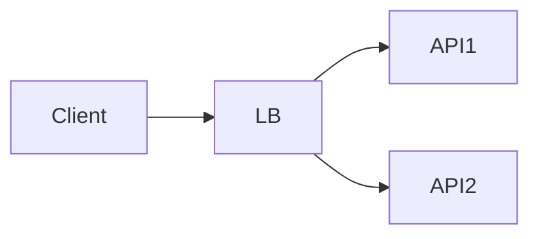

# Scaling Architecture Decision Record

## Decision

```text
Title:
Status: proposed / accepted / superseded
Date:
Owner:
```

---

# 1. Context

What workload/system are we scaling?

```text
```

# 2. Requirements

## Functional

```text
```

## Non-functional / SLO

```text
latency:
throughput:
availability:
burst behavior:
```

# 3. Scale assumptions

```text
users:
peak RPS:
concurrency:
request size:
media/data volume:
regional distribution:
```

# 4. Current bottleneck

```text
resource:
evidence/metric:
threshold:
```

# 5. Proposed topology



# 6. State placement

| State | Location | Why |
|---|---|---|
| | | |

# 7. Load-balancing policy

```text
algorithm:
health/readiness:
draining:
affinity/sticky sessions:
```

# 8. Autoscaling policy

```text
min replicas:
max replicas:
metric(s):
target(s):
scale-up behavior:
scale-down behavior:
startup time:
headroom:
```

# 9. Shared dependency budgets

```text
PostgreSQL connection budget:
Redis capacity:
downstream rate limits:
object-store limits:
```

# 10. Rate/admission policy

```text
per-user:
per-tenant:
global:
concurrency:
quota:
```

# 11. Backpressure / overload

```text
max in-flight:
queue bound:
load-shed threshold:
retry behavior:
Retry-After behavior:
graceful degradation:
```

# 12. Failure behavior

| Failure | Expected behavior | Mitigation |
|---|---|---|
| one API dies | | |
| DB saturated | | |
| Redis unavailable | | |
| autoscaling delayed | | |
| traffic 10× | | |

# 13. Observability

```text
traffic:
latency:
errors:
saturation:
business UX:
```

# 14. Cost

```text
steady cost:
burst cost:
main cost driver:
```

# 15. Alternatives considered

## Alternative A

```text
Why rejected:
```

## Alternative B

```text
Why rejected:
```

# 16. Tradeoffs

```text
We gain:
We pay:
```

# 17. Review trigger

Revisit this decision when:

```text
```
