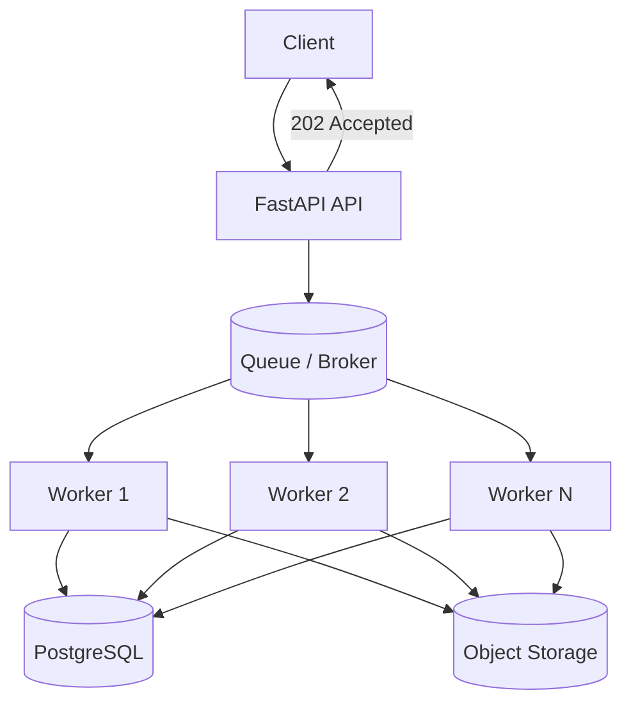
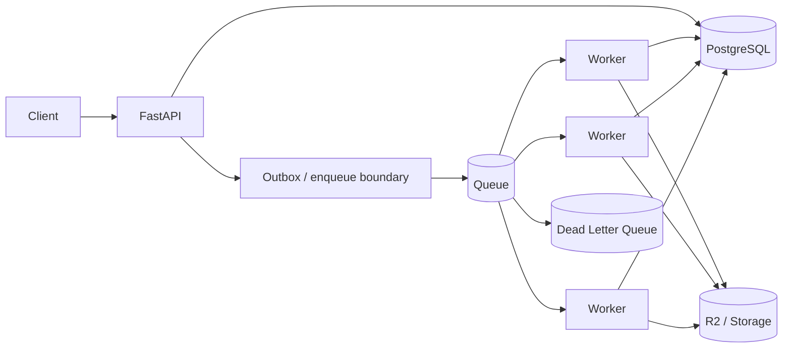

# Week 5 — Queues, Workers & Asynchronous Work ⚙️

## Mission

By the end of this week, you should be able to take a long-running operation such as transcription and turn it into a resilient asynchronous workflow with explicit delivery semantics, idempotent workers, retries, dead-letter handling, and measurable queue health.

The central transformation is:

```text
POST /transcribe

API waits 38 minutes ☠️
```

into:



The request becomes **control-plane work**. The queue absorbs differences between production rate and worker capacity. Workers own the long-running computation.

---

## Learning outcomes

By Sunday, you should be able to:

- Explain why long-running work should usually leave the HTTP request lifecycle.
- Define producer, broker, queue/topic, consumer, worker, acknowledgement, offset, retry, and DLQ.
- Compare at-most-once, at-least-once, and scoped exactly-once guarantees.
- Explain why at-least-once delivery implies duplicate-safe consumers.
- Decide when to acknowledge a message.
- Design an idempotent worker using database constraints and state transitions.
- Explain the dual-write problem between a database and a broker.
- Explain the transactional outbox pattern at a system-design level.
- Compare Redis Streams, RabbitMQ, and Kafka using workload requirements.
- Design retry/backoff/jitter and dead-letter policies.
- Identify poison messages and distinguish transient from permanent failures.
- Use queue depth, oldest-message age, processing latency, failure rate, and worker utilization as scaling signals.
- Put a queue around the transcription pipeline and defend every major tradeoff.

---

## Week architecture



---

## Daily plan

| Day | Topic | Time | Deliverable |
|---|---|---:|---|
| 1 | Queue mental model: producers, consumers, workers | 60–75 min | Basic async architecture + queue capacity worksheet |
| 2 | Delivery semantics, acknowledgements, ordering | 60–75 min | Failure-window table |
| 3 | Idempotent consumers + transactional boundaries | 75–90 min | Idempotent worker + outbox design |
| 4 | Redis Streams vs RabbitMQ vs Kafka | 75–90 min | Technology selection matrix |
| 5 | Retries, poison messages, DLQs | 60–75 min | Retry/DLQ policy |
| 6 | Queue the transcription pipeline | 90 min | Production queue architecture + metrics plan |
| 7 | Capstone + review | 120 min | Async transcription system design review |

---

## The seven questions for every queue

Do not stop at “we use RabbitMQ” or “we added Kafka.” Ask:

1. **What exactly is the message?**
2. **Who is the source of truth?**
3. **What delivery guarantee do we actually need?**
4. **When is the message acknowledged?**
5. **What happens if processing succeeds but acknowledgement fails?**
6. **How are retries bounded and poison messages isolated?**
7. **What metric tells us workers are falling behind?**

If those answers are fuzzy, the queue design is fuzzy.

---

## Project thread: transcription

Throughout the week, evolve this:

```text
Upload complete
    ↓
POST /transcribe
    ↓
API downloads video
    ↓
API transcribes for 38 min
    ↓
response
```

into:

```text
Upload complete
    ↓
Create durable Job
    ↓
Publish job reference
    ↓
202 Accepted
    ↓
Worker receives job
    ↓
Process media
    ↓
Persist result/status
    ↓
ACK message
```

The queue message should usually be **small**:

```json
{
  "job_id": "2ce4...",
  "upload_id": "a81d...",
  "attempt": 1
}
```

Do not put a 1 GB video into the broker. The message points to durable state and object storage.

---

## Files in this module

```text
week-05-queues-workers/
├── README.md
├── day-01-queue-mental-model.md
├── day-02-delivery-semantics-acks-ordering.md
├── day-03-idempotency-outbox.md
├── day-04-redis-rabbitmq-kafka.md
├── day-05-retries-dlq-poison-messages.md
├── day-06-transcription-queue-architecture.md
├── day-07-design-lab-async-transcription.md
├── resources.md
├── cheat-sheet.md
├── review-and-quiz.md
├── answer-key.md
├── queue-decision-template.md
└── labs/
    ├── redis-streams/
    └── rabbitmq-mini/
```

Do not open `answer-key.md` until you finish the review.

---

## Week 5 mantra

> **Queues move waiting away from the request path. They do not remove work, failures, or capacity limits.**

A queue can protect your API from slow work. It can also quietly accumulate six hours of backlog while every API dashboard looks green. That is why queue age is a first-class production signal.
