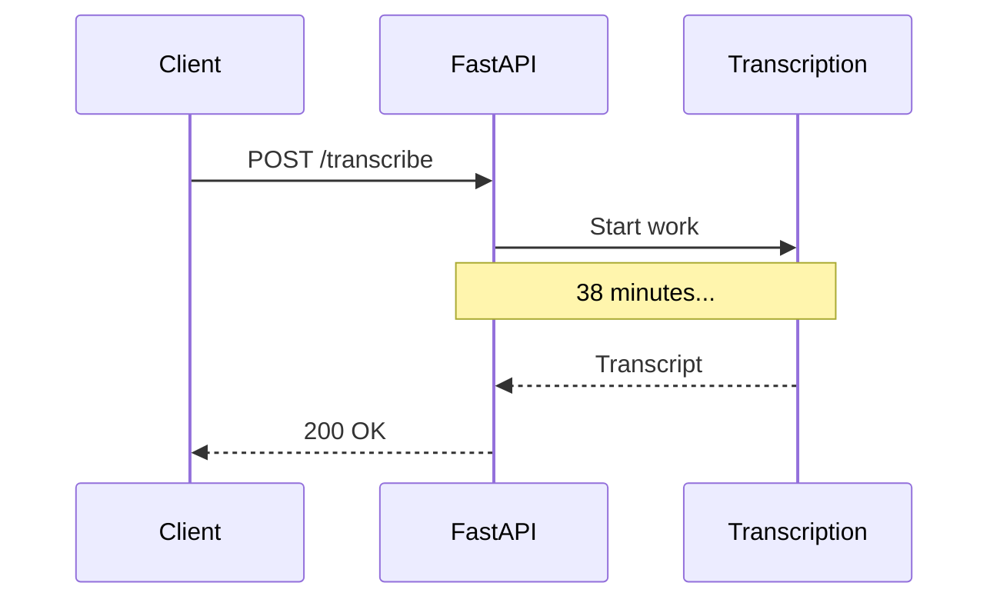
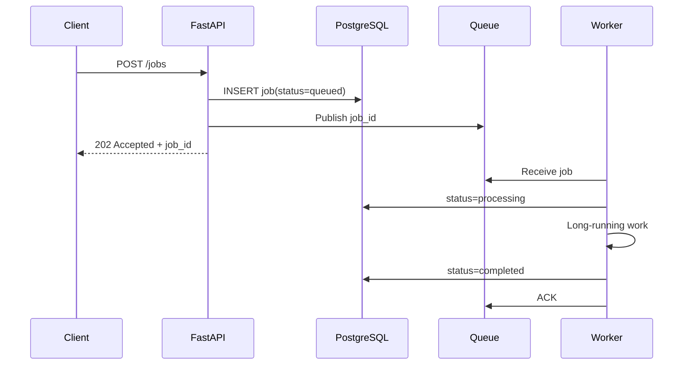

# Day 1 — Message Queues, Producers, Consumers & Workers

## Goal

Build a precise mental model of asynchronous work and understand what a queue changes—and what it does not.

## Timebox

- 15 min — synchronous vs asynchronous work
- 20 min — queue anatomy
- 15 min — capacity/backlog math
- 15 min — transcription exercise
- 10 min — failure drill + retrieval quiz

---

# 1. Why move work out of HTTP?

Suppose transcription takes 38 minutes.

A naive design:



This creates several problems:

- client or proxy timeouts,
- API worker/process occupied by long-running work,
- difficult retries,
- deployment interruptions,
- poor failure isolation,
- no durable backlog,
- hard independent scaling.

The async version:



The HTTP request now lasts milliseconds or seconds rather than tens of minutes.

Important:

> The queue did not make transcription faster. It decoupled **request latency** from **work duration**.

---

# 2. Core vocabulary

## Producer

Creates work/messages.

For the transcription platform:

```text
FastAPI → publish {job_id}
```

The API is a producer.

## Broker / queue system

Stores or routes work between producers and consumers.

Examples:

- Redis Streams,
- RabbitMQ,
- Kafka.

Their models differ. We compare them on Day 4.

## Consumer

Receives messages from the messaging system.

## Worker

The application/process that performs the actual business computation.

In a work-queue design, consumer and worker are often the same process:

```text
Worker
  ├── consume message
  ├── load job
  ├── transcribe
  ├── save result
  └── acknowledge
```

## Acknowledgement

A signal saying roughly:

> “I have safely finished responsibility for this delivery.”

The exact semantics depend on the system.

## Backlog / queue depth

How much work is waiting.

## Queue age

How old the oldest waiting item is.

For long-running jobs, age often tells you more than raw queue length.

---

# 3. The queue is a buffer between rates

Imagine:

```text
Producer rate = 100 jobs/min
Worker capacity = 80 jobs/min
```

Backlog growth:

```text
+20 jobs/min
```

After 30 minutes:

```text
600 waiting jobs
```

A queue can absorb the mismatch temporarily.

It cannot violate arithmetic forever.

If arrival rate remains above processing capacity, backlog grows without bound.

That produces a critical system-design rule:

> **A queue is not a substitute for enough downstream capacity.**

---

# 4. Queue length vs queue age

Suppose:

### Queue A

```text
10,000 jobs waiting
average job time = 20 ms
```

### Queue B

```text
500 jobs waiting
average job time = 20 min
```

Queue B may be far worse for users.

Useful signals include:

```text
queue depth
oldest message age
arrival rate
completion rate
processing duration p50/p95/p99
worker concurrency
failure/retry rate
```

---

# 5. A rough capacity model

Suppose one worker can complete one video every 15 minutes.

Worker throughput:

```text
4 videos/hour
```

Twenty workers:

```text
20 × 4 = 80 videos/hour
```

If uploads create:

```text
200 jobs/hour
```

then backlog grows by:

```text
120 jobs/hour
```

The architecture question becomes:

> Do we add workers, reduce work per job, partition jobs into chunks, prioritize, throttle admission, or accept a larger user wait time?

Week 6 will focus on splitting long work into chunk sub-jobs.

---

# 6. Job queue vs event stream

These ideas overlap but are not identical.

## Work queue intuition

```text
job 1 → one worker
job 2 → one worker
job 3 → one worker
```

The goal is distributing work.

## Event log intuition

```text
JobCreated event
   ├── transcription consumer group
   ├── billing consumer group
   └── analytics consumer group
```

Multiple independent subscribers may process the same durable event.

RabbitMQ, Redis Streams, and Kafka can support overlapping patterns, but their strengths and operational models differ.

Do not reduce the decision to:

```text
RabbitMQ = queue
Kafka = fast queue
```

That mental model will betray you later. 😄

---

# 7. Keep messages small

Bad:

```text
Queue message = 1.8 GB MP4
```

Better:

```json
{
  "job_id": "job_123",
  "upload_id": "upload_456",
  "media_key": "uploads/user-7/video.mp4"
}
```

The video belongs in object storage.

Why?

- brokers have message-size limits,
- large payloads increase memory/network/disk pressure,
- retrying a message should not retransmit gigabytes,
- durable storage already exists for media.

Use the queue to transport **intent/reference**, not bulk media.

---

# 8. HTTP contract for async work

A clean pattern:

```http
POST /jobs
```

Response:

```http
202 Accepted
Location: /jobs/job_123
```

```json
{
  "jobId": "job_123",
  "status": "queued"
}
```

Then:

```http
GET /jobs/job_123
```

returns current durable state.

This is valuable because queue internals remain private implementation details.

The client asks your **application state**, not RabbitMQ directly.

---

# 9. The queue is not the database

A useful initial rule:

```text
PostgreSQL → business state / source of truth
Queue      → work delivery mechanism
R2         → large media/results
```

For example:

```sql
jobs
-----
id
upload_id
status
attempt_count
created_at
started_at
completed_at
error_code
```

If the broker loses a dashboard history entry, the job history should not disappear with it.

Kafka/event-sourced architectures can intentionally make logs more authoritative, but that is a different design decision.

---

# 10. Exercise — Convert sync transcription to async

Start with:

```text
React → POST /transcribe → FastAPI → Whisper/API → response
```

Redesign it with:

- PostgreSQL,
- object storage,
- queue,
- 3 workers,
- job-status endpoint.

Your diagram must show:

1. where the job is created,
2. what goes into the message,
3. when the HTTP response returns,
4. where the worker reads the video,
5. where final state is persisted.

Then answer:

> If every worker crashes, can users still see that their jobs exist?

If not, you probably made the queue your accidental database.

---

# 11. Break it 💥

Predict what happens when:

1. API successfully inserts the job but crashes before publishing the message.
2. API publishes the message but crashes before returning `202`.
3. Worker receives a job then dies immediately.
4. Worker finishes transcription but dies before acknowledging.
5. Queue is healthy but workers are 4× slower than incoming traffic.
6. Queue message contains a 2 GB video body.

Do not solve all of them yet. Days 2–5 exist because every one of these is a real distributed-systems problem.

---

# Retrieval quiz

1. What problem does a message queue solve in long-running HTTP workflows?
2. What is the difference between request latency and job completion latency?
3. Define producer, consumer, worker, broker, acknowledgement.
4. Why can backlog still grow when the queue itself is perfectly healthy?
5. Why might oldest-message age be more useful than queue length?
6. Why should large media normally not be embedded in queue messages?
7. Why should the client query application job state instead of broker state?
8. What does `202 Accepted` communicate?

## Exit criterion

You can redraw the async transcription architecture from memory and explain why the queue decouples time without pretending it creates free capacity.
