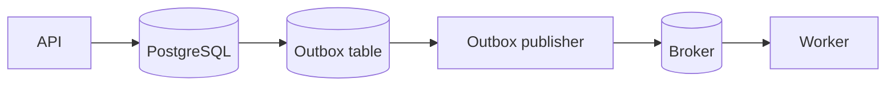

# Day 3 — Idempotent Workers, Deduplication & the Outbox Pattern

## Goal

Make duplicate delivery boring instead of catastrophic.

## Timebox

- 20 min — idempotency model
- 20 min — database techniques
- 20 min — dual-write problem + outbox
- 15 min — transcription worker design
- 10 min — failure drill

---

# 1. Idempotency is a business property

A message can arrive twice.

The important question is not:

> Can I detect duplicates perfectly?

It is:

> If I execute this operation twice, do I create two business effects?

Safe-ish:

```sql
UPDATE jobs
SET status = 'processing'
WHERE id = :job_id
  AND status = 'queued';
```

Dangerous:

```text
charge customer €10
charge customer €10 again
```

---

# 2. Natural idempotency

Some operations are naturally safe to repeat.

Example:

```sql
UPDATE jobs
SET status = 'completed'
WHERE id = 'job_123';
```

Repeating the assignment may produce the same final state.

But beware side effects:

```text
UPDATE state
+ send email
+ charge card
```

The combined operation is not automatically idempotent just because the SQL update is.

---

# 3. Idempotency keys

Give a logical operation a stable identifier:

```text
job_id = job_123
```

or:

```text
operation_id = transcription:job_123:v1
```

Store processed operations:

```sql
CREATE TABLE processed_messages (
  consumer_name text NOT NULL,
  message_id text NOT NULL,
  processed_at timestamptz NOT NULL DEFAULT now(),
  PRIMARY KEY (consumer_name, message_id)
);
```

Worker transaction:

```text
BEGIN
  INSERT processed_messages
  if duplicate → already processed → stop safely

  perform durable state changes
COMMIT
ACK
```

The database unique constraint becomes a concurrency-safe deduplication gate.

---

# 4. State-machine idempotency

Another technique is making transitions conditional.

```text
QUEUED → PROCESSING → COMPLETED
                   ↘ FAILED
```

Example:

```sql
UPDATE jobs
SET status = 'processing', started_at = now()
WHERE id = :job_id
  AND status = 'queued';
```

If zero rows update:

- job may already be processing,
- completed,
- cancelled,
- or invalid.

You then read state and decide.

This protects against duplicate workers both starting the same logical job.

---

# 5. Idempotency does not always mean “skip duplicate”

Suppose:

```text
message says recalculate transcript summary
```

Maybe duplicate execution is cheap and harmless.

For another operation:

```text
charge invoice
```

you need strong dedupe or provider-side idempotency.

Choose effort based on consequence.

---

# 6. External APIs complicate everything

Suppose worker:

```text
PostgreSQL
   ↓
external transcription API
   ↓
PostgreSQL
```

You cannot wrap the internet inside a normal PostgreSQL transaction.

Useful strategies include:

- provider idempotency keys,
- durable provider operation IDs,
- polling existing provider job state,
- state machine before/after external calls,
- reconciliation processes.

Example:

```text
job_123
provider_request_id = transcribe:job_123:v1
```

Retry with the same provider idempotency key if the provider supports it.

---

# 7. The dual-write problem

Consider API logic:

```text
1. INSERT job in PostgreSQL
2. publish message to broker
```

What if the process crashes between 1 and 2?

```text
DB says job=queued
queue has nothing
```

Reverse it:

```text
1. publish message
2. INSERT job
```

Crash between them:

```text
worker receives job
DB job doesn't exist
```

Two independent systems cannot normally be updated atomically with one ordinary local transaction.

This is the **dual-write problem**.

---

# 8. Transactional outbox pattern

Instead of writing DB + broker directly:

```text
BEGIN DATABASE TRANSACTION
  INSERT jobs(...)
  INSERT outbox(event_id, type, payload)
COMMIT
```

Now both durable records commit together.

A separate publisher reads the outbox and publishes messages:



The publisher may publish the same outbox event twice if confirmation is uncertain.

So the consumer still needs idempotency.

The outbox solves:

```text
job exists but event was never durably recorded
```

It does **not** eliminate all duplicates.

---

# 9. Inbox pattern

Consumer-side sibling:

```text
Message arrives
    ↓
transactionally record message_id
    +
apply business state
```

Sometimes called an inbox/deduplication table.

Outbox:

```text
reliable publication intent
```

Inbox:

```text
reliable duplicate-safe consumption
```

These are useful patterns when DB state and messaging interact heavily.

---

# 10. Idempotent transcription worker

Possible flow:

```text
receive {job_id, message_id}
        ↓
BEGIN
  acquire/claim job transition
  check processed message
COMMIT
        ↓
perform expensive transcription
        ↓
BEGIN
  save result metadata
  mark completed
  record processing outcome
COMMIT
        ↓
ACK
```

Reality is more nuanced because you do not want a DB transaction open for 38 minutes.

That means job state is used as a **durable lease/state machine**, not one giant transaction.

Example states:

```text
QUEUED
PROCESSING
COMPLETED
FAILED_RETRYABLE
FAILED_PERMANENT
CANCELLED
```

Store:

```text
worker_lease_until
attempt_count
provider_operation_id
```

Week 6 will go deeper into orchestration and leases.

---

# 11. Exercise — design duplicate safety

A message is redelivered after the worker already created the transcript.

Design a worker that prevents:

- duplicate transcript rows,
- duplicate billing,
- duplicate provider call where possible,
- invalid status regression from COMPLETED → PROCESSING.

Use at least:

- one unique constraint,
- one conditional update/state transition,
- one stable idempotency key.

---

# 12. Break it 💥

For each failure, explain durable state:

1. DB commits job + outbox, publisher never runs.
2. Publisher sends message, broker receives it, publisher crashes before marking outbox sent.
3. Consumer saves transcript, crashes before ACK.
4. Two consumers receive equivalent messages concurrently.
5. External provider processed request but worker timed out.

If your architecture has no answer, “at least once” is going to be exciting in all the wrong ways.

---

# Retrieval quiz

1. What makes an operation idempotent?
2. Why is a database unique constraint useful for deduplication?
3. What is the dual-write problem?
4. What does a transactional outbox solve?
5. Why can outbox publication still create duplicate messages?
6. What is the inbox pattern?
7. Why should a 38-minute worker not keep a PostgreSQL transaction open the whole time?
8. Give one method for making an external API call retry-safe.
9. Why should state transitions be conditional?
10. What does “effectively-once business effect” mean?

## Exit criterion

You can design a worker that assumes duplicate delivery is normal rather than exceptional.
