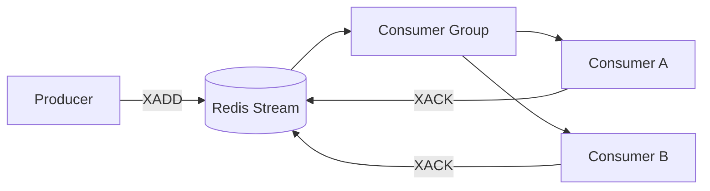
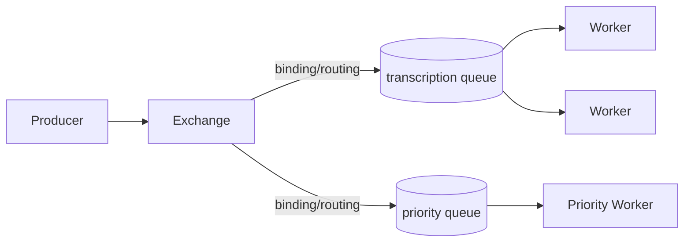
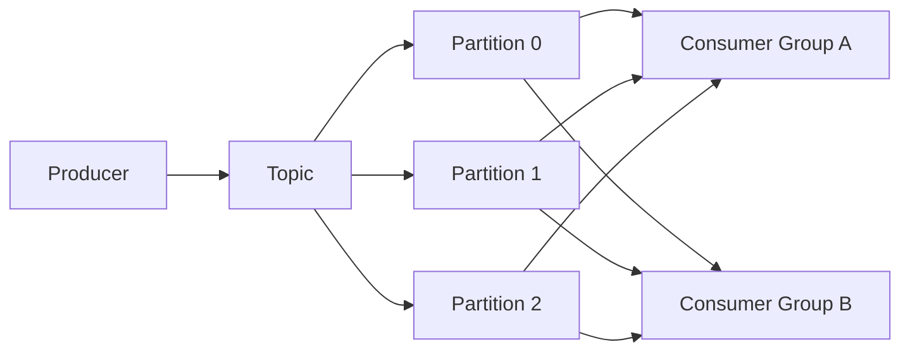

# Day 4 — Redis Streams vs RabbitMQ vs Kafka

## Goal

Learn the **messaging models**, not just the product names, and choose technology from workload requirements.

## Timebox

- 20 min — Redis queue/Streams model
- 20 min — RabbitMQ model
- 20 min — Kafka model
- 15 min — comparison matrix
- 10 min — transcription decision

---

# 1. First principle: these systems overlap, but they are not identical

All three can move data between producers and consumers.

But they optimize for different mental models:

```text
Redis Streams → lightweight persistent stream + consumer groups
RabbitMQ      → brokered messaging/work routing
Kafka         → durable partitioned append-only log + replay
```

A senior design answer starts with requirements such as:

```text
Do I need replay?
Do I need routing?
How long should messages live?
How many independent subscribers?
Do I need per-message ACK/requeue semantics?
What ordering scope matters?
What operations team will run this?
```

---

# 2. Redis: from simple queue to Streams

Redis can model queues in several ways.

## Simple lists

Classic pattern:

```text
Producer → LPUSH/RPUSH
Worker   → BRPOP/BLPOP
```

Advantages:

- very simple,
- low latency,
- good for lightweight work distribution.

Limitations compared with richer broker semantics:

- less durable workflow state unless you build it,
- simple pop removes the item from the list,
- recovery/acknowledgement needs more careful design.

## Redis Streams

Streams provide an append-only structure with IDs, consumer groups, pending entries, acknowledgements, and claiming abandoned work.

Mental model:



Important concepts:

```text
XADD        → append message
XGROUP      → create/manage consumer group
XREADGROUP  → receive work through group
XPENDING    → inspect unacknowledged work
XACK        → acknowledge
XCLAIM / XAUTOCLAIM → recover stale pending work
```

Redis Streams are a strong learning tool because you can see the mechanics directly.

For your MVP, they may be sufficient if Redis is already part of the stack and the workload does not require sophisticated routing or long-term event replay at Kafka scale.

---

# 3. RabbitMQ: brokered messaging and work queues

RabbitMQ is built around messaging concepts.

A simplified AMQP model:



Key concepts:

## Exchange

Receives publishes and routes messages according to exchange type and bindings.

Common exchange types include:

- direct,
- topic,
- fanout,
- headers.

## Queue

Stores messages waiting for consumers.

## Consumer acknowledgement

Worker acknowledges after safe processing.

## Publisher confirms

Producer can know when RabbitMQ accepted responsibility for a publish.

## Prefetch

Limits how many unacknowledged deliveries a consumer can hold.

## Dead-letter exchange

Messages can be routed to a dead-letter path when rejected without requeue, expired, or subject to configured delivery/queue policies.

## Quorum queues

Replicated queue type intended for stronger data safety/availability, at the cost of replication work and latency/throughput tradeoffs.

RabbitMQ is attractive when:

- you have work-queue semantics,
- routing matters,
- per-message ACK/requeue behavior is central,
- delayed/retry/DLQ patterns are important,
- replay of an immutable history is not the main requirement.

---

# 4. Kafka: durable distributed log

Kafka's mental model starts with **topics and partitions**, not a single destructive queue.



Kafka records remain according to retention policy even after consumers read them.

Consumers track **offsets**.

That enables:

```text
replay
rewind
multiple independent consumer groups
high-throughput durable event pipelines
```

## Partitions are the parallelism unit

Within one consumer group:

```text
partition → one active consumer at a time
```

If a topic has 6 partitions and a consumer group has 20 consumers:

```text
at most 6 consumers can actively own those partitions at once
```

More consumers than partitions does not create more partition-level parallelism.

## Ordering

Kafka preserves ordering **within a partition**.

If related events must stay ordered, choose a stable key:

```text
key = job_id
```

Then events for one job can map consistently to the same partition.

Kafka is attractive when:

- event history/replay matters,
- many independent consumer groups need the same events,
- very high sustained throughput matters,
- partitioned ordering is useful,
- event-driven architecture is becoming a platform concern.

It can be unnecessary complexity for a small single-purpose background-job system.

---

# 5. Redis Streams vs RabbitMQ vs Kafka matrix

| Dimension | Redis Streams | RabbitMQ | Kafka |
|---|---|---|---|
| Primary mental model | Stream / lightweight work queue | Message broker / work routing | Durable partitioned log |
| Consumer groups | Yes | Competing consumers on queues | Yes |
| Explicit ACK model | Yes | Yes | Offset commit model |
| Replay/history | Yes, stream retained until trimmed | Not the primary model after ack/removal | Core capability |
| Routing flexibility | Limited compared with AMQP exchanges | Strong | Usually topic/partition/key based |
| Ordering | Stream ID order; parallel processing can reorder completion | Queue delivery ordering has caveats with parallelism/redelivery | Guaranteed within partition |
| DLQ | Application pattern / separate stream | First-class dead-letter exchange pattern | Usually separate DLQ topic/application pattern |
| Operational footprint | Low if Redis already exists | Dedicated broker operations | Highest of the three in many teams |
| Good MVP worker queue | Yes | Yes | Often overkill |
| Good event backbone | Moderate | Moderate | Strong |

This table is not a benchmark. Requirements decide.

---

# 6. Where does Celery fit?

Celery is a **task queue framework**, not a broker.

It can use brokers such as:

```text
RabbitMQ
Redis
```

It provides application-level conveniences:

- task registration,
- retries,
- worker processes,
- routing,
- scheduling,
- task states/result backends.

For Python/FastAPI, it can accelerate implementation.

But learn the broker concepts first.

Otherwise:

```python
@app.task(autoretry_for=(Exception,))
```

looks magical and you never ask what gets acknowledged, redelivered, or duplicated underneath.

---

# 7. Recommendation exercise: transcription MVP

Requirements:

```text
- one main processing pipeline
- Python workers
- PostgreSQL authoritative job state
- Redis already present
- moderate initial scale
- need at-least-once work delivery
- replay of years of events not required
```

A reasonable initial choice could be:

```text
Redis Streams
```

or:

```text
RabbitMQ
```

depending on team familiarity and desired broker features.

Kafka becomes more compelling if the platform evolves toward:

```text
JobCompleted
   ├── billing
   ├── analytics
   ├── audit
   ├── notifications
   ├── ML quality evaluation
   └── data warehouse
```

with durable replay and many independent subscribers.

Do **not** migrate because “10,000 users sounds like Kafka.”

Measure throughput, retention, subscriber topology, ordering, recovery requirements, and operational constraints.

---

# 8. Exercise — technology selection

Choose Redis Streams, RabbitMQ, Kafka, or another justified option for:

1. Send 50 emails/minute.
2. Distribute long-running transcription jobs to workers.
3. Stream click events to 12 independent analytics consumers.
4. Durable audit history with replay.
5. Route image-processing jobs by type and priority.
6. Small internal FastAPI app with 100 async jobs/day.

For every choice include:

```text
Requirement
Chosen model
Why
What complexity it adds
Migration trigger
```

---

# 9. Break it 💥

Explain what changes if:

- Redis restarts and persistence is misconfigured.
- RabbitMQ consumer ACKs too early.
- Kafka topic has 4 partitions but you deploy 50 workers in one consumer group.
- Kafka consumer processes a record but crashes before committing the offset.
- RabbitMQ prefetch is 1 for 10 ms jobs vs 30-minute jobs.
- One message is permanently corrupt.

---

# Retrieval quiz

1. What does Redis `XACK` do conceptually?
2. What is Redis's pending entries list for?
3. What problem does RabbitMQ prefetch solve?
4. Difference between RabbitMQ publisher confirms and consumer ACKs?
5. What is a RabbitMQ dead-letter exchange?
6. What is a Kafka consumer offset?
7. Why is partition count related to consumer parallelism?
8. Where does Kafka guarantee ordering?
9. Why is Kafka not merely “RabbitMQ but faster”?
10. Is Celery a broker?

## Exit criterion

You can choose a messaging technology without using popularity or raw benchmark numbers as the primary argument.
