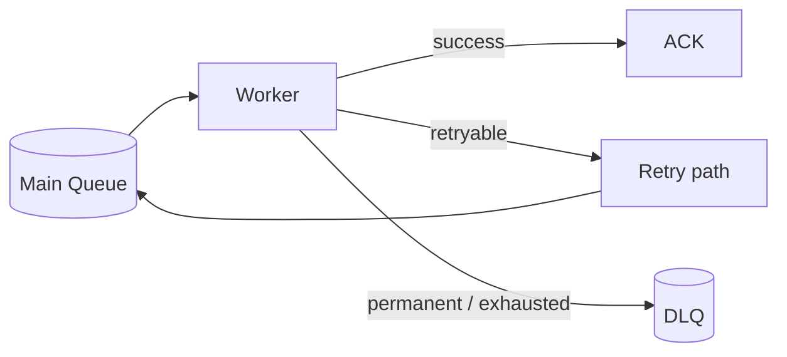

# Day 5 — Retries, Backoff, Poison Messages & Dead-Letter Queues

## Goal

Design retries that recover from transient failure without turning a broken dependency into a denial-of-service attack launched by your own workers.

## Timebox

- 15 min — failure taxonomy
- 20 min — retry/backoff/jitter
- 20 min — DLQ + poison messages
- 15 min — operational recovery
- 10 min — transcription exercise

---

# 1. Not every failure should be retried

Start by classifying.

## Transient

Examples:

```text
HTTP 503 from provider
network timeout
temporary broker/database unavailability
rate limit with retry guidance
```

May succeed later.

## Permanent

Examples:

```text
unsupported codec
corrupt media
invalid credentials/configuration
file deleted by user
schema-invalid message
```

Repeating unchanged input probably will not help.

## Unknown

Sometimes you cannot know immediately.

That is where bounded retries + diagnostics help.

---

# 2. The retry storm

Bad policy:

```text
failure → retry immediately
```

If 1,000 workers hit the same provider outage:

```text
1,000 failures
→ 1,000 immediate retries
→ 1,000 more failures
→ ...
```

Congratulations, your recovery mechanism has become load amplification. 🎉

---

# 3. Exponential backoff

Conceptually:

```text
attempt 1 → wait 1s
attempt 2 → wait 2s
attempt 3 → wait 4s
attempt 4 → wait 8s
```

Usually cap the delay:

```text
max backoff = 5 min
```

Why exponential?

It reduces pressure while the dependency has time to recover.

---

# 4. Add jitter

Without jitter, many workers that fail together retry together.

```text
12:00:00 fail
12:00:01 all retry
12:00:03 all retry
```

Jitter introduces randomness:

```text
retry somewhere between 0 and calculated backoff
```

This spreads synchronized retry waves.

Celery's current task retry support includes exponential backoff and jitter options; regardless of framework, understand the pattern underneath.

---

# 5. Retry budget

Define a bound.

Example:

```text
max attempts: 5
max total retry age: 30 minutes
```

Why both?

Because:

```text
5 retries every 10 seconds
```

and:

```text
5 retries over 3 days
```

have very different user meaning.

A retry budget can include:

- max attempt count,
- max elapsed age,
- maximum cost,
- dependency-specific rules.

---

# 6. Poison messages

A poison message is work that repeatedly fails due to its content or state.

Example:

```text
job_942
codec = broken/proprietary
```

If you blindly requeue it forever:

```text
receive → fail → requeue → receive → fail → ...
```

It consumes worker capacity indefinitely.

You need an escape hatch.

---

# 7. Dead-letter queue

After retry policy is exhausted:



DLQ record should contain enough context to diagnose:

```json
{
  "message_id": "m_123",
  "job_id": "job_42",
  "original_type": "transcription.requested",
  "failure_class": "unsupported_media",
  "attempts": 4,
  "first_seen_at": "...",
  "last_error_code": "FFMPEG_UNSUPPORTED_CODEC"
}
```

Avoid copying huge stack traces or sensitive media payloads into queue messages.

---

# 8. A DLQ is not a graveyard

Bad architecture:

```text
failed → DLQ → nobody looks at it
```

A production DLQ needs an operational policy:

- alerts on rate/age,
- dashboards,
- ownership,
- inspection tooling,
- replay/redrive procedure,
- retention policy,
- security/data classification.

Questions:

```text
Who owns the DLQ?
How long can messages wait?
Can we safely replay?
Did we fix the root cause first?
```

---

# 9. Redrive carefully

Suppose 20,000 messages accumulated because of a provider outage.

Provider recovers.

Bad:

```text
replay all 20,000 immediately
```

Better:

```text
controlled redrive rate
+ health checks
+ concurrency limit
+ observation
```

Recovery traffic must respect dependency capacity.

---

# 10. Delay queue / scheduled retry concept

Do not make a worker sleep for ten minutes holding a process slot:

```python
# bad mental model for large systems
sleep(600)
retry()
```

Instead schedule the message/task for later or put it into a retry mechanism that releases the worker.

Implementation differs by broker/framework:

- broker TTL + dead-letter routing,
- delayed queues/plugins,
- scheduled task framework,
- retry topic/stream with due timestamps.

The architectural idea is:

> **Waiting should consume as little worker capacity as possible.**

---

# 11. Retry safety matrix

| Operation | Retry automatically? | Why |
|---|---|---|
| GET object metadata | Usually yes with bounds | Read/idempotent |
| Update job status via conditional SET | Usually | Can be idempotent |
| External transcription request | Depends | Need provider idempotency/reconciliation |
| Charge card | Only with strong idempotency | Duplicate money effect |
| Parse corrupt MP4 | No repeated blind retry | Permanent input problem |
| DB timeout before outcome known | Carefully | Commit may have happened |

---

# 12. Transcription failure policy exercise

Design policy for:

### A. Object storage timeout

```text
retry?
backoff?
max attempts?
```

### B. ffmpeg reports invalid file

```text
retry?
user-visible error?
DLQ?
```

### C. AI provider returns 429

```text
respect Retry-After?
per-provider concurrency?
```

### D. Worker OOMs on huge input

```text
retry same worker class?
route to larger worker?
permanent after repeated OOM?
```

### E. PostgreSQL unavailable after transcript file stored

```text
how do we reconcile durable object + missing DB state?
```

---

# 13. Break it 💥

1. Retry policy has no jitter.
2. DLQ grows by 50k/day with no alert.
3. Permanent file-format errors use the same retry path as 503s.
4. All DLQ messages are replayed after a bug fix at unlimited speed.
5. Worker ACKs then tries to move message to a DLQ.
6. Error payload includes the user's full private transcript.

For each, identify availability, cost, security, or correctness impact.

---

# Retrieval quiz

1. Difference between transient and permanent failure?
2. Why use exponential backoff?
3. Why add jitter?
4. What is a retry budget?
5. What is a poison message?
6. What is a DLQ for?
7. Why is a DLQ useless without an operational process?
8. Why can bulk redrive overload a recovered dependency?
9. Why should waiting retries not occupy scarce worker slots?
10. Why is retryability a property of the operation, not only the error code?

## Exit criterion

You can design a bounded retry path that protects dependencies, isolates permanent failures, and gives operators a safe recovery path.
