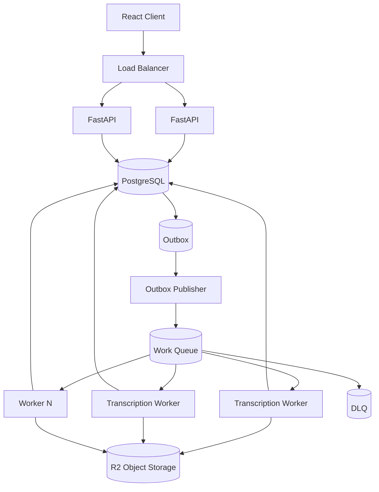
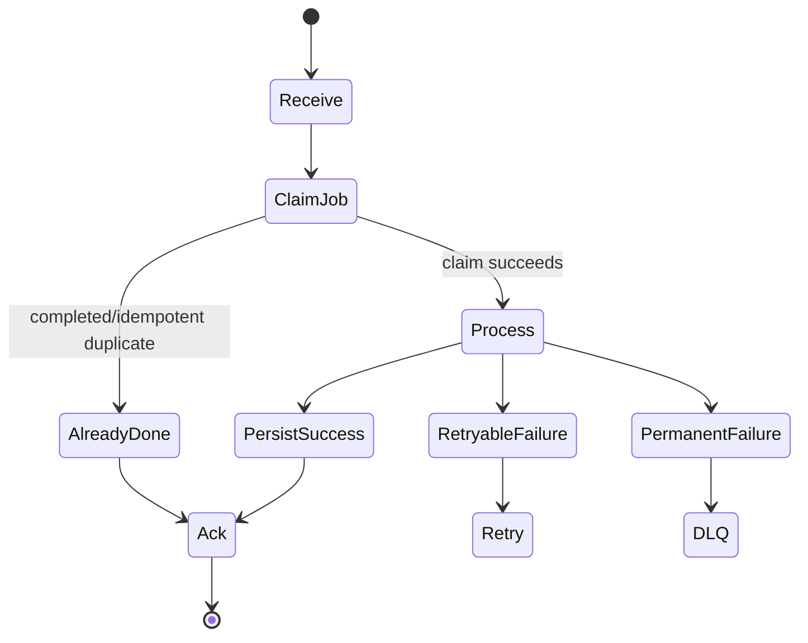

# Day 6 — Queue Architecture for the Transcription Platform

## Goal

Combine Weeks 1–5 into a production-oriented asynchronous transcription architecture.

## Timebox

- 20 min — end-to-end flow
- 20 min — durable publish boundary
- 20 min — worker lifecycle
- 15 min — capacity/metrics
- 15 min — failure analysis

---

# 1. Start from the end of Week 4

We already have direct-to-storage upload:

```text
CONTROL PLANE
Client → LB → FastAPI → PostgreSQL/Redis

DATA PLANE
Client =====================> R2
```

Now upload completes.

What next?

Bad:

```text
POST /uploads/{id}/complete
        ↓
FastAPI starts transcription
        ↓
38 minutes
```

Better:

```text
POST /uploads/{id}/complete
        ↓
create durable Job
        ↓
record publish intent
        ↓
202 Accepted
        ↓
queue
        ↓
workers
```

---

# 2. Proposed high-level architecture



For an MVP you may simplify the outbox, but you should know which failure window you accept if you omit it.

---

# 3. Upload completion transaction

Possible database transaction:

```text
BEGIN

verify upload belongs to user
verify object exists / metadata acceptable

INSERT job(
  id,
  upload_id,
  status='queued'
)

INSERT outbox(
  event_id,
  type='transcription.requested',
  aggregate_id=job_id,
  payload={job_id, upload_id}
)

COMMIT
```

Then:

```text
outbox publisher → broker
```

HTTP can return `202` once the system has durable ownership of the request.

Exactly where you place that durability boundary is an architecture decision.

---

# 4. Message schema

Keep it small and versioned.

```json
{
  "message_id": "evt_01J...",
  "type": "transcription.requested",
  "schema_version": 1,
  "job_id": "job_01J...",
  "upload_id": "upl_01J...",
  "created_at": "2026-08-26T00:00:00Z",
  "trace_id": "..."
}
```

Do not include:

```text
video bytes
full transcript
access token
sensitive unnecessary metadata
```

The worker can load authoritative metadata from PostgreSQL and fetch media using controlled storage access.

---

# 5. Worker lifecycle



Pseudo-flow:

```python
message = receive()
job = load_job(message.job_id)

if job.status == "completed":
    ack(message)
    return

if not claim_job(job):
    handle_existing_owner_or_state()
    return

try:
    result = transcribe(job)
    persist_result_and_complete(job, result)
    ack(message)
except RetryableError:
    schedule_retry(message)
except PermanentError:
    mark_failed(job)
    dead_letter(message)
```

Real code needs careful broker-specific acknowledgement behavior.

---

# 6. Where should result data live?

From Week 2:

```text
PostgreSQL
vs
object storage
vs
hybrid
```

A practical hybrid:

```text
PostgreSQL
- job state
- metadata
- duration
- language
- transcript version
- object key
- searchable excerpts / derived fields

R2
- large raw/final transcript artifacts
- intermediate media/audio if retained
```

Queue messages reference IDs, not huge result bodies.

---

# 7. Worker classes

Do not assume every worker is identical forever.

Potential pools:

```text
CPU preprocessing workers
GPU transcription workers
LLM categorization workers
merge/finalization workers
```

Week 6 will formalize the fan-out/fan-in pipeline.

For Week 5, start with one logical job:

```text
process_video(job_id)
```

Then understand its limitations before splitting it.

---

# 8. Capacity model

Let:

```text
λ = incoming jobs/hour
μ = jobs/hour per worker
N = workers
```

Total steady processing capacity:

```text
N × μ
```

If:

```text
λ > N × μ
```

backlog grows.

Example:

```text
arrival = 300 videos/hour
one worker = 5 videos/hour
workers = 40

capacity = 200/hour
backlog growth = 100/hour
```

No queue setting fixes that permanently.

You need more throughput, less work, admission control, or longer accepted wait time.

---

# 9. Queue delay is part of user latency

User-perceived completion time:

```text
upload time
+
queue wait time
+
processing time
+
finalization time
```

A system can report:

```text
worker processing p95 = 8 min ✅
```

while users wait 90 minutes because:

```text
queue wait p95 = 82 min 💀
```

Therefore monitor **queue age/wait latency**, not only worker runtime.

---

# 10. Minimum queue dashboard

Track:

## Demand

```text
publish rate
queue depth
oldest queued age
```

## Processing

```text
worker concurrency
completion rate
processing p50/p95/p99
```

## Reliability

```text
retry rate
redelivery rate
DLQ rate
permanent failure rate
```

## Broker

```text
broker availability
memory/disk
consumer lag/pending count
connection/channel health
```

## Business

```text
time from upload complete → transcript complete
cost per video minute
jobs failing by failure code
```

---

# 11. Autoscale workers on useful signals

CPU may help, but for background work the more useful signal can be:

```text
queue age
queue depth adjusted for job cost
consumer lag
```

Example policy:

```text
Target: oldest queued job < 2 min

if oldest age > 2 min
and provider/database healthy
→ add workers
```

But remember Week 4:

> Scaling workers against an already-saturated dependency can make the outage worse.

Autoscaling needs dependency/concurrency limits.

---

# 12. Fairness

Imagine:

```text
Enterprise customer uploads 5,000 videos
Free user uploads 1 video
```

Pure FIFO might make the free user wait behind thousands of jobs.

Possible strategies:

- per-user concurrency limits,
- per-plan queues,
- weighted fair scheduling,
- priority levels,
- admission quotas.

Do not over-engineer on day one, but recognize this as a product requirement disguised as queue architecture.

---

# 13. Cancellation

User clicks Cancel.

Queue removal alone may not be enough if worker already owns the message.

Durable job state can include:

```text
cancel_requested_at
```

Worker checks safe cancellation points.

For an external provider, cancellation may require provider API support.

Again, the database holds business intent; queue state alone is not sufficient.

---

# 14. Failure matrix

| Failure | Desired behavior |
|---|---|
| FastAPI dies after DB commit | outbox eventually publishes |
| Broker unavailable | job remains durably queued-to-publish |
| Worker dies before processing | message becomes available/redelivered |
| Worker dies after result save | duplicate delivery handled idempotently |
| Provider 503 | bounded retry with backoff/jitter |
| Corrupt media | permanent failure, no blind retry loop |
| PostgreSQL slow | reduce worker pressure / backpressure |
| Queue backlog grows | alert + scale/throttle based on policy |
| DLQ grows | operator-owned incident/recovery workflow |

---

# 15. Exercise — your Week 5 architecture ADR

Choose:

```text
Redis Streams
or
RabbitMQ
or
Kafka
```

for the first production version of the transcription job queue.

Write:

- requirements,
- expected jobs/hour,
- message schema,
- delivery semantics,
- ACK point,
- idempotency strategy,
- retry policy,
- DLQ policy,
- worker scaling signal,
- why the other two options are not selected **yet**,
- migration trigger.

There is no magic answer.

The reasoning is the deliverable.

---

# Retrieval quiz

1. Why should queue messages contain IDs rather than video bytes?
2. What problem does the outbox address?
3. What state should be authoritative for users: broker queue state or PostgreSQL job state?
4. What is the ACK point in the proposed worker lifecycle?
5. Why is queue wait time part of user latency?
6. Give five queue/worker metrics.
7. When can worker autoscaling make an incident worse?
8. Why might per-user fairness become necessary?
9. How would cancellation differ before vs after a worker receives a message?
10. What evidence would make you migrate your initial broker choice?

## Exit criterion

You can explain the complete upload-complete → queue → worker → transcript lifecycle including every major crash window.
