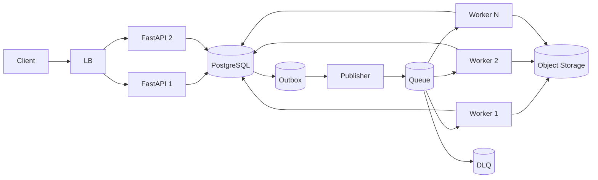

# Day 7 — Design Lab: Asynchronous Transcription Pipeline

## Mission

Design a production-oriented asynchronous job system for 1+ hour video transcription.

Do not optimize for naming the fanciest broker.

Optimize for:

```text
correctness
recovery
operability
scaling
cost
clarity
```

## Timebox

- 15 min — requirements
- 15 min — workload/capacity assumptions
- 20 min — API + data model
- 25 min — queue/worker architecture
- 20 min — failure semantics
- 15 min — broker decision
- 15 min — observability + scaling
- 15 min — review/rubric

---

# Scenario

Users upload videos directly to object storage.

Typical video:

```text
60–120 minutes
```

After upload completion the system must:

1. create a durable transcription job,
2. process it asynchronously,
3. survive worker/broker/API failures,
4. expose job status,
5. avoid duplicate business effects,
6. retry transient failures,
7. isolate permanently broken jobs,
8. scale workers independently of APIs.

Week 6 will split each video into chunk sub-jobs. For this lab, treat one video as one logical work message.

---

# Step 1 — Functional requirements

Your system must support:

```http
POST /uploads/{upload_id}/complete
GET  /jobs/{job_id}
POST /jobs/{job_id}/retry
POST /jobs/{job_id}/cancel
```

Optional:

```http
GET /jobs
```

Define response/status semantics.

Ask:

- Should `/complete` be idempotent?
- What happens if the client retries because the response was lost?
- Can users retry a permanently invalid file?
- Who may cancel a job?

---

# Step 2 — Non-functional requirements

Choose explicit targets.

Example starting assumptions:

```text
API availability target: 99.9%
POST /complete p95: < 500 ms excluding storage verification
job enqueue durability: high
worker delivery: at-least-once
job status freshness: seconds
```

Define your own.

Do not say “highly available” without an operational meaning.

---

# Step 3 — Workload assumptions

Use a scenario:

```text
10,000 upload completions arrive during a 20-minute burst
average job processing time if treated as one job: 12 minutes
```

Completion request rate:

```text
10,000 / 1,200 sec
≈ 8.3 requests/sec average during burst
```

The API control-plane load is modest compared with media bandwidth.

But worker demand is enormous.

If one worker completes:

```text
5 videos/hour
```

then 100 workers provide:

```text
500 videos/hour
```

10,000-job burst drainage time without new arrivals:

```text
10,000 / 500 = 20 hours
```

That may be unacceptable.

This is why Week 6 introduces chunking and parallel processing.

The queue lets the system survive the burst; it does not make the backlog disappear.

---

# Step 4 — Data model

Start with:

```text
User
 ↓
Upload
 ↓
Job
```

Suggested job fields:

```text
id
upload_id
user_id
status
attempt_count
message_version
created_at
queued_at
started_at
completed_at
cancel_requested_at
last_error_code
provider_operation_id
worker_lease_until
```

Add:

```text
outbox_events
processed_messages (optional inbox/dedupe)
```

Explain which constraints protect idempotency.

---

# Step 5 — API transaction

Design:

```http
POST /uploads/{upload_id}/complete
```

One possible transaction:

```text
BEGIN
  verify upload
  create/reuse Job via unique(upload_id, pipeline_version)
  create Outbox event via unique(event_id/logical key)
COMMIT
```

Response:

```http
202 Accepted
Location: /jobs/{id}
```

Client retry should return the same logical job, not create 17 transcription jobs because Wi-Fi sneezed.

---

# Step 6 — Draw architecture

Your diagram should include:

```text
React
Load Balancer
FastAPI replicas
PostgreSQL
Outbox publisher
Broker/queue
Worker pool
Object storage
DLQ
```

Suggested shape:



Now annotate every arrow with:

```text
request
transaction
message
media read
state update
acknowledgement
```

---

# Step 7 — Choose broker

Write a decision table:

| Requirement | Redis Streams | RabbitMQ | Kafka |
|---|---:|---:|---:|
| Simple worker pool | | | |
| Existing operational familiarity | | | |
| Explicit ACK/requeue | | | |
| Routing/priority | | | |
| Event replay | | | |
| Many independent subscribers | | | |
| Operations complexity | | | |

Then choose one.

Your conclusion should sound like:

> “For v1, I choose X because our primary workload is Y and we need A/B/C. I am not choosing Z because its advantage D is not yet a requirement. I would revisit this when metric/requirement E changes.”

That is architecture reasoning.

---

# Step 8 — Delivery and ACK contract

Write explicitly:

```text
Delivery: at-least-once
ACK: after durable success state
Duplicate handling: ...
```

Then walk this sequence:

```text
receive job_42
transcribe
store result
mark completed
CRASH
```

Message redelivers.

What happens?

Your answer must not be:

```text
“hopefully broker knows.”
```

---

# Step 9 — Retry policy

Create a table:

| Failure | Retry? | Backoff | Max | Final action |
|---|---|---|---|---|
| R2 timeout | | | | |
| AI provider 503 | | | | |
| AI provider 429 | | | | |
| invalid MP4 | | | | |
| DB timeout | | | | |
| worker OOM | | | | |

Include jitter.

Define what reaches DLQ versus what becomes an ordinary permanent user-facing failure without DLQ.

Not every invalid input needs operator investigation.

---

# Step 10 — Poison-message strategy

Define:

```text
max attempts
max retry age
failure classification
DLQ metadata
DLQ alert threshold
redrive process
```

Then answer:

> If 50,000 messages are in the DLQ after a provider bug, how do you recover without causing a second outage?

---

# Step 11 — Capacity + backlog

Track:

```text
arrival_rate
completion_rate
queue_depth
oldest_job_age
```

If:

```text
arrival_rate > completion_rate
```

for a sustained period, backlog grows.

Give your system an SLO such as:

```text
95% of accepted jobs begin processing within 5 minutes
```

Now worker scaling has a user-facing target.

---

# Step 12 — Backpressure from Week 4

If queue age exceeds what the product can tolerate:

Possible choices:

- add workers,
- lower per-user concurrency,
- reject/defer new free-tier work,
- expose realistic wait estimates,
- route premium work separately,
- reduce processing quality/cost if product allows,
- stop scaling when downstream AI/DB capacity is saturated.

A queue should make overload **visible and controllable**, not invisible.

---

# Step 13 — Observability

Your dashboard must include at least:

```text
publish success/failure rate
queue depth
oldest message age
consumer count
in-flight/pending messages
processing p95
redelivery/retry rate
DLQ rate and age
job end-to-end completion p95
```

Add correlation:

```text
trace_id
message_id
job_id
upload_id
attempt
worker_id
```

Do not put PII into identifiers/logs unnecessarily.

---

# Step 14 — Failure defense

Explain expected behavior for:

1. FastAPI crashes before responding.
2. PostgreSQL commits but broker is offline.
3. Outbox event is published twice.
4. Worker dies immediately after receive.
5. Worker completes DB write but ACK is lost.
6. Broker node fails.
7. All workers disappear for 20 minutes.
8. AI provider is down for 45 minutes.
9. One video always crashes ffmpeg.
10. DLQ storage is filling.

---

# Step 15 — Cost

Queues create economic controls too.

Track:

```text
worker-hours
GPU-hours
provider cost/minute
retry cost
duplicate processing cost
broker/storage cost
```

A retry that is technically safe may still be economically stupid if it repeats a €4 operation five times.

---

# Step 16 — Produce the design review

Use:

```text
Requirements
SLOs
Scale assumptions
API contract
Data model
Message schema
Broker choice
Delivery semantics
Idempotency
Retry/DLQ
Worker scaling
Backpressure/fairness
Observability
Security/privacy
Cost
Tradeoffs
Migration triggers
```

---

# Scoring rubric — 20 points

| Area | Points |
|---|---:|
| Requirements + assumptions | 2 |
| API + durable job model | 2 |
| Queue architecture | 2 |
| Delivery/ACK reasoning | 2 |
| Idempotency | 3 |
| Retry + DLQ | 2 |
| Broker tradeoff decision | 2 |
| Capacity/backpressure | 2 |
| Observability | 2 |
| Clear tradeoffs / migration trigger | 1 |

### 17–20

Strong. You are reasoning about asynchronous systems, not merely drawing a queue icon.

### 13–16

Good. Revisit crash windows and idempotency.

### 9–12

You understand the components, but delivery/failure semantics need more work.

### <9

Return to Days 1–3 before moving to orchestration.

---

# Final oral defense

Answer in under 3 minutes:

> Why is `POST /transcribe` → queue → worker better than keeping the HTTP request open, and what new problems did adding the queue create?

A strong answer includes both sides:

```text
Benefits:
- decoupling
- independent worker scaling
- durable buffering
- retry/recovery
- fast API response

New problems:
- duplicate delivery
- ordering
- backlog
- broker availability
- idempotency
- retry storms
- DLQ operations
- observability
```

That second list is where actual system design begins. 🥷
