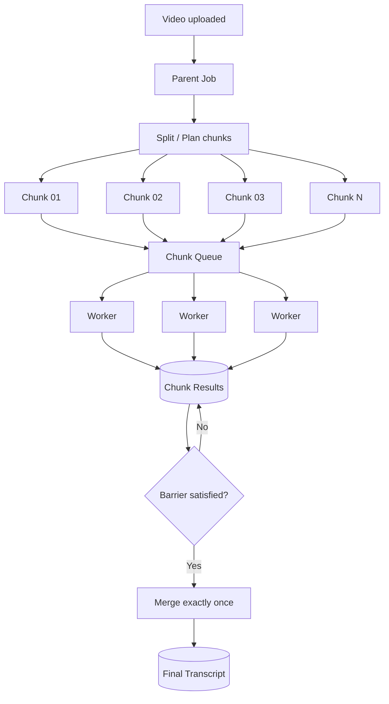

# Week 6 — Distributed Processing & Orchestration 🌶️

## Mission

By the end of this week, you should be able to take one large unit of work, split it into independently retryable tasks, execute those tasks in parallel without overwhelming dependencies, and safely merge the results back into one deterministic output.

This week turns the transcription pipeline from:

```text
Video → One Worker → Transcript
```

into:

```text
                 ┌─ Chunk 01 → Worker
                 ├─ Chunk 02 → Worker
Video → Split ───┼─ Chunk 03 → Worker
                 ├─ ...
                 └─ Chunk N  → Worker
                         ↓
                       Merge
                         ↓
                    Transcript
```

The easy part is creating more tasks.

The hard part is keeping the system correct when:

- tasks finish out of order,
- the same task is delivered twice,
- one chunk is much slower than the others,
- workers crash after committing output,
- cancellation races with completion,
- two workers both think they are the last one,
- a merge starts before every required result is durable,
- an orchestrator itself restarts halfway through the workflow.

That is the actual lesson.

---

## Prerequisites

You should already be comfortable with:

- queues, producers, consumers and workers,
- at-least-once delivery,
- idempotency,
- retries and DLQs,
- PostgreSQL transactions and unique constraints,
- horizontal scaling and backpressure.

Those concepts came from Weeks 2, 4 and 5. Week 6 combines them.

---

## Week architecture



---

## Learning outcomes

By Sunday, you should be able to:

- explain fan-out and fan-in without using framework-specific vocabulary,
- distinguish concurrency, parallelism and throughput,
- choose a chunk size from workload evidence rather than habit,
- model parent and child jobs explicitly,
- bound concurrency globally, per tenant and per parent job,
- explain why stragglers matter to fan-in latency,
- design a deterministic merge stage,
- identify race conditions before production does it for you,
- prefer uniqueness/CAS/idempotency over locks when possible,
- explain what a distributed lock lease does **not** guarantee,
- compare simple queue orchestration with Celery chords, workflow engines and managed orchestrators,
- defend why retrying one failed chunk is usually better than retrying an entire long video.

---

## Daily plan

| Day | Topic | Main deliverable |
|---|---|---|
| 1 | Fan-out, fan-in, concurrency & parallelism | Distributed-processing diagram + speedup worksheet |
| 2 | Work partitioning & chunk-size strategy | Chunk-size ADR |
| 3 | Parent/child jobs, orchestration & bounded concurrency | Workflow state machine |
| 4 | Fan-in, aggregation, ordering, stragglers & progress | Deterministic merge algorithm |
| 5 | Race conditions, distributed locks & idempotency | Race-condition mitigation table |
| 6 | Orchestrators: DB+queue, Celery, Temporal, Step Functions | Orchestration decision matrix |
| 7 | Design lab: 90-minute transcription pipeline | Full distributed-processing design review |

---

## The Week 6 rule

For every parallel stage, ask:

1. **What is the unit of work?**
2. **How is that unit uniquely identified?**
3. **What is the maximum useful concurrency?**
4. **What happens if one unit runs twice?**
5. **What happens if one unit never finishes?**
6. **How do we know the fan-in barrier is satisfied?**
7. **How do we guarantee the finalizer runs safely?**

If you cannot answer those seven questions, the workflow is not yet production-ready.

---

## The core transcription model

A useful starting model is:

```text
Parent Job
  id
  upload_id
  status
  expected_chunks
  completed_chunks
  failed_chunks
  pipeline_version

Chunk Job
  id
  parent_job_id
  chunk_index
  start_ms
  end_ms
  status
  attempt_count
  output_uri / output_text
```

And one critical invariant:

```text
UNIQUE(parent_job_id, chunk_index, pipeline_version)
```

That invariant does more correctness work than a surprising amount of distributed-lock code.

---

## Final challenge

At the end of the week, you should be able to answer this cleanly:

> Why retry one failed chunk instead of retrying a 90-minute video?

A strong answer should mention **failure-domain size, wasted work, retry latency, idempotency, observable progress, parallel scheduling and cost** — not just “because chunks are smaller.”
