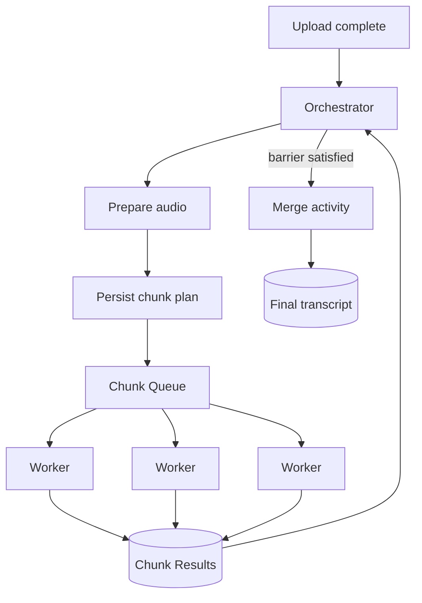

# Day 6 — Orchestration Tools: DB+Queue, Celery, Temporal & Step Functions

## Goal

Understand what workflow/orchestration tools automate, what guarantees they provide, and when the transcription pipeline has outgrown a hand-built database+queue coordinator.

## Timebox

- 20 min — minimal orchestrator
- 20 min — Celery canvas
- 20 min — durable workflow engines
- 15 min — managed orchestration
- 20 min — decision matrix

---

# 1. Start with the problem, not the tool

The workflow is:

```text
Upload complete
   ↓
Extract audio
   ↓
Plan chunks
   ↓
Fan out chunk transcription
   ↓
Wait / retry
   ↓
Fan in
   ↓
Merge
   ↓
Categorize / post-process
   ↓
Complete
```

A workflow tool exists to make state, retries, waiting, fan-out and recovery easier to manage.

It does not make the business invariants disappear.

---

# 2. Option A — Database + queue orchestrator

You can build this with technologies already learned:

```text
PostgreSQL = workflow state
Queue      = task delivery
Workers    = task execution
Orchestrator service = transition logic
```

Advantages:

- few new dependencies,
- complete control,
- easy to start,
- excellent learning vehicle.

Tradeoffs:

- you implement timers/retries/state recovery,
- fan-in coordination is yours,
- observability UI is yours,
- workflow evolution/versioning is yours.

For an MVP, this can be entirely reasonable.

---

# 3. Option B — Celery Canvas

Celery provides workflow primitives such as:

- `chain` — sequential tasks,
- `group` — parallel tasks,
- `chord` — parallel group followed by a callback,
- `map` / `starmap`.

A chord maps naturally to:

```text
GROUP(chunk transcriptions)
        ↓
all complete
        ↓
CHORD CALLBACK(merge)
```

Conceptually:

```python
chord(
    transcribe_chunk.s(chunk_id)
    for chunk_id in chunk_ids
)(merge_transcript.s(job_id))
```

This is a direct fan-out/fan-in abstraction.

But ask:

- Which result backend is required?
- What happens to huge chord result sets?
- How are retries configured?
- How do I inspect a workflow stuck for hours?
- How do I version a long-running workflow safely?

Framework convenience does not remove operational questions.

---

# 4. Option C — Temporal-style durable workflow engine

A durable workflow engine persists workflow history so that orchestration can resume after process crashes.

A useful mental model:

```text
Workflow = durable coordination logic
Activity = side-effecting unit of work
```

For transcription:

```text
TranscriptionWorkflow
  1. prepare media activity
  2. fan out chunk activities / child workflows
  3. await results
  4. merge activity
  5. finalize
```

Why this can help:

- long-running workflow state survives process restarts,
- retries/timers are first-class,
- workflow history is inspectable,
- cancellation/signals can be modeled explicitly.

Tradeoffs:

- new platform and programming model,
- deterministic workflow constraints,
- operational/vendor considerations,
- another piece of infrastructure to understand.

Do not add a workflow engine just because the diagram looks fancy.

Add it when orchestration complexity is becoming the product's complexity.

---

# 5. Option D — Managed workflow orchestrator

AWS Step Functions is one concrete managed example.

Its `Map` state can execute iterations in parallel, and Distributed Map can run child workflow executions with explicit concurrency limits.

This maps to:

```text
Parent workflow
   ↓
Distributed Map
   ├→ chunk workflow
   ├→ chunk workflow
   └→ chunk workflow
   ↓
merge state
```

Advantages:

- managed state persistence,
- built-in observability,
- explicit concurrency and failure thresholds,
- little orchestrator infrastructure to operate.

Tradeoffs:

- cloud coupling,
- pricing per state/execution model,
- service-specific limits,
- portability.

Use it as a **reference architecture**, not a default recommendation.

---

# 6. Orchestrator comparison

| Requirement | DB + Queue | Celery Canvas | Durable Workflow Engine | Managed Workflow |
|---|---|---|---|---|
| Simple MVP | Excellent | Good | Heavier | Good if already cloud-native |
| Fan-out/fan-in | Manual | Built-in group/chord | Built-in pattern | Map/parallel states |
| Crash recovery | You build | Task-level + backend | Core feature | Core feature |
| Long waits/timers | Awkward | Possible | Strong | Strong |
| Workflow visibility | You build | Moderate | Strong | Strong |
| Vendor neutrality | High | High | Medium/high | Low |
| Operational burden | Medium | Medium | Medium | Lower infra / vendor coupling |
| Learning complexity | Low initially | Medium | Higher | Medium |

No row has a universal winner.

---

# 7. The orchestration boundary

A useful design principle:

> Put coordination in the orchestrator; keep heavy computation in workers/activities.

Bad:

```text
workflow state function downloads and transcribes 1GB media
```

Better:

```text
workflow schedules activity(chunk_id)
worker downloads/processes chunk
workflow receives durable result/status
```

The workflow should coordinate, not become the media processor.

---

# 8. What should be durable?

At minimum:

- parent identity,
- pipeline version,
- child plan,
- terminal child results/status,
- cancellation intent,
- retry/exhaustion state,
- merge/finalization state.

Do not make the queue itself the only source of workflow truth.

Queues are excellent delivery mechanisms.

They are usually poor workflow databases.

---

# 9. Transcription reference architecture



Important:

```text
orchestrator state ≠ queue state
```

The queue tells you what may be delivered.
The workflow state tells you what the business believes happened.

---

# 10. Decision triggers

Stay with a DB+queue coordinator while:

- workflow is short/simple,
- few stages,
- retries are easy,
- little waiting/cancellation complexity,
- team can reason about state transitions.

Consider a workflow engine when:

- workflows run for hours/days,
- many dependent stages,
- dynamic fan-out/fan-in,
- complex compensation/cancellation,
- timer-heavy behavior,
- repeated coordination bugs,
- operational visibility becomes painful.

This is an evolutionary decision.

---

# Exercise — Choose an orchestrator

For your transcription MVP assume:

```text
1–2 hour videos
90–180 chunk tasks
retries per chunk
merge stage
categorization stage
job cancellation
real-time progress
small engineering team
EU/GDPR constraints
```

Compare:

1. PostgreSQL + Redis/RabbitMQ + custom orchestrator,
2. Celery chord,
3. Temporal,
4. AWS Step Functions.

For each write:

```text
What problem it removes
What complexity it adds
Migration/lock-in cost
Operational model
GDPR/data-residency question
Trigger that would justify it
```

Then choose **one for MVP** and **one possible future migration path**.

---

# Retrieval quiz

1. What does a workflow orchestrator own?
2. Why should heavy media processing not happen inside orchestration logic?
3. What is a Celery group?
4. What is a Celery chord?
5. What is durable execution conceptually?
6. Why do workflow engines help after process crashes?
7. What does a managed Map/Distributed Map abstraction provide?
8. Why should the queue not be the only workflow source of truth?
9. Give three signals that a custom orchestrator is becoming too complex.
10. Why is choosing an orchestrator an evolutionary architecture decision?

## Exit criterion

You can choose an orchestration approach from workflow requirements rather than tool popularity.
