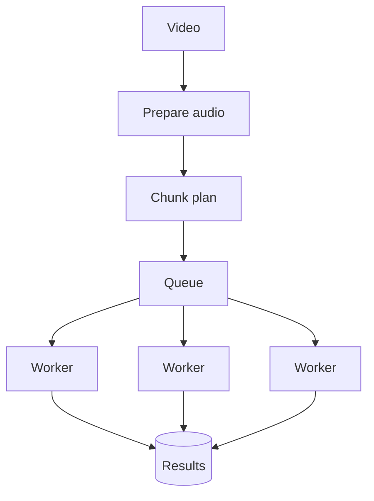

# Day 7 — Design Lab: Distributed 90-Minute Transcription Pipeline 🔥

## Mission

Design a production-oriented distributed pipeline for a **90-minute video** where individual chunk failures can be retried independently and the final transcript is created deterministically exactly once at the business level.

This lab combines Weeks 1–6.

Do not open the answer key until you finish your first design.

---

## Timebox

- 15 min — requirements
- 15 min — workload assumptions
- 20 min — data/job model
- 25 min — fan-out + concurrency
- 25 min — fan-in + race handling
- 20 min — failure injection
- 15 min — orchestration/tool choice
- 15 min — write ADR / self-score

---

# Scenario

A user uploads a 90-minute meeting video.

The system must:

- extract/normalize audio,
- split it into independently processable chunks,
- transcribe chunks in parallel,
- preserve timestamps/order,
- retry transient chunk failures,
- expose progress,
- allow cancellation,
- merge results into one transcript,
- avoid duplicate business effects under at-least-once delivery.

Assume the user may upload many such videos and the platform may process thousands of jobs concurrently.

---

# Step 1 — Functional requirements

Write your own first.

Minimum:

```text
create parent job
prepare media
create chunk plan
process chunks
retry chunk failures
track progress
merge results
return transcript
cancel job
```

Optional:

- speaker diarization,
- language detection,
- categorization,
- partial transcript preview,
- fallback transcription provider.

---

# Step 2 — Non-functional requirements

Choose explicit targets.

Example questions:

- How quickly should processing start after upload?
- What p95 completion target exists for a 90-minute video?
- How much stale progress is acceptable?
- What percentage of jobs may require manual intervention?
- Must partial transcripts survive a worker restart?
- How many concurrent videos should one tenant be able to process?

Do not design scale without defining the intended scale.

---

# Step 3 — Chunk strategy

Compare:

```text
30 sec  → 180 chunks
60 sec  →  90 chunks
5 min   →  18 chunks
```

Choose one starting point.

Record:

```text
chunk target duration
min/max duration
boundary strategy
overlap
pipeline version
chunk identity
```

Explain why.

---

# Step 4 — Parent/child data model

Design at least:

```text
jobs
chunks
transcripts / artifacts
```

Required invariants:

```text
one logical chunk per:
(job_id, chunk_index, pipeline_version)
```

Decide whether parent progress is:

- counter-maintained,
- query-derived,
- both.

Explain how duplicate completion cannot increment it twice.

---

# Step 5 — Fan-out architecture

Draw:



Now add:

- orchestrator,
- PostgreSQL,
- object storage,
- retry/DLQ path,
- concurrency limiter.

---

# Step 6 — Capacity math

Assume:

```text
90 chunks
average chunk service time = 20 seconds
per-video chunk concurrency = 15
```

Ideal chunk-wave time:

```text
ceil(90 / 15) × 20s
= 120 seconds
```

Now add:

```text
prepare time
queue delay
p95 chunk time
retry delay
merge time
```

Your design target must use p95/p99 behavior, not only ideal averages.

### Alternative capacity question

If the platform has:

```text
5,000 active parent jobs
10 chunk concurrency per parent
```

that theoretical demand is:

```text
50,000 concurrent chunk tasks
```

Should you allow that?

Probably not without provider/GPU capacity to support it.

Define global and per-tenant bounds.

---

# Step 7 — Retry one chunk vs whole video

Write a short design defense.

Your answer should include:

## Failure domain

```text
whole video → up to 90 minutes logical work at risk
chunk       → one partition at risk
```

## Wasted compute

Successful chunks remain durable.

## Recovery latency

A failed child can re-enter the queue immediately without recomputing everything.

## Cost

Only failed work is repeated.

## Progress

The user retains visible completed progress.

## Idempotency

Redelivery of one child is easier to make duplicate-safe than replaying the whole workflow blindly.

## Caveat

More tasks create more orchestration overhead and more opportunities for individual transient failures. Chunking is not free.

---

# Step 8 — Fan-in barrier

Define exactly when merge is allowed.

Strict example:

```text
all expected chunk rows = SUCCEEDED
AND
all outputs durable
AND
parent desired_state != CANCELLED
```

Then define how one actor claims merge.

Possible DB guard:

```sql
UPDATE jobs
SET status = 'merging'
WHERE id = :job_id
  AND status = 'processing'
  AND completed_chunks = expected_chunks;
```

Only one logical claimant should succeed.

Then **reconcile child rows before merge**, rather than trusting only the counter.

---

# Step 9 — Merge algorithm

Specify:

- ordering,
- overlap handling,
- timestamps,
- missing chunks,
- output key,
- retry behavior.

Example deterministic output key:

```text
jobs/{job_id}/pipeline-v3/final-transcript.json
```

Crash injection:

```text
object write succeeds
DB update fails
```

How does retry remain safe?

---

# Step 10 — Race-condition drill

Solve all of these:

### A — Duplicate delivery

Chunk 42 is delivered to Worker A and Worker B.

### B — Lost ACK

Worker commits chunk 42, crashes before ACK.

### C — Last-two-workers race

Chunks 88 and 89 finish simultaneously.

### D — Cancellation race

User cancels while merge is being claimed.

### E — Slow original + retry

Worker A appears dead. Worker B gets a retry. Both eventually finish.

### F — Old pipeline message

A pipeline-v2 chunk arrives while job is currently reprocessing on pipeline-v3.

For each write:

```text
invariant
mechanism
expected state
```

---

# Step 11 — Lock decision

Answer:

> Do I need a distributed lock to merge?

Do not answer yes/no immediately.

First try:

- DB unique constraints,
- guarded state transition,
- idempotent deterministic output,
- transaction/advisory lock if needed.

If you choose an external distributed lock, specify:

- owner identity,
- lease duration,
- renewal,
- stale-owner behavior,
- fencing strategy,
- failure during release.

If that feels more complicated than a DB CAS, that is useful evidence.

---

# Step 12 — Orchestration choice

Choose:

```text
A. PostgreSQL + queue + custom orchestrator
B. Celery group/chord
C. Temporal-style workflow engine
D. Managed workflow service
```

Defend using:

- workflow duration,
- dynamic fan-out,
- cancellation,
- observability,
- team size,
- operational burden,
- portability,
- GDPR/data residency,
- cost.

---

# Step 13 — Metrics

At minimum:

## Parent

```text
job_completion_seconds
job_queue_delay_seconds
job_failure_rate
job_cancel_rate
```

## Chunk

```text
chunk_service_seconds p50/p95/p99
chunk_retry_rate
chunk_permanent_failure_rate
chunk_queue_age
chunk_duplicate_suppressed_total
```

## Fan-out/fan-in

```text
fanout_children_total
active_children_per_parent
straggler_ratio
merge_wait_seconds
merge_duration_seconds
merge_duplicate_claims_total
```

## Dependencies

```text
AI provider throttles/errors
object-storage latency/errors
DB connection utilization
queue depth/oldest age
```

---

# Step 14 — Cost model

Track:

```text
media minutes processed
retry minutes processed
AI cost
GPU/CPU worker time
storage intermediate bytes
queue/workflow operations
```

A useful KPI:

```text
retry_amplification = retried_media_minutes / original_media_minutes
```

A chunked system should keep this far below the “retry entire video” alternative.

---

# Step 15 — Write the design review

Use:

```text
Requirements
Scale assumptions
Partition strategy
Parent/child model
Fan-out
Concurrency/fairness
Delivery semantics
Idempotency
Fan-in barrier
Merge algorithm
Race conditions
Lock decision
Failure handling
Cancellation
Observability
Cost
Orchestrator choice
Tradeoffs
Open questions
```

---

# 20-point self-score

Give yourself 0–2 each:

| Area | Score |
|---|---:|
| Requirements & scale | /2 |
| Chunking rationale | /2 |
| Parent/child model | /2 |
| Concurrency & backpressure | /2 |
| Idempotency | /2 |
| Fan-in correctness | /2 |
| Race-condition handling | /2 |
| Failure/cancellation | /2 |
| Observability/cost | /2 |
| Tradeoff/orchestrator defense | /2 |

Interpretation:

```text
18–20  strong
15–17  good, revisit weak sections
11–14  review Days 3–5
≤10    rebuild the workflow from first principles
```

---

# Final oral defense

Without notes, answer in 3 minutes:

> “Why retry one failed chunk instead of retrying a 90-minute video?”

Then answer the harder follow-up:

> “What new distributed-systems problems did chunking create?”

If you can answer both cleanly, Week 6 did its job. 🌶️
