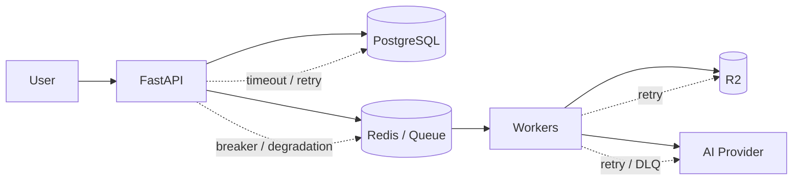

# Week 7 — Reliability Engineering 🛡️

## Mission

By the end of this week, you should stop treating failures as surprising exceptions and start designing **explicit failure behavior** into every dependency boundary.

The mindset changes from:

```text
Will this fail?
```

to:

```text
When it fails:
- how do we detect it?
- how long do we wait?
- should we retry?
- what state may already have changed?
- how do we avoid making the failure worse?
- what can still work?
- how do we recover?
```

That is reliability engineering.

---

## Week architecture



Every arrow is now treated as a **failure boundary**.

---

## Learning outcomes

By Sunday, you should be able to:

- distinguish transient, permanent, partial and slow failures,
- create a timeout budget rather than picking arbitrary timeout values,
- explain why retries can improve availability **and** cause outages,
- use exponential backoff, caps and jitter deliberately,
- define which operations are safe to retry,
- explain CLOSED / OPEN / HALF_OPEN circuit-breaker behavior,
- distinguish a circuit breaker from a timeout, retry, rate limiter and bulkhead,
- design graceful degradation instead of all-or-nothing availability,
- separate startup, liveness and readiness checks,
- reason about graceful shutdown and connection draining,
- define RTO and RPO for stateful dependencies,
- explain failover hazards such as stale replicas and split brain,
- design recovery for Redis, PostgreSQL, object storage and AI-provider failure,
- create a reliability playbook for the transcription platform,
- run a small failure-injection / game-day exercise.

---

## Prerequisites

You should already understand:

- stateless APIs and load balancing,
- rate limiting and backpressure,
- PostgreSQL transactions and replication basics,
- Redis and caching,
- queues, ACKs, retries and DLQs,
- idempotency,
- parent/child distributed workflows.

Weeks 1–6 gave you the components. Week 7 teaches you what happens when those components misbehave.

---

## Daily plan

| Day | Topic | Main deliverable |
|---|---|---|
| 1 | Failure models, deadlines & timeouts | Dependency timeout budget |
| 2 | Retries, exponential backoff, jitter & retry budgets | Retry policy matrix |
| 3 | Circuit breakers, bulkheads & dependency isolation | Dependency protection flow |
| 4 | Graceful degradation, health checks & graceful shutdown | Degraded-mode + health policy |
| 5 | Failover, redundancy, RTO/RPO & stateful recovery | Failover strategy |
| 6 | Transcription recovery playbook | Dependency-by-dependency recovery matrix |
| 7 | Chaos design lab: destroy the transcription system | Reliability review + game-day plan |

---

## The Week 7 rule

For every remote dependency, answer these eight questions:

1. **What is the timeout/deadline?**
2. **Which failures are retryable?**
3. **Is the operation idempotent?**
4. **What is the maximum retry budget?**
5. **How is overload prevented from becoming a retry storm?**
6. **What happens when the dependency stays unhealthy?**
7. **Can the product degrade instead of fail completely?**
8. **What state is required to recover safely?**

If these are unknown, failure behavior is currently accidental.

---

## Core reliability stack

```text
Deadline / timeout
      ↓
Classify failure
      ↓
Retry safely?
  ├─ no → fail / degrade / DLQ
  └─ yes
       ↓
exponential backoff + jitter
       ↓
retry budget exhausted?
  ├─ no → retry
  └─ yes → breaker / DLQ / fail
```

A stronger system does **not** retry everything forever.

---

## Final challenge

By the end of the week, you should be able to defend this question dependency by dependency:

> Redis dies. A worker crashes halfway through chunk 37. PostgreSQL becomes unavailable. R2 returns `503`. The AI provider begins returning `429`. The user submits the same upload twice. What happens next?

A good answer names:

- user-visible behavior,
- durable state,
- retryability,
- timeout/backoff,
- idempotency boundary,
- degraded mode,
- failover path,
- alerts/metrics,
- recovery procedure.
