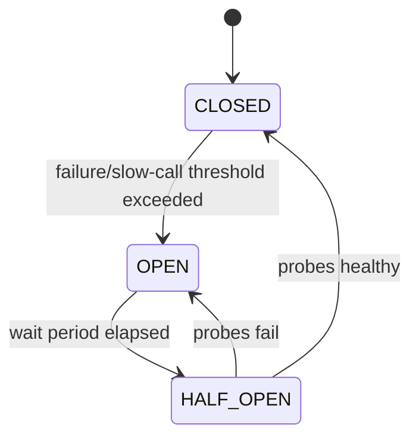

# Day 3 — Circuit Breakers, Bulkheads & Dependency Isolation

## Goal

Learn when to stop calling an unhealthy dependency and how to contain its failure so it does not consume the whole application.

## Timebox

- 20 min — circuit breaker model
- 15 min — retry vs breaker vs rate limit
- 20 min — bulkheads/isolation
- 20 min — transcription dependency design
- 10 min — lab + quiz

---

# 1. Circuit breaker mental model

A breaker observes calls to a dependency.



### CLOSED

Calls flow normally while outcomes are measured.

### OPEN

Calls fail fast without touching the unhealthy dependency.

### HALF_OPEN

A small number of probe calls are allowed to determine whether recovery occurred.

---

# 2. Why fail fast?

Suppose the AI provider is unhealthy and every call takes 30 seconds to time out.

Without breaker:

```text
workers
 ↓
slow calls
 ↓
worker slots remain occupied
 ↓
queue grows
 ↓
more workers/autoscaling
 ↓
more calls to unhealthy provider
 ↓
🔥
```

With breaker:

```text
provider failure rate high
      ↓
OPEN circuit
      ↓
new attempts fail/defer quickly
      ↓
queue + retry scheduler control recovery rate
```

The breaker protects **your capacity and the dependency**.

---

# 3. Circuit breaker is not a retry mechanism

Different tools solve different problems:

| Mechanism | Question |
|---|---|
| Timeout | How long will I wait? |
| Retry | Should I attempt again? |
| Backoff/jitter | When should I attempt again? |
| Circuit breaker | Should I call this dependency at all right now? |
| Rate limiter | How much traffic may enter? |
| Bulkhead | How much of my capacity may this dependency consume? |

These can be combined.

---

# 4. Avoid tiny-sample breaker flapping

Bad breaker design:

```text
one request fails
→ OPEN everything for 5 minutes
```

You usually need:

- minimum number of calls,
- time/count sliding window,
- failure-rate threshold,
- slow-call threshold,
- open duration,
- controlled half-open probes.

The goal is **hysteresis**: avoid bouncing rapidly between healthy/unhealthy states.

---

# 5. Slow calls matter

A dependency can be technically successful while operationally unhealthy.

```text
HTTP 200
latency = 45 seconds
```

Some breaker implementations can treat a high slow-call rate as an unhealthy signal.

For your architecture, this matters because worker saturation can happen before hard failures appear.

---

# 6. Bulkhead pattern

A ship uses watertight compartments so one leak does not sink everything.

Software version:

```text
AI provider pool       max 40 concurrent
R2 pool                max 100 concurrent
PostgreSQL pool        max 30 connections
Admin/background pool  isolated from user-facing API
```

If AI is unhealthy, it should not consume every available worker/thread/connection in the process.

---

# 7. Breaker + queue

For asynchronous transcription, OPEN does not necessarily mean:

```text
mark every job FAILED
```

It can mean:

```text
AI breaker OPEN
      ↓
stop/defer new chunk attempts
      ↓
queue remains durable
      ↓
probe provider later
      ↓
resume gradually
```

That is graceful pressure management.

---

# 8. Breaker scope

Possible scopes:

```text
one breaker per provider
one breaker per provider region
one breaker per operation
one breaker per model/API class
```

Too broad:

```text
one failed endpoint disables everything
```

Too narrow:

```text
thousands of tiny breakers with meaningless statistics
```

Choose scope from the actual failure domain.

---

# 9. Fallback warning

Fallback can be useful:

```text
AI summary unavailable
→ transcript still available
```

But fallback can also be dangerous:

```text
primary DB fails
→ secretly write to unrelated local file
```

A fallback must preserve the business invariant.

Do not return fabricated/stale data merely to avoid an error.

---

# Exercise — AI dependency protection

Design:

```text
Chunk Worker
    ↓
Timeout
    ↓
Circuit Breaker
    ↓
Concurrency Bulkhead
    ↓
AI Provider
```

Decide:

- minimum samples,
- failure-rate threshold,
- slow-call threshold,
- open duration,
- half-open probe count,
- max concurrent calls,
- retry interaction,
- job status while OPEN,
- metrics.

Do not obsess over perfect numeric values. Explain how you would tune them from evidence.

---

# Break it 💥

1. Breaker opens because the client itself sent invalid requests.
2. Breaker opens globally due to one bad tenant.
3. OPEN breaker causes all jobs to be immediately DLQed.
4. Half-open permits 5,000 simultaneous test calls.
5. Circuit breaker state is treated as application liveness and Kubernetes restarts every pod.

Which are architecture mistakes?

---

# Retrieval quiz

1. Describe CLOSED, OPEN and HALF_OPEN.
2. What does a breaker protect?
3. Why isn't a breaker a concurrency limiter?
4. What is a bulkhead?
5. Why can slow-call rate matter?
6. Why require a minimum sample size?
7. How can a queue make circuit breaking more useful?
8. Give one dangerous fallback.

## Exit criterion

You can explain **timeout + retry + breaker + bulkhead** as complementary mechanisms instead of interchangeable buzzwords.
