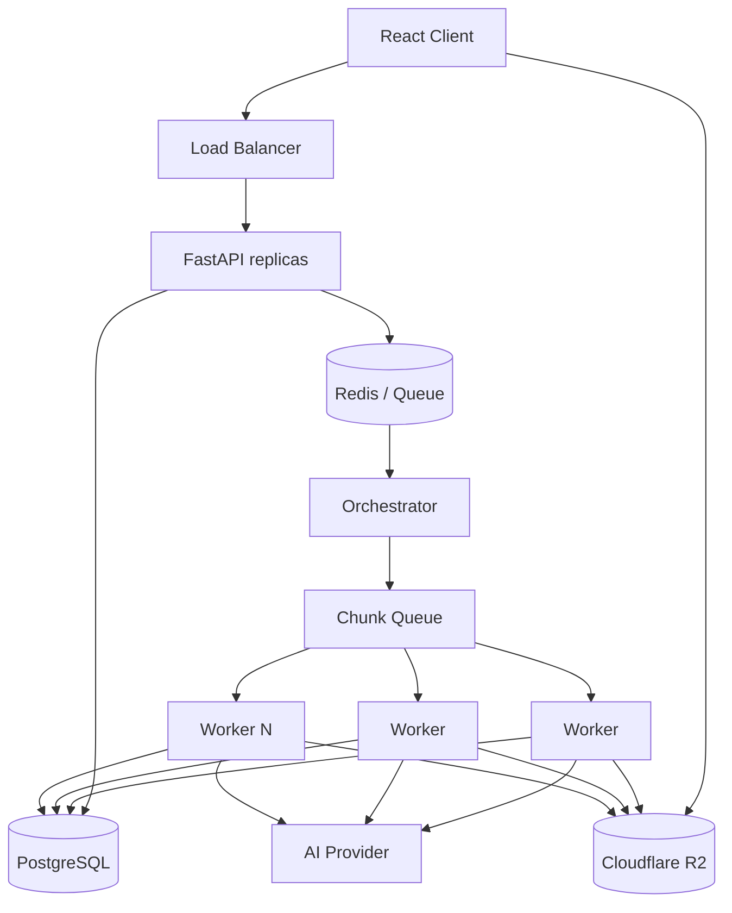

# Day 6 — Transcription Reliability Playbook

## Goal

Turn the architecture from Weeks 1–6 into an explicit recovery plan for real failure scenarios.

Today is deliberately operational.

---

# Architecture under test



Every box can fail.

---

# Scenario 1 — Redis dies

First ask: **what role is Redis currently playing?**

If Redis is only cache:

```text
Redis unavailable
      ↓
cache bypass
      ↓
PostgreSQL becomes origin
      ↓
protect DB from cache-miss storm
```

If Redis is the queue:

```text
Redis unavailable
      ↓
new job publication cannot proceed normally
      ↓
keep durable job/outbox state in PostgreSQL
      ↓
publisher retries later
```

Key lesson:

> Recovery depends on whether Redis is authoritative for data that cannot be reconstructed.

Recovery questions:

- Are queued messages durable/replicated?
- Do we have an outbox?
- What happens to in-flight/pending messages?
- Is failover automated?
- Are workers paused or failing noisily?
- Can API still accept uploads safely?

---

# Scenario 2 — Worker dies halfway through a chunk

Desired behavior:

```text
Worker receives chunk 37
      ↓
processes partly
      ↓
worker dies before ACK
      ↓
message becomes eligible for redelivery
      ↓
new worker processes chunk 37
```

Safety requirement:

```text
chunk result key / DB state is idempotent
```

Possible invariant:

```text
UNIQUE(parent_job_id, chunk_index, pipeline_version)
```

If the first worker had already uploaded output before dying, the second worker must not create a logically duplicated effect.

---

# Scenario 3 — PostgreSQL is unavailable

Classify operations.

### API read

Could possibly:

```text
serve safe cache if available and freshness allows
```

### Create/complete upload

If job state must be durable before acknowledging:

```text
fail/defer with explicit status
```

Do not say “success” if you cannot durably record the business operation.

### Worker finishing chunk

Danger:

```text
AI work completed
      ↓
PostgreSQL unavailable
```

Options:

- keep message unacked and retry DB persistence,
- persist result artifact to object storage with deterministic key then reconcile DB later,
- use workflow engine durable state,
- pause new work if DB outage is prolonged.

You must decide the source of truth and reconciliation procedure.

---

# Scenario 4 — R2 returns `500` / `503`

Treat documented service errors as transient candidates.

```text
R2 operation fails transiently
      ↓
bounded exponential backoff + jitter
      ↓
respect provider guidance
      ↓
retry only the failed part/object operation
```

For multipart upload:

```text
part 17 failed
```

should not imply:

```text
restart 4 GB upload from byte 0
```

Preserve multipart upload state and successful part ETags.

For worker GET/PUT:

- timeout,
- retry class,
- max elapsed time,
- object key idempotency,
- degraded job state.

---

# Scenario 5 — AI provider returns 429

Desired reaction:

```text
429 / Retry-After
      ↓
reduce launch rate
      ↓
backoff + jitter
      ↓
queue absorbs work
      ↓
possibly open breaker if sustained
      ↓
show delayed-processing status
```

Do not react with:

```text
add 100 workers
```

That makes provider throttling worse.

Autoscaling workers should consider **provider capacity**, not only queue depth.

---

# Scenario 6 — user uploads the same video twice

There are two different products you might want:

### A. Duplicates are allowed

Two uploads become two jobs, but billing/dedup policy is explicit.

### B. Duplicate processing should be avoided

Possible fingerprint:

```text
user_id + content hash + pipeline version + config
```

Then:

```text
lookup existing completed/in-flight equivalent job
```

But beware:

- hashing huge uploads costs time,
- same bytes may legitimately require different categories/config,
- cross-user dedup can create privacy/security concerns,
- cached output must be authorization-safe.

Do not implement global content dedup casually.

---

# Scenario 7 — AI call succeeds, worker dies before state commit

This is the ambiguity window.

Use deterministic artifact identity:

```text
results/{parent_job_id}/{pipeline_version}/{chunk_index}.json
```

and guarded persistence:

```text
upsert / unique invariant
```

On redelivery:

```text
check durable output
validate version
reconcile DB
ACK
```

---

# Scenario 8 — merge succeeds, final DB update fails

Final merge should be deterministic and stored under a deterministic/versioned key.

```text
merge output durable ✅
DB says MERGING ❌ update failed
```

Recovery:

```text
finalizer retries
      ↓
detect existing matching artifact
      ↓
validate it
      ↓
complete guarded state transition
```

Do not regenerate blindly if the output already exists.

---

# Build the recovery matrix

For every dependency:

| Failure | Detect | Timeout | Retry | Breaker | Degraded mode | Failover | Durable recovery state |
|---|---|---|---|---|---|---|---|
| Redis cache | | | | | | | |
| Redis queue | | | | | | | |
| Worker | | | | | | | |
| PostgreSQL | | | | | | | |
| R2 | | | | | | | |
| AI provider | | | | | | | |
| Merge stage | | | | | | | |

---

# User-visible state model

Avoid a single generic `processing` state.

Consider:

```text
UPLOADED
QUEUED
PROCESSING
RETRYING
WAITING_FOR_PROVIDER
MERGING
COMPLETED
FAILED_RETRYABLE_EXHAUSTED
FAILED_PERMANENT
CANCELLED
```

Do not expose internal implementation jargon unnecessarily, but internal state should be precise enough to support recovery.

---

# Reliability metrics to carry into Week 8

Capture candidates now; Week 8 will instrument them.

```text
dependency timeout rate
retry attempts / original attempts
retry success rate
breaker state / open duration
queue age
DLQ depth
worker crash/redelivery rate
PostgreSQL failover events
R2 5xx/429 rate
AI 429/5xx rate
job recovery time
permanent failure rate
```

---

# Deliverable — reliability playbook

Write one page per major dependency:

```text
Dependency:
Business role:
Failure modes:
Timeout:
Retry policy:
Idempotency boundary:
Breaker/bulkhead:
Degraded behavior:
Failover/recovery:
User-visible impact:
Metrics:
Runbook trigger:
```

## Exit criterion

For each of the six original scenarios, you can explain **what happens next** without hand-waving “the system retries.”
