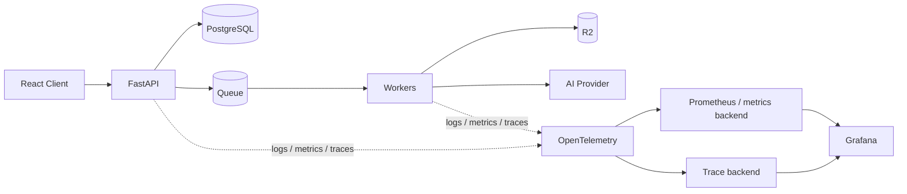

# Week 8 — Observability 🔭

## Mission

By the end of this week, you should be able to investigate a distributed production incident **from evidence rather than intuition**.

The core question is:

> A customer says their transcription has been stuck for 30 minutes. How do I find out why?

Week 7 designed recovery behavior. Week 8 makes that behavior **visible, measurable and debuggable**.

---

## Mental model

```text
Logs     → What happened to this specific job?
Metrics  → Is this happening broadly, and how badly?
Traces   → Where did this request/workflow spend time?
```

Together:

```text
User report
   ↓
Metrics: is there a systemic symptom?
   ↓
Trace: where is the slow/failing path?
   ↓
Logs: what exactly happened to job/chunk X?
   ↓
Authoritative state: what does PostgreSQL say?
```

No single signal replaces the others.

---

## Week architecture



OpenTelemetry is the instrumentation/collection layer, not your dashboard product.

---

## Learning outcomes

By Sunday, you should be able to:

- explain the difference between logs, metrics and traces,
- emit structured logs with stable fields,
- correlate API, queue and worker activity using IDs,
- avoid logging transcript content, credentials and unnecessary PII,
- distinguish Prometheus counters, gauges and histograms,
- design useful metrics for online APIs and offline workers,
- explain why `job_id` is usually a terrible Prometheus label,
- calculate rates and latency percentiles from metrics,
- explain traces, spans, context propagation and sampling,
- propagate trace context across a queue boundary,
- use OpenTelemetry's API/SDK/Collector mental model,
- define SLIs, SLOs, SLAs and error budgets,
- build dashboards around user symptoms rather than component vanity metrics,
- design actionable alerts with runbooks,
- investigate a stuck transcription job across API → queue → worker → AI → storage,
- produce an incident timeline and evidence-backed root-cause hypothesis.

---

## Daily plan

| Day | Topic | Main deliverable |
|---|---|---|
| 1 | Structured logs & correlation | Logging schema |
| 2 | Metrics, Prometheus & cardinality | Pipeline metric catalog |
| 3 | Distributed tracing & OpenTelemetry | End-to-end trace design |
| 4 | SLIs, SLOs, SLAs & error budgets | Initial SLO document |
| 5 | Grafana dashboards, alerts & signal correlation | Dashboard + alert plan |
| 6 | Incident lab: “job stuck for 30 minutes” | Investigation playbook |
| 7 | Review, incident defense & observability scorecard | Observability review |

---

## The Week 8 rule

For every important production question, ask:

1. **Which signal answers this fastest?**
2. **What identifier lets me correlate across components?**
3. **What is the authoritative state?**
4. **Can I see both aggregates and one specific execution?**
5. **Will this telemetry still be affordable at 100× scale?**
6. **Does the telemetry expose sensitive data?**
7. **Can an on-call engineer take action from the alert?**

If the answer to #7 is “open twelve dashboards and vibe-check them,” the alert is not finished. 😄

---

## Final challenge

Given only a `job_id`, you should be able to answer:

```text
Where is the job?
How long has it been there?
Which chunk is blocking it?
Which worker handled it?
Which dependency is slow/failing?
How many retries happened?
Is this one user or the whole system?
What changed recently?
Can the system recover automatically?
What should the user see?
```
