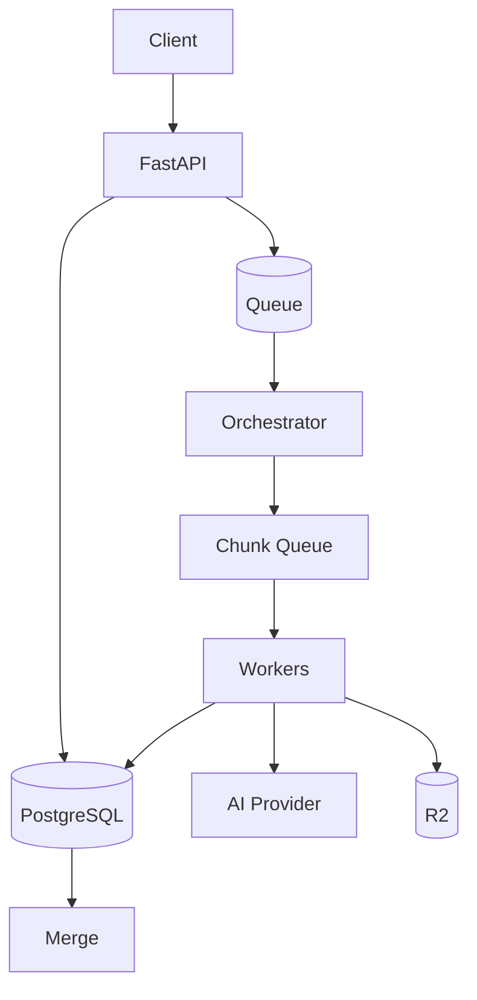

# Day 6 — Incident Lab: “My Transcription Has Been Stuck for 30 Minutes” 🔥

## Mission

A customer reports:

> “My transcription has been processing for 30 minutes and nothing is happening.”

Your task is not to guess.

Your task is to **reconstruct the workflow from evidence**.

---

# Architecture under investigation



---

# Step 1 — Establish authoritative state

Start with the business state, not random dashboards.

Conceptual query:

```sql
SELECT
    id,
    status,
    created_at,
    started_at,
    updated_at,
    completed_chunks,
    expected_chunks,
    last_error
FROM jobs
WHERE id = 'job_abc123';
```

Then inspect children:

```sql
SELECT
    chunk_index,
    status,
    attempt_count,
    worker_id,
    started_at,
    updated_at,
    error_class
FROM chunks
WHERE job_id = 'job_abc123'
ORDER BY chunk_index;
```

Question:

```text
Which state transition should have happened next?
```

---

# Step 2 — Decide the stuck stage

Typical cases:

```text
QUEUED too long
→ queue/admission/worker-capacity problem

PROCESSING + no chunk progress
→ orchestrator/worker/dependency problem

89/90 chunks complete
→ one failed/straggling child

all chunks complete but status PROCESSING
→ fan-in / merge claim problem

MERGING too long
→ merge worker / R2 / DB persistence problem
```

This is why workflow state must be explicit.

---

# Step 3 — Ask whether it is systemic

Look at metrics around the incident window:

```text
queue_depth
oldest_queued_job_age_seconds
arrival_rate
completion_rate
worker_utilization
chunk_processing_p95/p99
retry_rate
AI 429 rate
R2 5xx rate
DB latency / pool usage
```

### If many jobs are affected

Think:

```text
capacity
provider outage/throttling
queue issue
database issue
bad deployment
```

### If only one job is affected

Think:

```text
poison input
one chunk
state-machine race
lost publication
corrupt media
job-specific dependency behavior
```

---

# Step 4 — Reconstruct the job timeline from logs

Query conceptually:

```text
job_id="job_abc123"
```

Expected lifecycle:

```text
09:00 job.queued
09:00 job.prepare_started
09:01 chunks.created count=90
09:01 chunk.started index=0
...
09:08 chunk.completed index=41
09:08 chunk.started index=42
09:08 chunk.provider_rate_limited index=42
09:08 chunk.retry_scheduled index=42 attempt=2
...
```

Look for the **last successful transition**, not merely the last error line.

---

# Step 5 — Inspect the trace

Use `trace_id` from a correlated log or search traces by known attributes.

A suspicious trace might look like:

```text
transcription.chunk[42]                 13.8s
└── ai.transcribe                       8.0s ERROR 429
    └── retry.wait                      4.1s
```

Or:

```text
transcription.merge                     90s
└── r2.put                              89s
```

Trace timing tells you **where time accumulated**.

---

# Step 6 — Six common root-cause paths

## A. Queue backlog

Evidence:

```text
queue_depth ↑
oldest_job_age ↑
workers busy ≈ 100%
arrival rate > completion rate
```

Likely action:

```text
admission control
capacity increase if dependency capacity allows
customer status = delayed/queued
```

---

## B. AI provider throttling

Evidence:

```text
AI 429 rate ↑
retries ↑
workers spend time waiting/backing off
queue age ↑
```

Do **not** blindly add workers.

That may increase throttling.

---

## C. One failed chunk blocks fan-in

Evidence:

```text
job = PROCESSING
completed_chunks = 89
expected_chunks = 90
chunk_42 = RETRYABLE/FAILED
```

Recovery:

```text
retry only chunk 42
```

This is the Week 6 failure-domain lesson paying rent.

---

## D. Worker died after output but before state update/ACK

Evidence:

```text
R2 artifact exists
DB chunk still RUNNING
message pending/redelivered
```

Recovery relies on:

```text
deterministic artifact key
idempotent consumer
state reconciliation
```

---

## E. Merge artifact exists but DB says MERGING

Evidence:

```text
R2 final transcript exists
merge success event exists
DB completion transition missing
```

This is an ambiguous side-effect window.

Reconcile durable artifact + DB state rather than recomputing blindly.

---

## F. Lost queue publication

Evidence:

```text
DB job = QUEUED
no publish event
no queue delivery
outbox row still unpublished / failed
```

Recovery:

```text
outbox publisher retries/replays
```

---

# Step 7 — Write the incident timeline

Use evidence, not storytelling:

```text
09:00:12 job accepted (DB)
09:00:13 chunk plan created (DB/log)
09:00:15 chunk 42 delivered (queue/log)
09:00:36 provider returned 429 (trace/log)
09:00:36 retry scheduled for +8.4s (log)
09:00:45 provider returned 429 again (metric/log)
09:10 onward provider 429 rate increased fleet-wide (metric)
09:30 customer reported delay
```

Then state:

```text
Root-cause hypothesis
Evidence supporting it
Evidence contradicting it
Immediate mitigation
Long-term fix
```

---

# Step 8 — User communication

Observability is also about knowing what the system can truthfully tell the user.

Better:

```text
Processing delayed — external transcription capacity is temporarily constrained. Your upload is safe and will resume automatically.
```

Worse:

```text
Processing... 68%
```

for 30 minutes with no explanation.

---

# Exercise — Run the supplied incident dataset

Use:

```text
labs/sample-events.jsonl
labs/stuck_job_investigator.py
```

Run:

```bash
python labs/stuck_job_investigator.py labs/sample-events.jsonl job_abc123
```

Before reading the script output, inspect the events yourself and write:

```text
1. last successful state transition
2. likely blocker
3. whether incident is job-specific/systemic
4. safe recovery action
5. missing telemetry that would increase confidence
```

---

## Exit criterion

Given a `job_id`, you can move deliberately through **DB state → metrics → logs → trace → timeline → hypothesis → recovery**, and explain why each signal was used.
