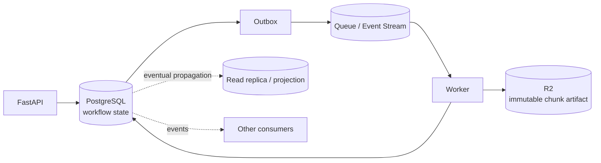

# Week 9 — Consistency & Distributed Data 🧭

## Mission

By the end of this week, you should be able to decide **which facts must be immediately consistent, which may converge later, and how the system recovers when durable components disagree**.

The core scenario is:

```text
Worker finishes chunk 42
        ↓
Transcript artifact is written
        ↓
Database update fails
        ↓
Queue message is redelivered
```

The question is not merely:

> “Did the worker succeed?”

It is:

> **Which durable state is authoritative for each fact, and how do we reconcile the rest?**

---

## Mental model

Distributed state is rarely one boolean called `done`.

```text
Business fact
   ↓
Authoritative write
   ↓
Derived copies / projections / caches / events
   ↓
Temporary disagreement
   ↓
Reconciliation / propagation
   ↓
Convergence
```

Consistency is a **product and workflow requirement**, not a badge attached to a database.

---

## Week architecture



Possible disagreement is normal:

```text
R2 says artifact exists
PostgreSQL says PROCESSING
Queue says message pending/redelivered
Read replica still shows old state
```

Your design must define what to trust and how to converge.

---

## Learning outcomes

By Sunday, you should be able to:

- distinguish strong consistency from eventual consistency,
- explain linearizable-style reasoning without drowning in formalism,
- recognize read-after-write, monotonic-read and stale-read requirements,
- explain CAP as a **partition-time tradeoff**, not a database classification game,
- reason about replica lag and stale reads,
- prevent lost updates with optimistic concurrency,
- implement a version-column compare-and-swap update in PostgreSQL,
- map HTTP `ETag` / `If-Match` to optimistic concurrency,
- distinguish local ACID transactions from distributed transactions,
- explain two-phase commit and why prepared transactions are operationally expensive,
- explain why long-lived workflows often use sagas rather than one global transaction,
- distinguish events from commands,
- design event-driven workflows with outbox + idempotent consumers,
- compare choreography with orchestration,
- define the **source of truth per fact**,
- design reconciliation when object storage, database and broker disagree,
- explain what should happen when a worker finishes computation but the DB state transition fails.

---

## Daily plan

| Day | Topic | Main deliverable |
|---|---|---|
| 1 | Strong vs eventual consistency + consistency requirements | Consistency contract matrix |
| 2 | CAP theorem, partitions, replica lag & practical tradeoffs | Partition scenario analysis |
| 3 | Optimistic concurrency, lost updates & conditional writes | Versioned update implementation |
| 4 | Distributed transactions & two-phase commit | 2PC failure analysis |
| 5 | Event-driven consistency, ordering, outbox & projections | Event contract + propagation flow |
| 6 | Sagas, compensation & source-of-truth design | Reconciliation/source-of-truth matrix |
| 7 | Design lab: chunk completed but DB update failed | Full consistency review + ADR |

---

## The Week 9 rule

For every piece of state, answer:

1. **What fact does this state represent?**
2. **Which component is authoritative for that fact?**
3. **Which copies are derived?**
4. **How stale may a derived copy be?**
5. **What happens during a network partition?**
6. **What prevents lost or conflicting writes?**
7. **How does the system detect divergence?**
8. **How does it reconcile?**
9. **What does the user see while convergence is incomplete?**

If you cannot answer #2, adding another event bus will not rescue you. 😄

---

## Final challenge

You should be able to defend this scenario:

```text
Chunk 42 transcription succeeds
        ↓
worker writes r2://results/job-123/chunk-42-v3.json
        ↓
PostgreSQL UPDATE fails
        ↓
worker crashes before ACK
        ↓
message redelivered
```

And explain, step-by-step:

- whether chunk 42 should be recomputed,
- which durable evidence proves useful work already happened,
- how the worker safely retries,
- how PostgreSQL reaches the correct state,
- how the parent job avoids double-counting the chunk,
- what the queue is authoritative for,
- what the user may observe during the inconsistency window,
- how a reconciliation process repairs state if automatic retry never happens.
