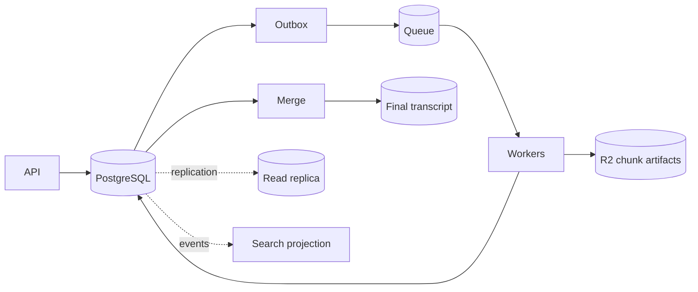

# Day 7 — Design Lab: Consistency Contract for the Transcription Platform 🔥

## Mission

Defend the distributed state model for the transcription platform under partial failure, duplicate delivery, replica lag and concurrent state changes.

Do not solve this with “use Kafka” or “use transactions.”

Define **authority, invariants, consistency guarantees, conflict rules and reconciliation**.

## Timebox

- 20 min — requirements & invariants
- 20 min — source-of-truth map
- 20 min — consistency contracts
- 25 min — failure windows
- 20 min — event flow / saga
- 20 min — reconciliation
- 15 min — ADR + oral defense

---

# Scenario

A 90-minute uploaded video becomes 90 one-minute chunks.



Assume:

- at-least-once task delivery,
- workers may crash at any instruction,
- R2 writes and PostgreSQL commits cannot be one atomic transaction,
- read replicas may lag,
- consumers may receive duplicate/out-of-order events,
- users can cancel jobs,
- retrying AI transcription is expensive.

---

# Part 1 — define invariants

Write at least eight.

Suggested starting points:

```text
A job belongs to exactly one user.

A logical chunk is unique by
(job_id, chunk_index, pipeline_version).

A SUCCEEDED chunk references one valid deterministic artifact.

A parent cannot enter MERGING until all required chunks are accepted.

A COMPLETED job references one final transcript artifact.

Progress must never exceed expected_chunks.

Billing must not double-charge duplicate completion events.
```

Add cancellation/versioning invariants.

---

# Part 2 — source-of-truth matrix

Complete:

| Fact | Authority | Derived copies | Consistency required | Repair path |
|---|---|---|---|---|
| user owns job | | | | |
| upload object exists | | | | |
| job status | | | | |
| chunk bytes/result | | | | |
| chunk accepted | | | | |
| parent progress | | | | |
| final transcript bytes | | | | |
| billing entry | | | | |
| search projection | | | | |
| queue delivery pending | | | | |

The important phrase is **authority per fact**.

---

# Part 3 — consistency contract by API

Design guarantees for:

## `POST /jobs`

- idempotency?
- authoritative write path?
- can it succeed if PostgreSQL unavailable?

## `GET /jobs/{id}`

- primary or replica?
- max staleness?
- monotonic progress?

## `POST /jobs/{id}/cancel`

- optimistic version/ETag?
- conflict with merge/completion?
- should a stale replica authorize cancellation?

## `GET /transcripts/{id}`

- DB metadata + R2 artifact?
- behavior when metadata says complete but object missing?

---

# Part 4 — failure window A

```text
Worker calls AI ✅
Worker writes deterministic R2 artifact ✅
PostgreSQL UPDATE ❌
Worker crashes before ACK 💥
```

Write the redelivery algorithm.

A strong solution should consider:

```text
DB state
artifact existence
artifact metadata/checksum
pipeline version
conditional state transition
idempotent progress update
ACK ordering
```

Explain why recomputing immediately is wasteful.

---

# Part 5 — failure window B

```text
PostgreSQL chunk SUCCEEDED ✅
Outbox row committed ✅
Publisher sends ChunkCompleted ✅
Publisher loses broker confirmation 💥
Publisher sends again
```

Design the consumer so duplicate events are harmless.

Include:

- `event_id`,
- inbox/processed-event table,
- local transaction,
- ACK behavior.

---

# Part 6 — failure window C

```text
Job cancelled at version 31
Worker still owns old attempt from version 29
Worker finishes expensive AI work
```

Should the worker:

- publish success?
- discard artifact?
- retain artifact temporarily?
- update job?

Use optimistic concurrency/state guards.

There may be a difference between:

```text
computation succeeded
```

and:

```text
workflow accepts the computation
```

---

# Part 7 — replica lag

Primary:

```text
COMPLETED, version 44
```

Replica:

```text
PROCESSING, version 42
```

User refreshes.

Define:

- allowed staleness,
- routing after writes,
- monotonic-read behavior,
- UI protection against progress regression,
- which operations must never trust stale state.

---

# Part 8 — event-driven propagation

Design:

```text
JobCompleted
    ↓
Email
Billing
Analytics
Search
```

For each consumer:

| Consumer | Strong or eventual? | Idempotency | Ordering | Failure handling |
|---|---|---|---|---|
| email | | | | |
| billing | | | | |
| analytics | | | | |
| search | | | | |

Do all four need the same guarantees?

No. Explain why.

---

# Part 9 — 2PC or saga?

Could you place all of this into one distributed transaction?

```text
PostgreSQL
R2
AI provider
broker
billing
search
```

Explain why classic 2PC is impractical for this heterogeneous, long-running workflow.

Then sketch the saga/orchestration model.

---

# Part 10 — reconciliation design

Define a scheduled or streaming reconciliation process.

Examples of queries:

```text
RUNNING chunk older than 15m
SUCCEEDED chunk missing artifact
artifact exists but chunk not accepted
COMPLETED job missing final transcript
outbox event unpublished for 5m
search projection version behind authority
```

For each anomaly specify:

- auto-repair,
- retry,
- quarantine,
- alert/manual review.

---

# Part 11 — metrics

Add observability from Week 8:

```text
consistency_repair_total{type}
reconciliation_backlog
stale_replica_seconds
optimistic_conflict_total{operation}
outbox_oldest_unpublished_seconds
projection_lag_seconds{projection}
duplicate_event_total{consumer}
artifact_db_mismatch_total{type}
```

Do **not** put `job_id` in Prometheus labels.

---

# Part 12 — write the ADR

Use `consistency-decision-template.md`.

Your conclusion should sound like:

> PostgreSQL is authoritative for workflow acceptance/state; deterministic R2 objects are authoritative for immutable transcript artifact bytes. Queue state is authoritative only for message delivery. We use at-least-once delivery with idempotent conditional transitions, transactional outbox/inbox patterns, and periodic reconciliation. User-critical mutations read/write authoritative state, while search/analytics projections are explicitly eventual with bounded lag targets.

Do not copy that blindly. Defend each clause.

---

# Oral defense prompts

Answer in 90 seconds each:

1. Why isn't the queue the source of truth for job completion?
2. Why can R2 contain a valid artifact while PostgreSQL still says PROCESSING?
3. How does redelivery avoid repeating expensive transcription?
4. Why does an outbox not remove the need for idempotent consumers?
5. When does optimistic locking beat a distributed lock?
6. Why isn't CAP “choose any two” a useful architecture answer?
7. What is the difference between retry and reconciliation?
8. Why are sagas suitable for long-running heterogeneous workflows?

---

# Scoring rubric — 20 points

| Area | Points |
|---|---:|
| Authority/source-of-truth clarity | 4 |
| Invariants + concurrency control | 4 |
| Failure-window handling | 4 |
| Eventual consistency + event design | 3 |
| Reconciliation | 3 |
| Tradeoff defense | 2 |

### 17–20

Strong. You are reasoning in terms of facts, invariants and recovery.

### 13–16

Good. Review the weak failure windows.

### ≤12

Rebuild the authority map before adding more distributed patterns.
