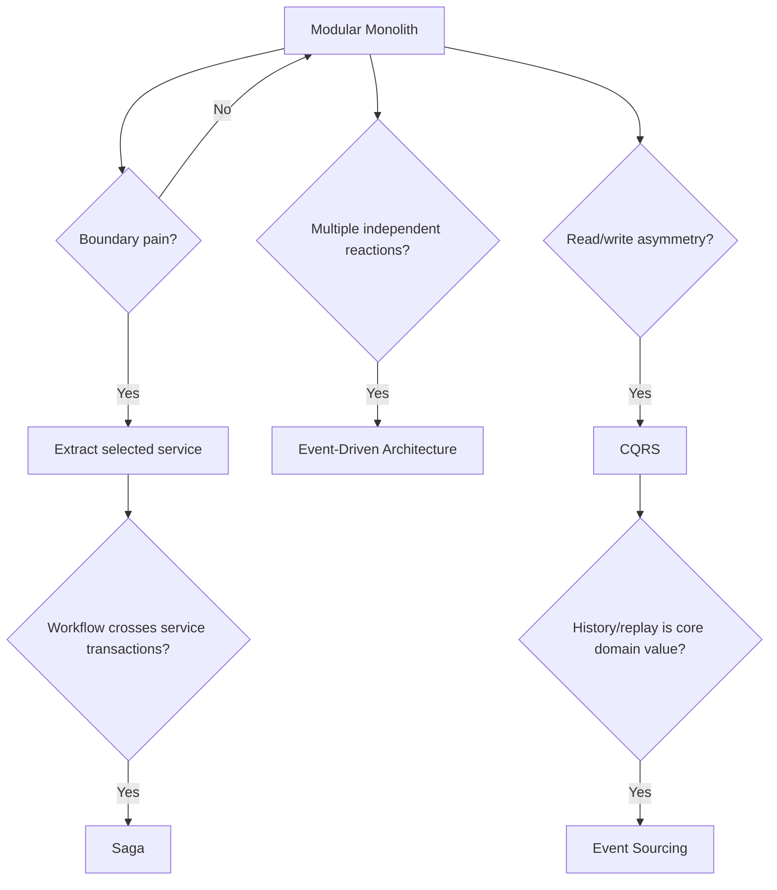

# Week 10 — Architecture Patterns 🏛️

## Mission

By the end of this week, you should be able to look at a system and ask:

> **What problem is this architecture solving, and is that problem expensive enough to justify the architecture?**

The week is deliberately anti-cargo-cult.

You are not learning six patterns so that every future diagram contains all six.

You are learning how to recognize the forces that justify each one.

---

## Running case study

Your transcription SaaS starts here:

```text
React
  ↓
FastAPI modular monolith
  │
  ├── Auth module
  ├── Upload module
  ├── Jobs module
  ├── Billing module
  └── Results module
  ↓
PostgreSQL

Independent worker processes
  ↓
Queue
  ↓
R2 + AI provider
```

That is a perfectly respectable production architecture.

The goal of Week 10 is **not** to turn it into 17 services.

The goal is to know when one of those modules has earned the right to become an independently deployed service.

---

## Mental model

```text
Pain / requirement
      ↓
Architectural force
      ↓
Candidate pattern
      ↓
Benefit
      ↓
New complexity
      ↓
Evidence-based decision
```

Examples:

```text
Different teams need independent deployment
→ maybe microservices

Reads and writes have radically different models/scale
→ maybe CQRS

Audit/replay/history is a first-class requirement
→ maybe event sourcing

Multiple systems must react independently to business facts
→ maybe event-driven architecture

A business workflow spans independently committed services
→ maybe a saga
```

---

## Week architecture



---

## Learning outcomes

By Sunday, you should be able to:

- explain a modular monolith without equating “monolith” with “bad architecture”,
- design explicit module boundaries and public contracts,
- identify real extraction triggers for microservices,
- explain the operational and consistency tax of distribution,
- distinguish synchronous request/response from event-driven collaboration,
- distinguish commands from events,
- explain when CQRS is useful and when CRUD is simpler,
- distinguish CQRS from event sourcing,
- explain event streams, projections, snapshots and schema evolution,
- explain why event sourcing is expensive to adopt and expensive to leave,
- distinguish saga choreography from saga orchestration,
- design compensating actions for long-running cross-service workflows,
- evolve a modular monolith incrementally rather than rewrite it,
- defend why **modular monolith + independent workers** is still the preferred starting architecture for the transcription SaaS.

---

## Daily plan

| Day | Topic | Main deliverable |
|---|---|---|
| 1 | Modular monolith, modules & dependency boundaries | Module map + dependency rules |
| 2 | Microservices, service boundaries & extraction criteria | Service-extraction scorecard |
| 3 | Event-driven architecture, commands, events & coupling | Event flow + event contract |
| 4 | CQRS, read models & projections | Read/write split design |
| 5 | Event sourcing, streams, snapshots & evolution | Event-store decision analysis |
| 6 | Saga pattern: choreography, orchestration & compensation | Saga workflow |
| 7 | Design lab: evolve the transcription SaaS | Architecture ADR + migration roadmap |

---

## The Week 10 rule

For every architecture pattern, answer:

1. **What concrete problem exists today?**
2. **Why is the current architecture insufficient?**
3. **What does this pattern improve?**
4. **What distributed/operational complexity does it add?**
5. **What data consistency model changes?**
6. **How does deployment/testing/observability change?**
7. **What evidence tells us the migration is worth it?**
8. **Can we obtain 80% of the benefit with a smaller change?**

If your answer to #1 is “Netflix uses it”, keep the monolith. 😄

---

## Final challenge

Defend this position:

```text
TODAY

React
  ↓
FastAPI modular monolith
  ↓
PostgreSQL

Queue → independent transcription workers
```

Then imagine these future pressures:

- billing is owned by a separate team,
- transcription workers require GPUs and scale independently,
- enterprise customers need immutable audit history,
- the job-history screen becomes 100× more read-heavy than writes,
- notifications, analytics and billing all react to `JobCompleted`,
- cancellation must coordinate quota, processing and billing.

For each pressure, decide whether to:

- keep the current module,
- strengthen a module boundary,
- introduce events,
- add a CQRS read model,
- use event sourcing for one aggregate,
- extract a service,
- introduce a saga.

The correct answer is intentionally **not “all of the above.”**
