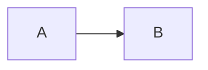

# Architecture Pattern Decision Record

## Decision

- Date:
- Owner:
- Status: proposed / accepted / rejected / superseded
- Scope:

## 1. Problem

What concrete pain or requirement exists today?

## 2. Evidence

- traffic/latency:
- deployment frequency:
- team ownership:
- failure pattern:
- consistency requirement:
- operational data:

## 3. Current architecture

## 4. Candidate patterns

| Pattern | Problem it would solve | Benefit | Cost | Fit |
|---|---|---|---|---|
| Modular monolith | | | | |
| Microservice extraction | | | | |
| Event-driven | | | | |
| CQRS | | | | |
| Event sourcing | | | | |
| Saga | | | | |

## 5. Decision

What are we choosing?

## 6. Why now?

What changed that justifies the complexity?

## 7. What we are explicitly NOT choosing

- Pattern:
- Reason:
- Revisit trigger:

## 8. Consistency implications

- authoritative state:
- derived state:
- acceptable lag:
- idempotency:
- reconciliation:

## 9. Operational implications

- deployables:
- databases:
- queues/brokers:
- observability:
- on-call ownership:
- CI/CD changes:

## 10. Migration plan

1.
2.
3.

## 11. Rollback / escape hatch

How do we undo or stop the migration safely?

## 12. Success metrics

What evidence proves this architectural change helped?

## 13. Review trigger

When will we reconsider this decision?
