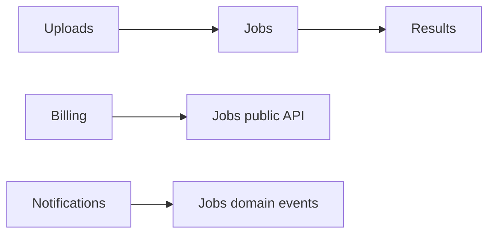

# Day 1 — Modular Monolith: Strong Boundaries Before Network Boundaries

## Goal

Understand how a single deployable application can still have strong domain boundaries, independent responsibilities, explicit contracts and evolutionary architecture.

## Timebox

- 20 min — monolith vs modular monolith
- 25 min — module boundaries and dependency direction
- 20 min — data ownership inside one database
- 20 min — transcription module exercise
- 10 min — break-it drill + retrieval quiz

---

## 1. A monolith is a deployment shape

A monolith is primarily an application deployed as one unit.

That says very little about internal quality.

Two systems can both be monoliths:

```text
BIG BALL OF MUD

routes → random service → random table
   ↘ shared utils ↗ circular imports
```

and:

```text
MODULAR MONOLITH

Application
├── Identity
├── Uploads
├── Jobs
├── Billing
└── Results

explicit contracts
controlled dependencies
clear ownership
```

The second can remain easy to understand for a long time.

---

## 2. Why start modular?

A modular monolith keeps several extremely valuable properties:

- in-process calls are cheap and reliable compared with network calls,
- one deployment pipeline,
- one observability surface,
- local transactions are available where appropriate,
- integration testing is simpler,
- refactoring across boundaries is still possible,
- you can learn the domain before freezing service boundaries.

The cost is discipline.

Nothing physically stops one module from reaching into another module's internals unless you enforce it.

---

## 3. Modules should be domain-shaped

Avoid purely technical modules like:

```text
controllers/
services/
repositories/
models/
```

as the only top-level architecture.

Prefer domain ownership:

```text
app/
├── identity/
│   ├── api.py
│   ├── service.py
│   ├── repository.py
│   └── public.py
├── uploads/
├── jobs/
├── billing/
└── results/
```

Technical layers can exist **inside** a domain module.

The question becomes:

> “Which business capability owns this behavior?”

rather than:

> “Which folder contains service classes?”

---

## 4. Public contract vs internals

Suppose `billing` needs to know a job completed.

Bad coupling:

```python
from app.jobs.repository import JobRepository
from app.jobs.models import JobRow
```

Now billing understands job persistence internals.

Better:

```python
from app.jobs.public import JobCompletedView, get_completed_job
```

or an internal domain event:

```text
Jobs
  ↓ JobCompleted
Billing
```

A module should expose the **smallest stable interface** other modules require.

---

## 5. Dependency direction

Draw module dependencies explicitly.

Example:



Avoid cycles such as:

```text
Jobs → Billing → Jobs
```

Cycles make modules inseparable and difficult to reason about.

---

## 6. Shared database does not mean shared ownership

A modular monolith may use one PostgreSQL cluster while still having logical ownership.

For example:

```text
identity owns:
users
sessions

uploads owns:
uploads
multipart_uploads

jobs owns:
jobs
chunks

billing owns:
plans
usage_ledger
```

A useful rule:

> A module may query or mutate another module's data only through an explicitly approved contract.

You can enforce this with:

- separate schemas,
- repository boundaries,
- code review rules,
- architecture tests,
- database permissions later if needed.

---

## 7. Local events inside the monolith

Event-driven design does not require microservices.

Inside the same process:

```text
Jobs module
  ↓ JobCompleted
Event dispatcher
  ├── Billing handler
  ├── Notification handler
  └── Analytics handler
```

This can reduce coupling while keeping deployment simple.

But ask whether the event is:

- synchronous in-process notification,
- durable asynchronous event,
- or an integration event leaving the application.

Those are different reliability contracts.

---

## 8. Transcription module map

Design these modules:

```text
Identity
Uploads
Jobs
Transcription
Results
Billing
Notifications
Admin
```

For each, write:

```text
Owns:
Public commands:
Public queries:
Publishes events:
Consumes events:
May depend on:
Must NOT depend on:
```

### Example

```text
Jobs

Owns:
job lifecycle, status, progress

Public commands:
create_job
cancel_job
mark_chunk_complete

Public queries:
get_job
list_user_jobs

Publishes:
JobCreated
JobCompleted
JobCancelled

Must not know:
Stripe SDK
R2 internals
email templates
```

---

## 9. Extraction readiness

A well-designed modular monolith makes future extraction easier because module boundaries already exist.

You want:

```text
in-process contract today
        ↓
network/event contract tomorrow
```

without rewriting the domain model from scratch.

But do not distort today's code solely to make a hypothetical extraction easy.

Architecture is about preserving useful options, not worshipping optionality.

---

## Break it 💥

For each problem, identify the violated boundary:

1. Billing imports `jobs.models.Job` directly.
2. Uploads writes to `jobs.status` with raw SQL.
3. Results calls a private helper inside Transcription.
4. Jobs imports Billing, while Billing already imports Jobs.
5. Every module can mutate the `users` table.
6. An internal in-memory event is treated as guaranteed delivery.

---

## Exercise — Build your transcription module diagram

Produce:

1. a Mermaid dependency diagram,
2. a table of module ownership,
3. three forbidden dependency rules,
4. one example of an internal domain event,
5. one module you believe might eventually be extracted and **why**.

Do not extract it yet.

---

## Retrieval quiz

1. Why is “monolith” not synonymous with “big ball of mud”? 
2. What is the benefit of domain-shaped modules?
3. Why should a module have a narrow public API?
4. Why are circular dependencies dangerous?
5. Can a modular monolith use events?
6. Why can one PostgreSQL database still have logical data ownership?
7. What makes a modular monolith a useful predecessor to selected microservices?

## Exit criterion

You can explain why **network boundaries are not required to obtain module boundaries**.
