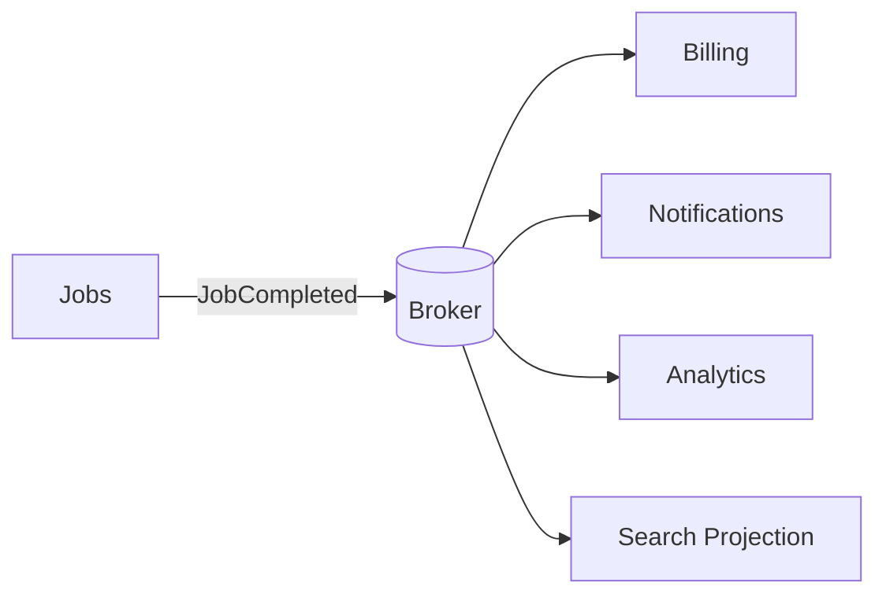

# Day 3 — Event-Driven Architecture: Decouple Reactions, Accept Temporal Coupling

## Goal

Understand when events are a better collaboration mechanism than synchronous calls, and how event-driven systems trade direct coupling for asynchronous consistency and operational complexity.

## Timebox

- 20 min — command vs event
- 25 min — producer/channel/consumer model
- 20 min — delivery and schema evolution
- 20 min — transcription event map
- 10 min — failure drill + quiz

---

## 1. Events describe facts that already happened

Command:

```text
SendInvoice(job_123)
```

Event:

```text
JobCompleted(job_123)
```

A command asks a specific capability to do something.

An event announces a fact and does not need to know who reacts.

That distinction affects coupling.

---

## 2. Basic architecture



Jobs does not synchronously call all four consumers.

Consumers can:

- evolve independently,
- scale independently,
- temporarily fall behind,
- fail without necessarily blocking job completion.

---

## 3. What problem EDA solves

Use event-driven collaboration when:

- several subsystems react independently to the same business fact,
- producers should not know every consumer,
- asynchronous processing is acceptable,
- consumers need independent scaling/reliability,
- a stream of domain changes has operational value.

Avoid it when:

- a simple synchronous request/response is clearer,
- the caller requires the result immediately,
- strong cross-component consistency is mandatory,
- the operational cost of a broker and async debugging is unjustified.

---

## 4. Eventual consistency is part of the contract

After `JobCompleted`:

```text
Jobs DB      COMPLETED
Billing      not updated yet
Search       old
Analytics    old
Email        not sent
```

This can be correct.

The question is:

> How long may each consumer lag, and what does the user see during that interval?

If the answer is “zero milliseconds,” asynchronous events may not be the right mechanism for that requirement.

---

## 5. Delivery is not business success

Week 5 returns:

```text
broker delivered event
≠
consumer business effect definitely happened once
```

Consumers need:

- idempotency,
- retry policy,
- DLQ or recovery path,
- ordering strategy where required,
- monitoring of lag/backlog.

---

## 6. Event schema design

Bad event:

```json
{
  "type": "UPDATE",
  "table": "jobs",
  "row": { "...all columns...": true }
}
```

This leaks persistence details.

Better integration event:

```json
{
  "event_id": "evt_123",
  "event_type": "job.completed.v1",
  "occurred_at": "2026-08-26T08:00:00Z",
  "job_id": "job_123",
  "user_id": "usr_42",
  "media_duration_seconds": 5432,
  "result_ref": "r2://results/job-123/final.json"
}
```

Ask:

- what fact does the consumer genuinely need?
- what data is safe to expose?
- how does schema versioning work?

---

## 7. Domain events vs integration events

Inside the modular monolith:

```text
ChunkCompleted
```

may contain rich domain objects.

Across service boundaries, prefer stable integration contracts.

```text
domain event
   ↓ translation
integration event
   ↓ broker
external consumers
```

This protects internal refactoring.

---

## 8. Ordering

Do not assume global ordering unless the system guarantees it.

If you emit:

```text
JobCreated
JobCancelled
JobCompleted
```

and consumers observe:

```text
JobCompleted
JobCancelled
```

you need either:

- per-aggregate ordering,
- versions/sequence numbers,
- state-machine validation,
- idempotent conflict handling.

A useful event field:

```json
{
  "aggregate_id": "job_123",
  "aggregate_version": 44
}
```

---

## 9. Outbox again

The event-driven system still needs to avoid:

```text
DB commit ✅
event publish ❌
```

Hence:

```text
business state + outbox row
       same DB transaction
               ↓
          publisher
               ↓
             broker
```

Outbox prevents lost publication intent.

It does not prevent duplicate publication.

---

## Exercise — Event map for transcription

Design events for:

```text
UploadCompleted
JobCreated
JobStarted
ChunkCompleted
JobCompleted
JobFailed
JobCancelled
```

For each event specify:

- producer,
- consumers,
- authoritative source,
- schema fields,
- ordering requirement,
- duplication behavior,
- acceptable lag.

Then identify **two cases that should remain synchronous**.

---

## Break it 💥

What happens if:

1. Billing is offline for 30 minutes?
2. `JobCompleted` is delivered twice?
3. Notification consumes version 42 after version 43?
4. Event schema removes a field an old consumer expects?
5. Broker lag grows to 2 hours?
6. Jobs waits synchronously for every event consumer anyway?

---

## Retrieval quiz

1. Difference between a command and an event?
2. What coupling does EDA reduce?
3. What consistency cost does EDA introduce?
4. Why should events avoid leaking database row structure?
5. What does the outbox solve?
6. Why do consumers still need idempotency?
7. When is synchronous request/response simpler and better?

## Exit criterion

You can decide **which interactions deserve events and which do not**.
