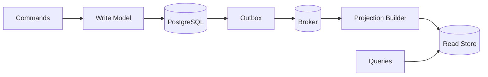

# Day 4 — CQRS: Separate Reads and Writes Only When They Want Different Things

## Goal

Understand Command Query Responsibility Segregation as a response to read/write asymmetry—not as a mandatory companion to microservices or event sourcing.

## Timebox

- 20 min — command/query separation
- 20 min — simple vs full CQRS
- 25 min — projections and consistency
- 20 min — transcription read-model exercise
- 10 min — break-it drill + quiz

---

## 1. Start from CRUD

Most systems should begin with something like:

```text
API
 ↓
Domain / service
 ↓
PostgreSQL
```

The same model can support:

```text
commands → create/cancel/update
queries  → list/get/search
```

That is simple and often ideal.

---

## 2. CQRS asks whether reads and writes have diverged

Write side may care about:

```text
business invariants
transactions
state transitions
validation
normalized data
```

Read side may care about:

```text
fast filtering
precomputed aggregates
user-specific views
full-text search
denormalized data
```

When those needs become significantly different, one model may become awkward for both.

---

## 3. CQRS has levels

### Level 1 — separate code paths

Same database:

```text
Commands → write service → PostgreSQL
Queries  → query service → PostgreSQL
```

Already useful.

### Level 2 — separate models

```text
Write domain model
        ↓
PostgreSQL
        ↓ projection
Read model tables/views
```

### Level 3 — separate stores

```text
Commands → PostgreSQL
              ↓ events
Queries  ← Elasticsearch / read DB / materialized projection
```

Complexity rises at each level.

Do not jump directly to Level 3 because you learned the acronym today.

---

## 4. Transcription example

Write model:

```text
jobs
chunks
transitions
quota rules
cancellation rules
```

Job-history screen wants:

```text
filename
status
progress
created_at
duration
category count
cost
result preview
failure summary
```

You could join many tables every time.

Or maintain a projection:

```text
user_job_history_projection
```

with exactly the fields the UI needs.

---

## 5. Projection flow



Now the read model is **eventually consistent**.

That is the price of decoupled projection updates.

---

## 6. Read-your-write UX

User clicks Cancel.

Write model says:

```text
CANCELLED v18
```

Read projection still says:

```text
PROCESSING v17
```

Possible strategies:

- update UI optimistically from command response,
- query authoritative write model for detail page,
- include version numbers and wait until projection catches up,
- accept brief staleness if product semantics allow it.

CQRS forces you to design this instead of hiding it.

---

## 7. CQRS does not require event sourcing

You can absolutely have:

```text
PostgreSQL current state
      ↓ outbox events
read projection
```

without storing every state change as the source of truth.

Conversely, event-sourced systems often use CQRS because event streams are poor ad-hoc query models.

Related patterns, not synonyms.

---

## 8. When CQRS is justified

Good signals:

- read traffic dwarfs writes,
- read shape is radically different,
- expensive joins/aggregations dominate latency,
- independent read scaling matters,
- domain writes are complex but reads should stay simple,
- multiple purpose-specific projections are valuable.

Weak signals:

- “we want clean architecture”,
- simple CRUD app,
- small traffic,
- one model already serves both well.

---

## Exercise — Job history CQRS

Design:

### Command side

```text
CreateJob
CancelJob
RetryJob
DeleteJob
```

### Query side

```text
GetJob
ListUserJobs
SearchJobs
GetDashboardStats
```

Decide:

1. Which queries can stay on PostgreSQL?
2. Which would benefit from a projection?
3. What fields belong in the projection?
4. How is it updated?
5. What is the acceptable lag?
6. What happens if projection processing stops for 20 minutes?
7. How do you rebuild it?

---

## Break it 💥

1. Read projection is three minutes behind after cancellation.
2. Projection consumer applies the same event twice.
3. A new projection field requires old historical data.
4. Search store is unavailable.
5. You need a strongly consistent billing balance but route reads to an eventually consistent projection.

---

## Retrieval quiz

1. What problem does CQRS solve?
2. Does CQRS require separate databases?
3. Does CQRS require event sourcing?
4. Why can projections improve read performance?
5. What consistency problem do separate read stores introduce?
6. Give one read-your-write strategy.
7. When is CRUD better than CQRS?

## Exit criterion

You can explain CQRS **without drawing Kafka automatically**.
