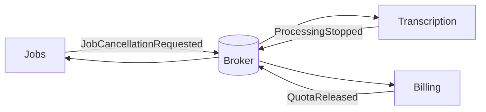
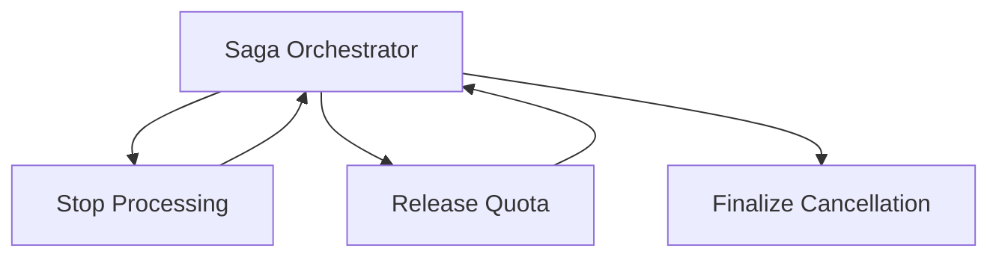

# Day 6 — Saga Pattern: Coordinate Business Work Without Pretending the Network Is One Transaction

## Goal

Understand sagas as a way to coordinate long-running business workflows across independently committed components, using forward actions and compensating actions instead of one global ACID transaction.

## Timebox

- 20 min — why local transactions stop at service boundaries
- 20 min — saga steps and compensation
- 20 min — choreography vs orchestration
- 25 min — transcription cancellation saga
- 10 min — failure drill + quiz

---

## 1. The problem

Imagine independent components:

```text
Jobs Service
Billing Service
Transcription Service
Notification Service
```

User cancels a job.

Business workflow:

```text
mark job cancelling
↓
stop processing
↓
release unused quota
↓
issue billing adjustment if needed
↓
mark job cancelled
```

Each service has its own local transaction.

There is no simple PostgreSQL `BEGIN...COMMIT` across all of them.

---

## 2. A saga is a sequence of local transactions

```text
T1 → T2 → T3 → T4
```

If T3 fails, the workflow may execute compensations:

```text
C2 ← C1
```

But compensation is **business correction**, not database rollback.

Example:

```text
Payment captured
↓ later workflow fails
Refund payment
```

The refund is a new business action with its own failure modes.

---

## 3. Not everything can be undone

Transcription has already consumed GPU/AI cost.

You cannot:

```text
uncompute 42 minutes of Whisper 😄
```

A compensation might instead:

- stop remaining work,
- avoid future billing,
- refund according to policy,
- preserve partial artifacts for audit,
- schedule deletion later.

Saga design forces the business to define what “undo” really means.

---

## 4. Choreography

Services react to events:



Benefits:

- loose direct coupling,
- no central workflow engine,
- consumers can evolve independently.

Costs:

- workflow is distributed across handlers,
- hard to see the full process,
- event loops and implicit dependencies can grow,
- debugging can become archaeology.

---

## 5. Orchestration

A saga orchestrator explicitly directs the workflow:



Benefits:

- workflow is explicit,
- easier progress visibility,
- centralized timeout/retry/compensation logic.

Costs:

- orchestrator is a coordination component,
- can become overly coupled to service details,
- needs durable state for long-running workflows.

---

## 6. Saga state is durable workflow state

Store something like:

```text
saga_id
job_id
state
current_step
attempts
started_at
updated_at
```

State machine:

```text
REQUESTED
  ↓
STOPPING_PROCESSING
  ↓
RELEASING_QUOTA
  ↓
FINALIZING
  ↓
COMPLETED
```

Failures can resume from durable state rather than restarting the whole workflow blindly.

---

## 7. Idempotency still matters

If `ReleaseQuota` is retried:

```text
release 60 minutes
release 60 minutes again
```

would be catastrophic.

Each saga command needs:

- stable operation ID,
- idempotency at the receiving service,
- durable result/state.

---

## 8. Isolation problems

Sagas do not provide the isolation of one ACID transaction.

While the cancellation saga runs:

```text
Jobs = CANCELLING
Transcription = stopping
Billing = still reserved
```

Other operations may observe intermediate states.

Design techniques include:

- semantic locks/statuses,
- version checks,
- rejecting conflicting commands,
- compensating on conflict.

---

## 9. Transcription cancellation saga

Design this:

```text
CancelJob(job_123)
```

Possible forward steps:

1. Jobs: `PROCESSING → CANCELLING`
2. Transcription: stop scheduling new chunks
3. Transcription: allow in-flight chunk policy to settle
4. Billing: release unused reserved minutes
5. Results: mark partial output retention policy
6. Jobs: `CANCELLING → CANCELLED`
7. Notification: notify user

Now identify compensation for failure after each step.

Not every step needs compensation.

---

## Exercise — Choose choreography or orchestration

For each workflow choose and justify:

1. `JobCompleted` → analytics + email + search indexing
2. Cancel a running job and release quota
3. User changes profile picture
4. Enterprise account deletion across storage, jobs, audit and billing
5. Generate a weekly analytics report

Rule of thumb:

- simple independent reactions → choreography can be elegant,
- multi-step business process with explicit sequencing/compensation → orchestration is often easier to reason about.

But context wins.

---

## Break it 💥

1. Orchestrator crashes after quota release but before recording success.
2. `StopProcessing` command is delivered twice.
3. Billing is unavailable for four hours.
4. User retries cancellation five times.
5. Notification fails after the business cancellation is complete.
6. A compensation itself fails.

---

## Retrieval quiz

1. What problem does a saga solve?
2. Why is compensation not rollback?
3. Difference between choreography and orchestration?
4. Why must saga steps be idempotent?
5. What consistency window does a saga create?
6. Why should saga state be durable?
7. Give an example of work that cannot truly be undone.

## Exit criterion

You can design a cross-service workflow **without pretending distributed ACID exists for free**.
